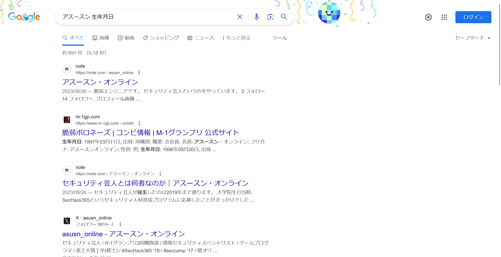
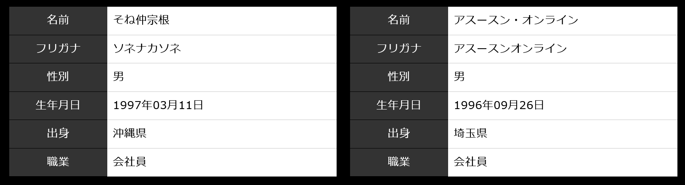

# Birthday:OSINT:pts
アスースンの誕生日はいつ？  
`※Facebookにはありません`  
形式: `YYYYMMDD`  

# Solution
CTF主催者のアスースンの誕生日を調べればよい。  
「アスースン 誕生日」でGoogle検索するもも良い結果は得られない。  
そこで、「アスースン 生年月日」とワードを変えてみると[脆弱ポロネーズのコンビ情報](https://www.m-1gp.com/combi/22332.html)がヒットした。  
  
M1グランプリに出場していたことは「アスースン M1」のGoogle検索ですぐにわかる。  
出場者の詳細が載っているらしいので確認する。  
  
アスースンの生年月日は`1996年09月26日`と書かれており、指定された形式に整形するとflagとなった。  

## 19960926