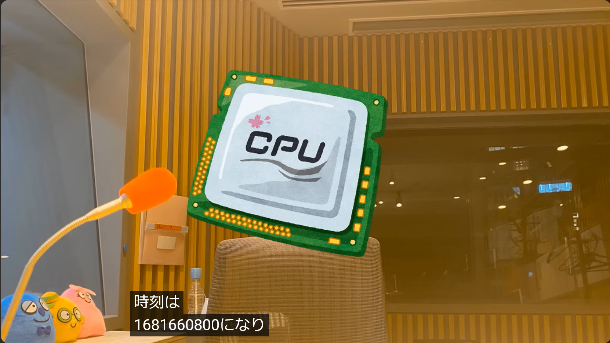

# CPU標準時:Misc:171pts
[CPUのオールナイトニッポン](https://youtu.be/srYTYbPCt88)の冒頭で時刻を言っているけれど、これは日本標準時でいつのことだろう？  
形式: `YYYYMMDDHHMMSS`  

# Solution
YouTubeの動画を見ると、冒頭で時刻について言及している。  
  
`時刻は1681660800になり……`とあるが、UNIX時のようだ。  
日本標準時へ変換する。  
```bash
$ date --date "@1681660800"
Mon Apr 17 01:00:00 JST 2023
```
指定した形式に整形した`20230417010000`がflagであった。  

## 20230417010000