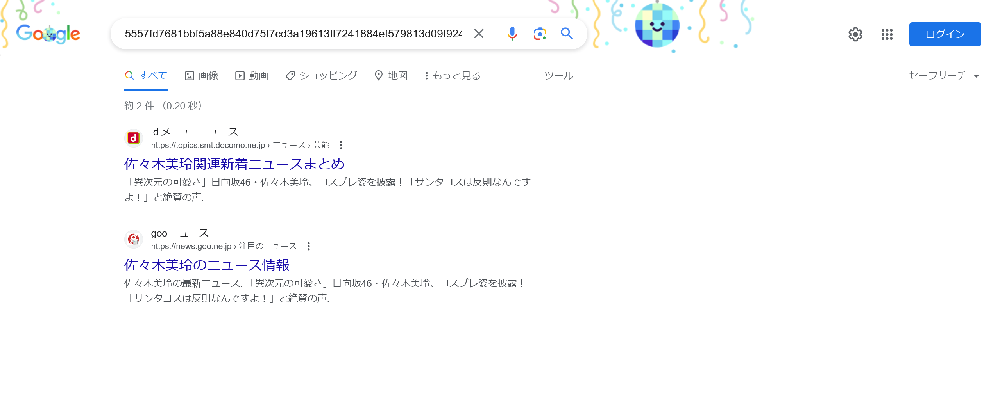

# アイドル:Crypto:198pts
[セキュリティ芸人のネタ](https://youtu.be/vmH9-a0BhTY)に出てくるアイドルグループ「SHA256」  
よく見るとアイドルの名前がSHA256でハッシュ化されているけれど  
`5557fd7681bbf5a88e840d75f7cd3a19613ff7241884ef579813d09f92421292`  
実はアスースンの好きなアイドルだった......！ 一体誰だろう？  
※提出回数3回まで  

Hint  
コメント欄  

# Solution
sha256sumの結果が渡される。  
どうやらアイドルの名前のようだが、さすがに戻すことはできない。  
ためしに「5557fd7681bbf5a88e840d75f7cd3a19613ff7241884ef579813d09f92421292」でGoogle検索する。  
  
`佐々木美玲`がヒットした。  
URLに検索ワードのハッシュ値を用いているサイトのようだ。  
念のため確認する。  
```bash
$ echo -n '佐々木美玲' | sha256sum
5557fd7681bbf5a88e840d75f7cd3a19613ff7241884ef579813d09f92421292  -
```
ハッシュ値が一致した`佐々木美玲`がflagであった。  

## 佐々木美玲