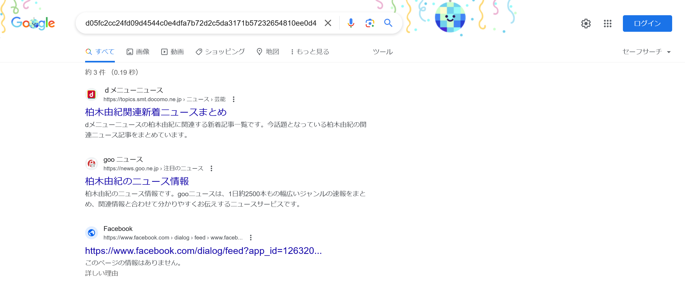

# アイドル2:Crypto:407pts
2番目に好きなアイドルは誰だったっけ......  
そこそこ有名なアイドルグループのメンバーだった気がする  
`d05fc2cc24fd09d4544c0e4dfa7b72d2c5da3171b57232654810ee0d48bec2e6`  
※提出回数3回まで  

# Solution
[アイドル](../アイドル)に続いて、2番目の推しのハッシュ値が渡される。  
同様に「d05fc2cc24fd09d4544c0e4dfa7b72d2c5da3171b57232654810ee0d48bec2e6」でGoogle検索する。  
  
`柏木由紀`がヒットした。  
念のため確認を行う。  
```bash
$ echo -n '柏木由紀' | sha256sum
d05fc2cc24fd09d4544c0e4dfa7b72d2c5da3171b57232654810ee0d48bec2e6  -
```
一致し、`柏木由紀`がflagであった。  

## 柏木由紀