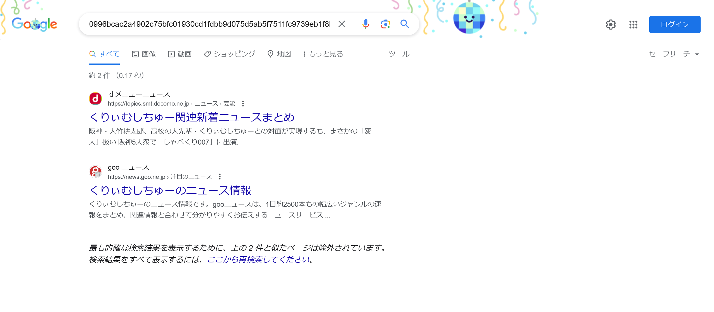

# アイドル3:Crypto:436pts
アイドルじゃないけど好きなやつハッシュ化したった！ SHA256は安全だし、これだったら誰も逆算できないだろ！  
`0996bcac2a4902c75bfc01930cd1fdbb9d075d5ab5f7511fc9739eb1f8b75b79`  
※提出回数3回まで  

# Solution
[アイドル](../アイドル)と[アイドル2](../アイドル2)の同系統問題だが、もはやアイドルではないらしい(問題名はアイドルだが)。  
同じく「0996bcac2a4902c75bfc01930cd1fdbb9d075d5ab5f7511fc9739eb1f8b75b79」でGoogle検索する。  
  
`くりぃむしちゅー`がヒットした。  
今までと同じく確認する。  
```bash
$ echo -n 'くりぃむしちゅー' | sha256sum
0996bcac2a4902c75bfc01930cd1fdbb9d075d5ab5f7511fc9739eb1f8b75b79  -
```
一致し、`くりぃむしちゅー`がflagであった。  

## くりぃむしちゅー