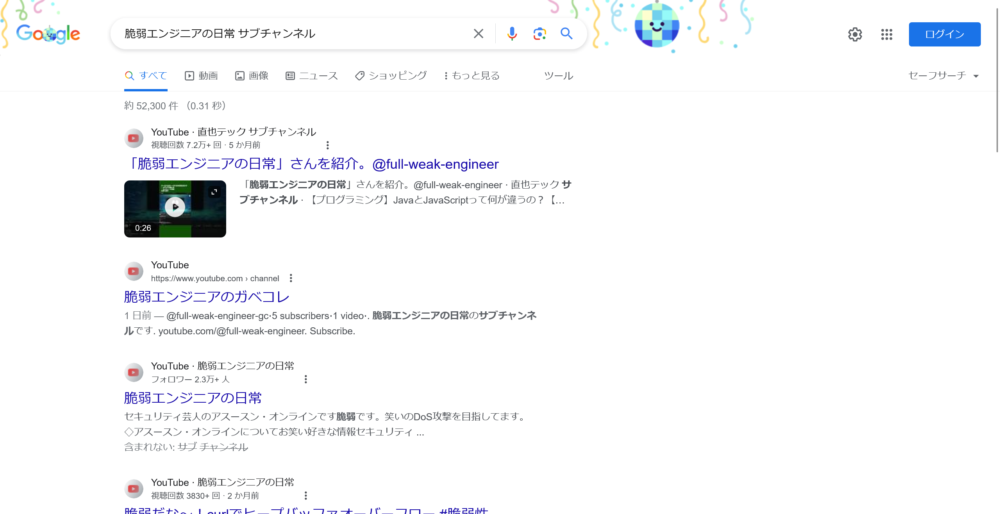

# サブチャンネル:OSINT:367pts
こっそりYouTubeのサブチャンネルを作ったらしい  
サブチャンネルの最初に投稿された動画に何か隠されていそうだ  
形式: `flag{XXXXXXXX}`  

# Solution
メインチャンネル[脆弱エンジニアの日常](https://www.youtube.com/channel/UCc-CRf4JTABah4SQ6XTTpXw)は知っているが、サブチャンネルを探せとのことらしい。  
「脆弱エンジニアの日常 サブチャンネル」でGoogle検索する。  
  
[脆弱エンジニアのガベコレ](https://www.youtube.com/channel/UCaTEwxaNmZ9AizUz0k3P9Dw)なるチャンネルがヒットする。  
  
謎の動画が投稿されており、タイトルがflagであった。  

## flag{7h15_v1de0_15_70p_5ecre7}