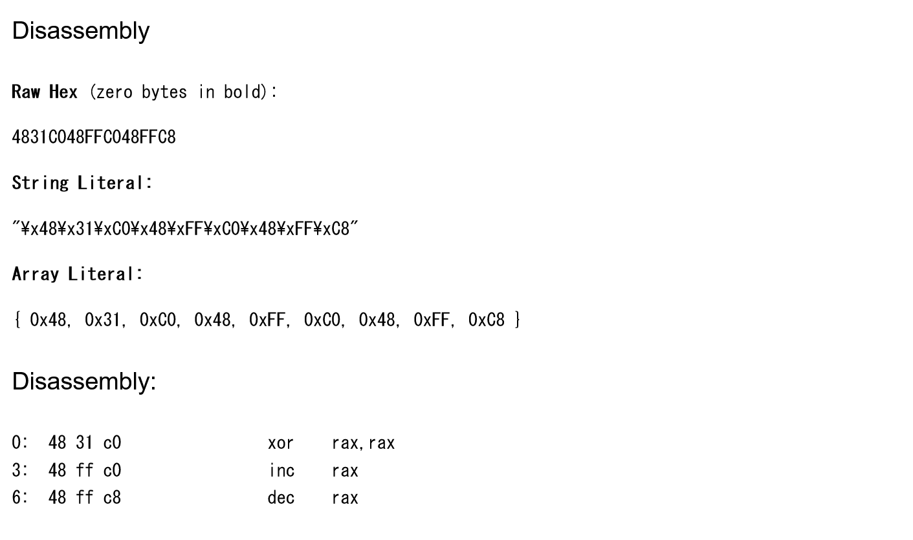

# フラッシュ機械語:Reversing:pts
[セキュリティ芸人のネタ](https://youtu.be/_2NgwNbEYrw)に出てくるフラッシュ機械語  
`48 31 c0 48 ff c0 48 ff c8`  
の答えは？  
(x86_64の命令として実行した場合のレジスタraxの値を答えよ)  

Hint  
```
xor rax, rax
inc rax
dec rax
```
これをアセンブルすると上のバイナリになるよ  

# Solution
x86_64の機械語が与えられる。  
実行後のraxを答えれば良いようだ。  
[Online x86 / x64 Assembler and Disassembler](https://defuse.ca/online-x86-assembler.htm)を使うことでDisassembleすることができる(x64にすることに注意)。  
  
初めにxorで0にし、incしてdecしているので、結局flagはraxの値の0となる。  

## 0