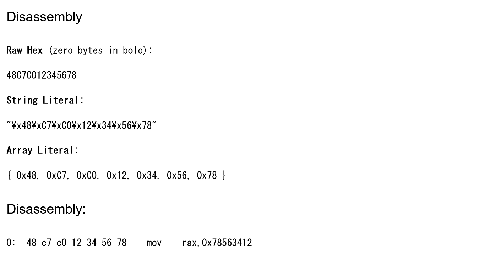

# フラッシュ機械語2:Reversing:374pts
これはどうだ！(10進数でお答えください)  
`48 c7 c0 12 34 56 78`  

# Solution
[フラッシュ機械語](../フラッシュ機械語)の続きのようで、x86_64の機械語が与えられる。  
同様に実行後のraxを10進数で答えれば良いようで、[Online x86 / x64 Assembler and Disassembler](https://defuse.ca/online-x86-assembler.htm)を使う。  
  
`mov    rax,0x78563412`なので10進数で2018915346となる。  
これがflagであった。  

## 2018915346