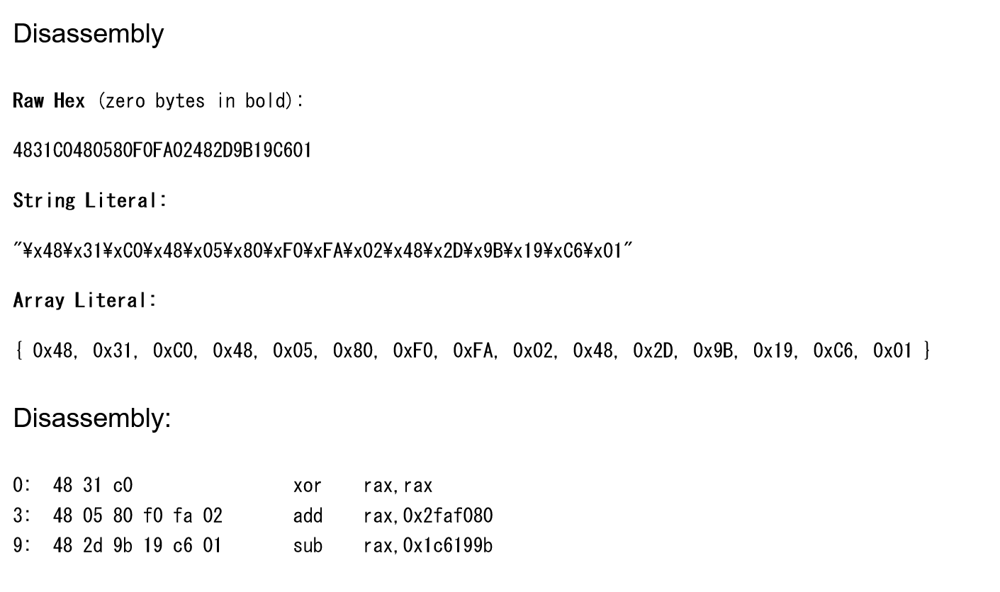

# フラッシュ機械語3:Reversing:418pts
`48 31 c0 48 05 80 f0 fa 02 48 2d 9b 19 c6 01`  
(10進数でお答えください)  

# Solution
[フラッシュ機械語](../フラッシュ機械語)と[フラッシュ機械語2](../フラッシュ機械語2)の続きのようで、x86_64の機械語が与えられる。  
同様に[Online x86 / x64 Assembler and Disassembler](https://defuse.ca/online-x86-assembler.htm)を使う。  
  
初めにxorで0とし、`add    rax,0x2faf080`の後に`sub    rax,0x1c6199b`している。  
10進数で`0 + 50000000 - 29759899 = 20240101`となり、flagは20240101となる。  

## 20240101