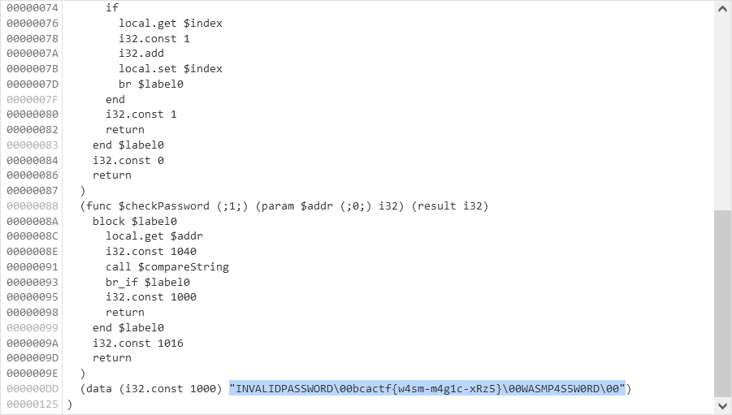

# Wasm Protected Site 1:webex:100pts
- Check out my super safe website! Enter the password to get the flag  

[http://web.bcactf.com:49157/](http://web.bcactf.com:49157/)  
  
Hint 1 of 1  
How does the Web Assembly check the password you entered, and what is it looking for?  

# Solution
サイトにアクセスするとwasmでログインフォームが動いているようだ。  
Wasm Protected Site 1  
[site.png](site/site.png)  
ネットワークを見てみると`http://web.bcactf.com:49157/code.wasm`が本体なようだ(jsを読んでもよい)。  
wgetしてstringsで中身を見てみる。  
```bash
$ wget http://web.bcactf.com:49157/code.wasm
~~~
$ strings code.wasm
memory
compareString
checkPassword
5INVALIDPASSWORD
bcactf{w4sm-m4g1c-xRz5}
WASMP4S5W0RD
name
compareString
checkPassword
str1
str2
index
addr
```
flagが書かれていた。  
デバッガを見てもよい。  
  

## bcactf{w4sm-m4g1c-xRz5}