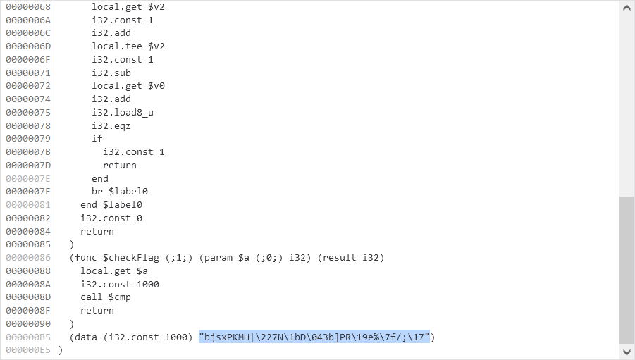

# Wasm Protected Site 2:webex:250pts
- Similar to wasm protected site 1, but this time there is no password, only the flag.  
- Enter the flag, and the program will check it for you  

[http://web.bcactf.com:49158/](http://web.bcactf.com:49158/)  
  
Hint 1 of 1  
What does the wasm do to compare each byte  

# Solution
サイトにアクセスすると[Wasm Protected Site 1](../Wasm_Protected_Site_1)と同様にwasmでログインフォームが動いているようだ。  
ネットワークを見てみるとこちらも同じく`http://web.bcactf.com:49158/code.wasm`が本体なようだ(jsを読んでもよい)。  
wgetしてstringsでは何も入手できない。  
デバッガを見ると以下のようであった。  
  
文字列が暗号化されているようなので上から順に読んでいく。  
```wasm
(module
  (memory $memory0 1)
  (export "memory" (memory $memory0))
  (export "checkFlag" (func $checkFlag))
  (func $cmp (;0;) (param $v0 (;0;) i32) (param $v1 (;1;) i32) (result i32)
    (local $v2 (;2;) i32)
    loop $label0
      local.get $v2
      local.get $v0
      i32.add
      i32.load8_u
      local.get $v2
      local.get $v1
      i32.add
      i32.load8_u
      local.get $v2
      i32.const 9
      i32.mul
      i32.const 127
      i32.and
      i32.xor
      i32.ne
      local.get $v2
      i32.const 27
      i32.ne
      i32.and
      if
        i32.const 0
        return
      end
      local.get $v2
      i32.const 1
      i32.add
      local.tee $v2
      i32.const 1
      i32.sub
      local.get $v0
      i32.add
      i32.load8_u
      i32.eqz
      if
        i32.const 1
        return
      end
      br $label0
    end $label0
    i32.const 0
    return
  )
  (func $checkFlag (;1;) (param $a (;0;) i32) (result i32)
    local.get $a
    i32.const 1000
    call $cmp
    return
  )
  (data (i32.const 1000) "bjsxPKMH|\227N\1bD\043b]PR\19e%\7f/;\17")
)
```
要約すると、`((暗号文の文字のindex * 9) & 127) ^ 暗号文の文字`を行って復号し、入力文字と比較している。  
暗号文が見にくいので、コンソールを用いてサイト内のjsの一部分を実行しメモリの中身を数値で見る。  
```JavaScript
> console.log(memory = new Uint8Array(wasm.instance.exports.memory.buffer).toString())
> 0,0,0,0,0,0,0,0,0,0,0,0,0,0,0,0,0,0,0,0,0,0,0,0,0,0,0,0,0,0,0,0,0,0,0,0,0,0,0,0,0,0,0,0,0,0,0,0,0,0,0,0,0,0,0,0,0,0,0,0,0,0,0,0,0,0,0,0,0,0,0,0,0,0,0,0,0,0,0,0,0,0,0,0,0,0,0,0,0,0,0,0,0,0,0,0,0,0,0,0,0,0,0,0,0,0,0,0,0,0,0,0,0,0,0,0,0,0,0,0,0,0,0,0,0,0,0,0,0,0,0,0,0,0,0,0,0,0,0,0,0,0,0,0,0,0,0,0,0,0,0,0,0,0,0,0,0,0,0,0,0,0,0,0,0,0,0,0,0,0,0,0,0,0,0,0,0,0,0,0,0,0,0,0,0,0,0,0,0,0,0,0,0,0,0,0,0,0,0,0,0,0,0,0,0,0,0,0,0,0,0,0,0,0,0,0,0,0,0,0,0,0,0,0,0,0,0,0,0,0,0,0,0,0,0,0,0,0,0,0,0,0,0,0,0,0,0,0,0,0,0,0,0,0,0,0,0,0,0,0,0,0,0,0,0,0,0,0,0,0,0,0,0,0,0,0,0,0,0,0,0,0,0,0,0,0,0,0,0,0,0,0,0,0,0,0,0,0,0,0,0,0,0,0,0,0,0,0,0,0,0,0,0,0,0,0,0,0,0,0,0,0,0,0,0,0,0,0,0,0,0,0,0,0,0,0,0,0,0,0,0,0,0,0,0,0,0,0,0,0,0,0,0,0,0,0,0,0,0,0,0,0,0,0,0,0,0,0,0,0,0,0,0,0,0,0,0,0,0,0,0,0,0,0,0,0,0,0,0,0,0,0,0,0,0,0,0,0,0,0,0,0,0,0,0,0,0,0,0,0,0,0,0,0,0,0,0,0,0,0,0,0,0,0,0,0,0,0,0,0,0,0,0,0,0,0,0,0,0,0,0,0,0,0,0,0,0,0,0,0,0,0,0,0,0,0,0,0,0,0,0,0,0,0,0,0,0,0,0,0,0,0,0,0,0,0,0,0,0,0,0,0,0,0,0,0,0,0,0,0,0,0,0,0,0,0,0,0,0,0,0,0,0,0,0,0,0,0,0,0,0,0,0,0,0,0,0,0,0,0,0,0,0,0,0,0,0,0,0,0,0,0,0,0,0,0,0,0,0,0,0,0,0,0,0,0,0,0,0,0,0,0,0,0,0,0,0,0,0,0,0,0,0,0,0,0,0,0,0,0,0,0,0,0,0,0,0,0,0,0,0,0,0,0,0,0,0,0,0,0,0,0,0,0,0,0,0,0,0,0,0,0,0,0,0,0,0,0,0,0,0,0,0,0,0,0,0,0,0,0,0,0,0,0,0,0,0,0,0,0,0,0,0,0,0,0,0,0,0,0,0,0,0,0,0,0,0,0,0,0,0,0,0,0,0,0,0,0,0,0,0,0,0,0,0,0,0,0,0,0,0,0,0,0,0,0,0,0,0,0,0,0,0,0,0,0,0,0,0,0,0,0,0,0,0,0,0,0,0,0,0,0,0,0,0,0,0,0,0,0,0,0,0,0,0,0,0,0,0,0,0,0,0,0,0,0,0,0,0,0,0,0,0,0,0,0,0,0,0,0,0,0,0,0,0,0,0,0,0,0,0,0,0,0,0,0,0,0,0,0,0,0,0,0,0,0,0,0,0,0,0,0,0,0,0,0,0,0,0,0,0,0,0,0,0,0,0,0,0,0,0,0,0,0,0,0,0,0,0,0,0,0,0,0,0,0,0,0,0,0,0,0,0,0,0,0,0,0,0,0,0,0,0,0,0,0,0,0,0,0,0,0,0,0,0,0,0,0,0,0,0,0,0,0,0,0,0,0,0,0,0,0,0,0,0,0,0,0,0,0,0,0,0,0,0,0,0,0,0,0,0,0,0,0,0,0,0,0,0,0,0,0,0,0,0,0,0,0,0,0,0,0,0,0,0,0,0,0,0,0,0,0,0,0,0,0,0,0,0,0,0,0,0,0,0,0,0,0,0,0,0,0,0,0,0,0,0,0,0,0,0,0,0,0,0,0,0,0,0,0,0,0,0,0,0,0,0,0,0,0,0,0,0,0,0,0,0,0,0,0,0,0,0,0,0,0,0,0,0,0,0,0,0,0,0,0,0,0,0,0,0,0,0,0,0,0,0,0,0,0,0,0,0,0,0,0,0,0,0,0,98,106,115,120,80,75,77,72,124,34,55,78,27,68,4,51,98,93,80,82,25,101,37,127,47,59,23,0,0,0,0,0,0,0,0,0,0,0,0,0,0,0,0,0,0,0,0,0,0,0,0,0,0,0,0,0,0,0,0,0,0,0,0,0,0,0,0,0,0,0,0,0,0,0,0,0,0,0,0,0,0,0,0,0,0,0,0,0,0,0,0,0,0,0,0,0,0,0,0,0,0,0,0,0,0,0,0,0,0
~~~
```
以下のwasm_dec.pyで復号する。  
```python:wasm_dec.py
crypto = [98,106,115,120,80,75,77,72,124,34,55,78,27,68,4,51,98,93,80,82,25,101,37,127,47,59,23]

for i in range(len(crypto)):
    print(chr(crypto[i] ^ ((i * 9) & 127)), end="")

print()
```
実行する。  
```bash
$ python wasm_dec.py
bcactf{w4sm-w1z4rDry-Xc0wZ}
```
flagが得られた。  

## bcactf{w4sm-w1z4rDry-Xc0wZ}