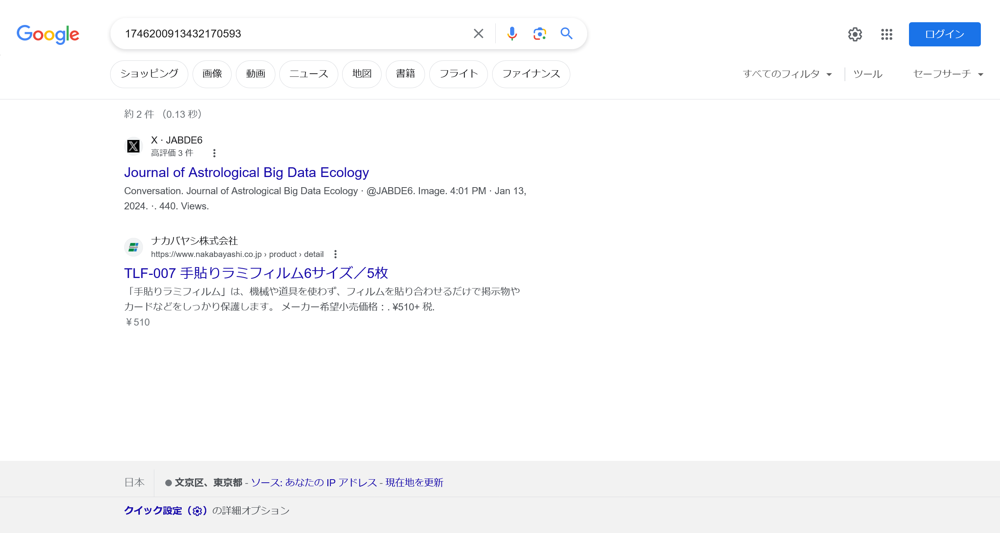
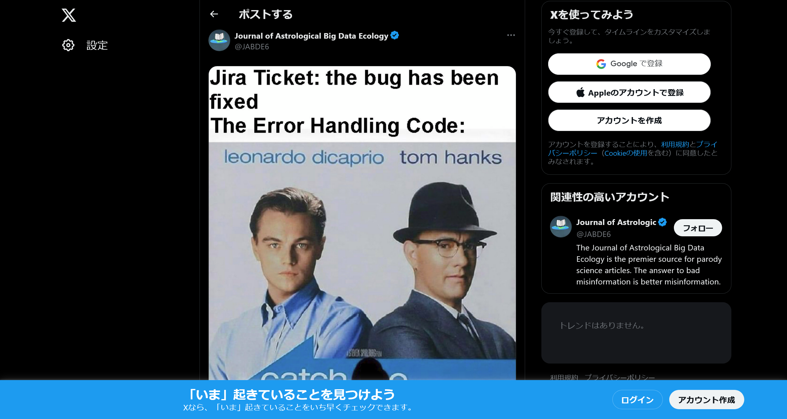
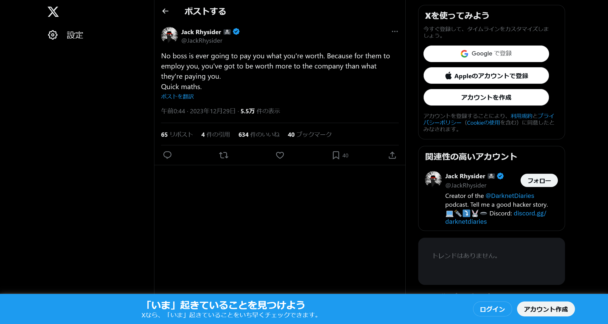

# Thus spoke machine:Crypto / Hashcracking:100pts
"One of our bots loves to read. We don't get it. Why would you stare at paper when all proper knowledge is shared by bots on the internet? Lately she even started talking in ciphers. I think the poor bot is possessed!"  
Can you figure out what she was trying to say?  
brck{1746200913432170593.11_1740398198542172490.3_789837700517945346.13}  
  
*Note that images are for entertainment and they are not part of the challenges.*  

Hint  
What do you normally do when you don't know something?  

# Solution
`brck{1746200913432170593.11_1740398198542172490.3_789837700517945346.13}`が与えられており、問題文からbook cipherであるような印象を受ける。  
book cipherであれば本がわからなければ復号できず、ページ数もあまりにも多いように見える。  
最初の値の整数部と思われるものをGoogle検索してみる。  
  
`https://twitter.com/JABDE6/status/1746200913432170593`なるポスト(ツイート)が得られた。  
ユーザ名が不明でも`https://twitter.com/omg/status/{id}`へアクセスすればポストへリダイレクトする。  
確認すると、その他の値の整数部もすべてポストのURLであった。  
book cipherのようであるのでポストのN文字目やN単語目が小数部に当たると考えられる。  
以下のように拾い集める。  

`1746200913432170593.11`  
URL: `https://twitter.com/JABDE6/status/1746200913432170593`  
  
画像の`11`単語目は`Code`となる。  

`1740398198542172490.3`  
URL: `https://twitter.com/JackRhysider/status/1740398198542172490`  
  
`3`単語目は`is`となる。  

`789837700517945346.13`  
URL: `https://twitter.com/schneierblog/status/789837700517945346`  
  
`13`単語目は`everywhere`となる。  

拾い集めた単語を指定された形式に整形すると`brck{Code_is_everywhere}`となる。  
これがflagだった。  

## brck{Code_is_everywhere}