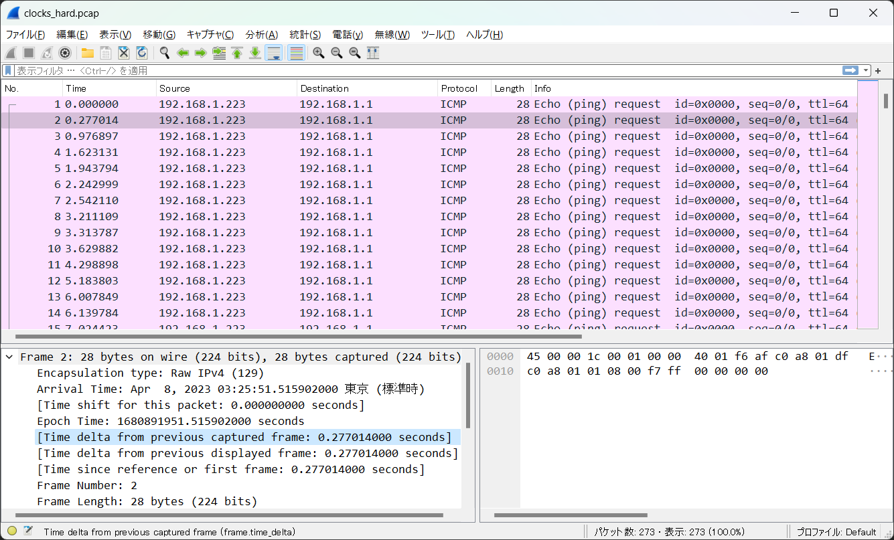

# Clocks 2:MISC:408pts
One of my cybersecurity professors, **Dr. Timely**, randomly sent my this file and said if I can decode the message he will give me an A in the class. Can you help me out?  

[clocks_hard.pcap](clocks_hard.pcap)  

# Solution
[clocks](../clocks)の高難易度バージョンのようだ。  
配布されたpcapを開くと、やはり到達時間の差のみが変化している。  
ただし、今回はばらつきが大きいようだ。  
  
試しにclocksと同じスクリプトを回してみる。  
```bash
$ tshark -r clocks_hard.pcap -T fields -e frame.time 'icmp.type==8' > times.txt
$ python icmp2bin.py
bucket{clocks_are_crazy_sometimes}
```
flagが得られた。  

## bucket{clocks_are_crazy_sometimes}