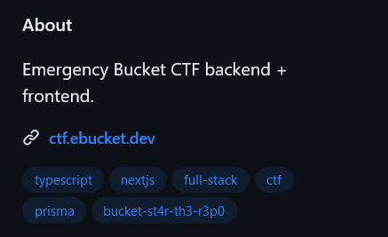

# Ping check:WEB:228pts
Did you know that this CTF is run on [custom built open source software](https://github.com/EmergencyBucket/pail)? Note: The flag is not in the usual `bucket{}` format.  
Do not overthink.  
You don't need to go to any other page.  

# Solution
WEBジャンルであるが、GitHubのリンクのみが渡される。  
さらに、フラグ形式も異なるらしい。  
アクセスすると、Topicsに謎の文字列が入っている。  
  
試しに入力すると、これがflagであった。  

## bucket-st4r-th3-r3p0