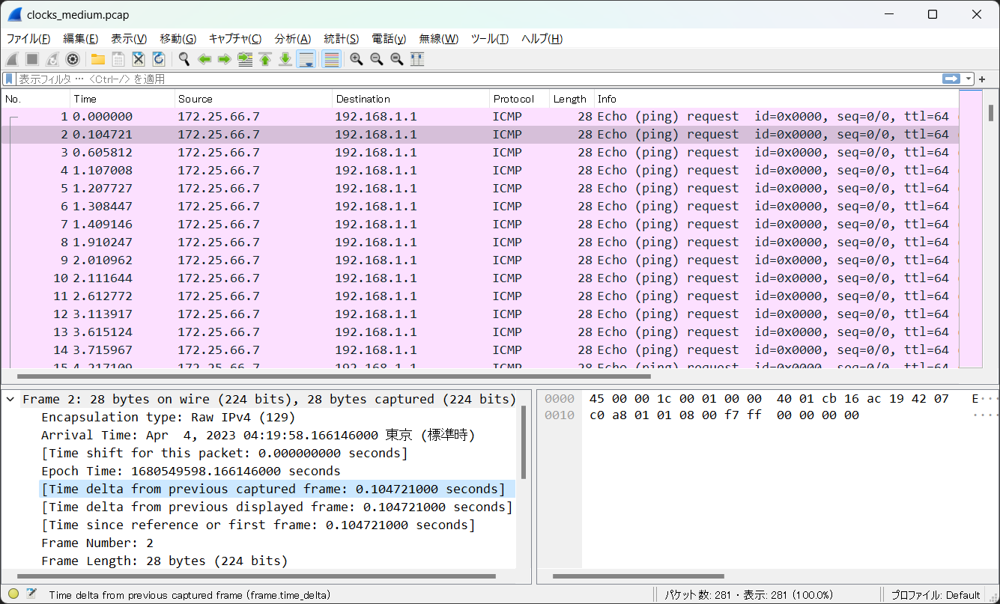

# clocks:MISC:358pts
One of my cybersecurity professors, Dr. **Timely**, randomly sent my this file and said if I can decode the message he will give me an A in the class. Can you help me out?  

[clocks_medium.pcap](clocks_medium.pcap)  

# Solution
pcapファイルが配布される。  
中身は全てICMPのようだ。  
  
良く知られているものとして、ICMP ExfiltrationというTime-Basedなものがある。  
今回も、到達時間の差が0.5sと0.1sでバイナリデータのように見える。  
時間部分のみ取り出して、以下のicmp2bin.pyでバイナリに変換してやる。  
```python
# tshark -r clocks_medium.pcap -T fields -e frame.time 'icmp.type==8' > times.txt
from Crypto.Util.number import long_to_bytes

times = open("times.txt").read().split("\n")

flag_bin = ""
prev_t = 0

for i in times[:-1]:
    time = float(i.split(" ")[4].split(":")[2])
    delta = time - prev_t
    if delta < 0:
        delta += 60
    if delta > 0.5:
        flag_bin += "1"
    else:
        flag_bin += "0"
    prev_t = time

flag_bin = flag_bin[1:]

print(long_to_bytes(int(flag_bin, 2)).decode())
```
実行する。  
```bash
$ tshark -r clocks_medium.pcap -T fields -e frame.time 'icmp.type==8' > times.txt
$ python icmp2bin.py
bucket{look_at_the_times_sometimes}
```
flagが得られた。  

## bucket{look_at_the_times_sometimes}