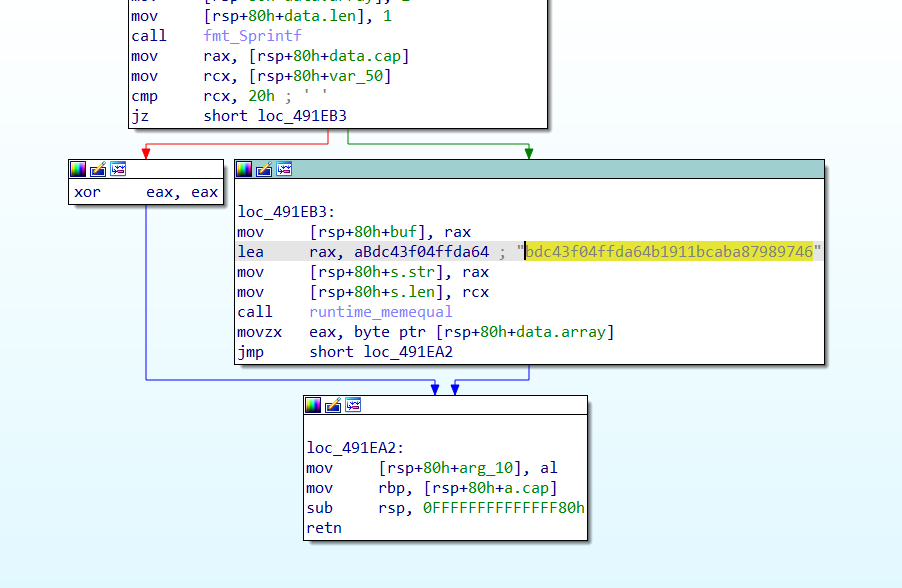

# licenseer:REV:454pts
Help! I tried writing my new authentication server in go, and I forgot the password!  
`nc dev.fyrehost.net 54321`  

[licenseer](licenseer)  
[213.133.103.186:6108](213.133.103.186:6108)  

# Solution
問題文にあるncは偽物と言うトラップがあるものの、まずはlicenseerを解析する。  
```bash
$ file licenseer
licenseer: ELF 64-bit LSB executable, x86-64, version 1 (SYSV), statically linked, Go BuildID=LjWVoCn2_Iq06CfaIuKR/7vjm3SIChsb3EN3EMIBq/rM0VBsh3a9ZLCYAsj_yo/uUjkSChJH9iRkNAGHiLS, not stripped
$ ./licenseer
satoki
Invalid Key
foo
Invalid Key
```
goで書かれたELFで、Keyを入力する系の問題のようだ。  
IDAで見ると`main_verifyKey`でmd5ハッシュ`bdc43f04ffda64b1911bcaba87989746`を検証している。  
  
md5からもとの文に戻す才能はないので、ひとまずGoogleに突っ込むと[MD5 Center](https://md5.gromweb.com/?md5=bdc43f04ffda64b1911bcaba87989746)がヒットした。  
どうやら、もとの文は`passWord1234!!`らしい。  
```bash
$ nc 213.133.103.186 6108
satoki
Invalid Key
passWord1234!!
bucket{HASH1NG_IS_S0_FUN_2f47d31e7c28d}
```
与えられた二つ目の接続先に投げるとflagが得られた。  

## bucket{HASH1NG_IS_S0_FUN_2f47d31e7c28d}