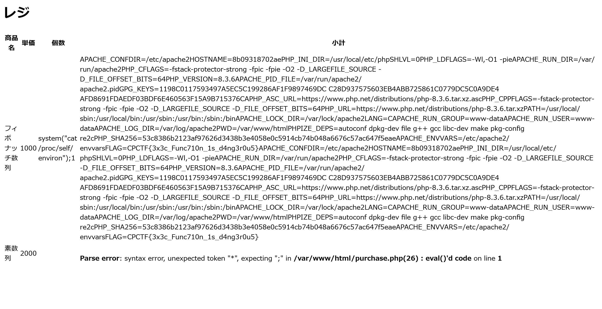

# Let's buy some array:Web:99.02pts
贔屓にしている数列屋さんがモバイルオーダーに対応したらしい。とは言っても金額計算機能しかないらしいけど。  
...この金額計算、あんまり安全じゃなくないか？  
問題サーバー：[https://lets-buy-some-array.web.cpctf.space/](https://lets-buy-some-array.web.cpctf.space/)  
配布ファイル：[https://files.cpctf.space/lets-buy-some-array.zip](lets-buy-some-array.zip)  

**Hint1**  
値が数値であるかどうかはクライアント側でしか検証していないようです。  
不正な文字列を注入することが出来るかもしれません。  
**Hint2**  
金額計算に`eval()`が使われているので、任意のPHPコードが実行できます。  
環境変数`FLAG`が表示されるよう、コードを入れてみましょう。  
**Hint3 (解法)**  
PHPでは`$_ENV['FLAG']`で環境変数`FLAG`を読み取ることが出来ます。  
`eval('return ' . $_POST["quantity1"] . '*1000;')`の`$_POST["quantity1"]`に不正なコードを注入することを考えます。  
単に`$_ENV['FLAG']`を入れると`$_ENV['FLAG'] *1000`が実行されてしまいます。PHPはPythonなどと異なり文字列×数字の演算は出来ないので、これはエラーになります。  
エラーを回避する方法としては、*1000の前に数字を置く方法があります。例えば、`quantity1`として`$_ENV['FLAG'] . 2`などを送ることで`$_ENV['FLAG'] . 2*1000` を実行させることができます。  

# Solution
URLとソースが渡される。  
アクセスすると個数を指定して商品を注文できるサイトだ。  
  
注文後ページのソースは以下の通りであった。  
```php
<html>
    <head>
        <title>数列屋</title>
        <meta charset="utf-8">
    </head>
    <body>
        <h1>レジ</h1>
        <form action="purchase.php" method="post">
            <table>
                <tr>
                    <th>商品名</th>
                    <th>単価</th>
                    <th>個数</th>
                    <th>小計</th>
                </tr>
                <tr>
                    <td>フィボナッチ数列</td>
                    <td>1000</td>
                    <td><?=$_POST["quantity1"]?></td>
                    <td><?=eval('return ' . $_POST["quantity1"] . '*1000;')?></td>
                </tr>
                <tr>
                    <td>素数列</td>
                    <td>2000</td>
                    <td><?=$_POST["quantity2"]?></td>
                    <td><?=eval('return ' . $_POST["quantity2"] . '*2000;')?></td>

                </tr>
                <tr>
                    <td>三角数列</td>
                    <td>1500</td>
                    <td><?=$_POST["quantity3"]?></td>
                    <td><?=eval('return ' . $_POST["quantity3"] . '*1500;')?></td>
                </tr>
            </table>
            <p>合計金額は<?=eval('return ' . $_POST["quantity1"] . '*1000+' . $_POST["quantity2"] . '*2000+' . $_POST["quantity3"] . '*1500;')?>円です。この画面を実店舗の店員にご提示ください。</p>
        </form>
    </body>
</html>
```
危険な`eval`を利用している。  
`$_POST["quantity1"]`に`system`などをうまく指定してやればRCEできそうだ。  
配布されたDockerfileより、フラグは環境変数にあることがわかるので`/proc/self/environ`から取得できる。  
注意点として、後ろに`*1000;`がついているので`system("cat /proc/self/environ");1`としてやる。  
また、フロントで数値のみの入力の制限がかかっているので、開発者ツールで`type="number"`を消してやればよい。  
送信すると以下の注文後ページとなる。  
  
flagが得られた。  

## CPCTF{3x3c_Func710n_1s_d4ng3r0u5}