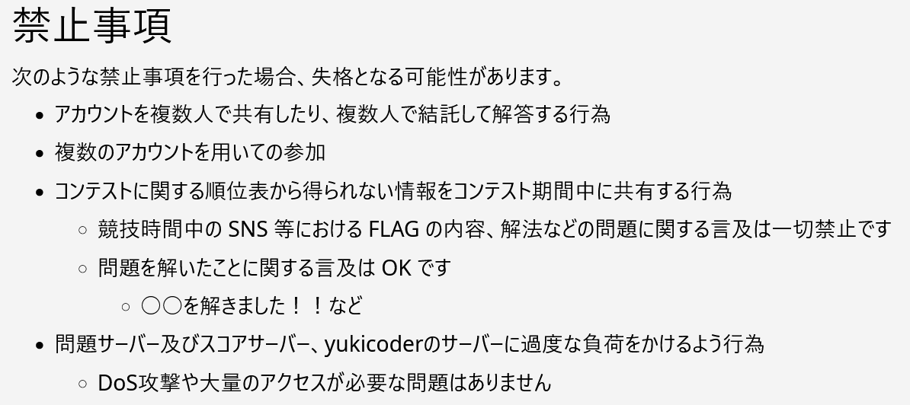
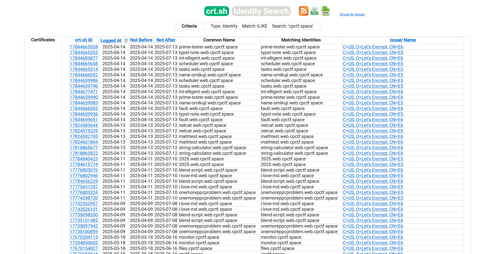

# CPCTF 2025:CTF:0pts

# Solution
コンテスト開始前の時点で、CPCTF 2025自体のハックを目指す。  
禁止事項に抵触しない範囲で行う必要があり、CPCTF 2025の禁止事項は以下の通りだった。  
  
まず目につくのが`コンテストに関する順位表から得られない情報をコンテスト期間中に共有する行為`である。  
```
競技開始 : 4月18日(金) 20:00
競技終了 : 4月20日(日) 20:00
```
とあるため、`コンテスト期間中`でないコンテスト期間**前**にフラグを取得できた場合には共有できることになる(もちろんしない)。  
どうにかして問題文の見えないコンテスト開始前に、問題サーバにアクセスする方法はないだろうか。  
ここで、例年のCPCTFの問題サーバがすべてHTTPSであったことを思い出す。  
CTF運営では、ワイルドカード証明書を使う(またはHTTPのままである)のが一般的だが、開始前に問題サーバの証明書を取ってしまいサブドメインが漏洩する事故がある。  
`cpctf.space`のサブドメインを[Certificate Search](https://crt.sh)で調査する。  
  
すると`<CHALL_NAME>.web.cpctf.space`という形式で、問題サーバ用と思われるサブドメインが大量に見つかる。  
ただ、開始前の問題サーバには認証があり、そもそも問題が動いていないことが一般的である。  
試しにアクセスすると、コンテスト開始前にも関わらずWebまたはMiscと思われる問題が動いていた(一部はHTTPを喋らない)。  
また、`files.cpctf.space`ではファイル一覧が表示され、配布ファイルと思われるzipもダウンロード可能であった。  
さらに各サブドメインは共通のIPアドレスであることが分かったため、**負荷をかけない程度**にポートスキャンを行う。  
すると30000以降に連番で解放されているポートが見つかる。  
試しにncすると、Pwn、Crypto、Miscと思われる問題が動いていた(先ほどのHTTPを喋らないものはおそらくこれらのサブドメイン)。  
ここで、コンテスト開始前にフラグがデプロイされているのかという疑問が生じる。  
得られたサブドメインはどう見ても問題サーバだが、開始前であるため問題文が読めず、攻撃してはいけないページの可能性もあるのでうかつにペイロードは投げられない。  
運よく攻撃ペイロードが必要ないが、フラグが得られそうなサービスがあったため検証すると、フラグ形式に合った文字列が取得できた。  
コンテスト開始を待って、これらの正当性を確認する。  
開始後に問題文を確認すると、やはり取得できていたサブドメインは問題サーバのものであり、取得できていたflagは有効なものであった。  
CPCTF 2026の禁止事項は`コンテストに関する順位表から得られない情報をコンテスト終了前に共有する行為`としたほうがよさそうだ。  

## None