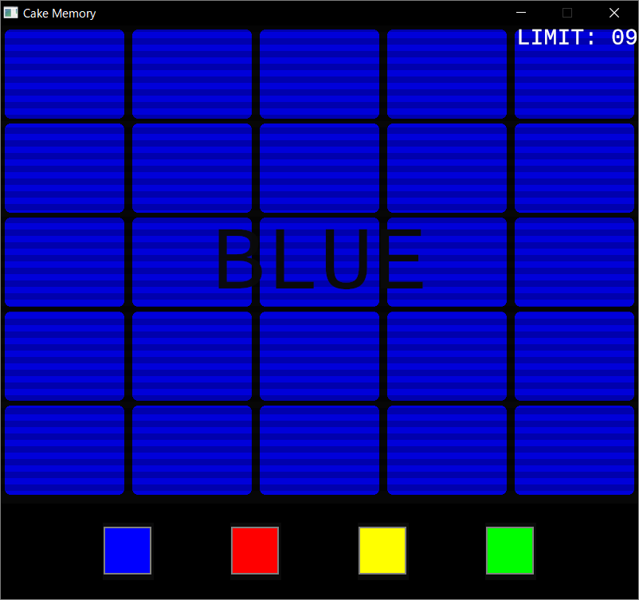
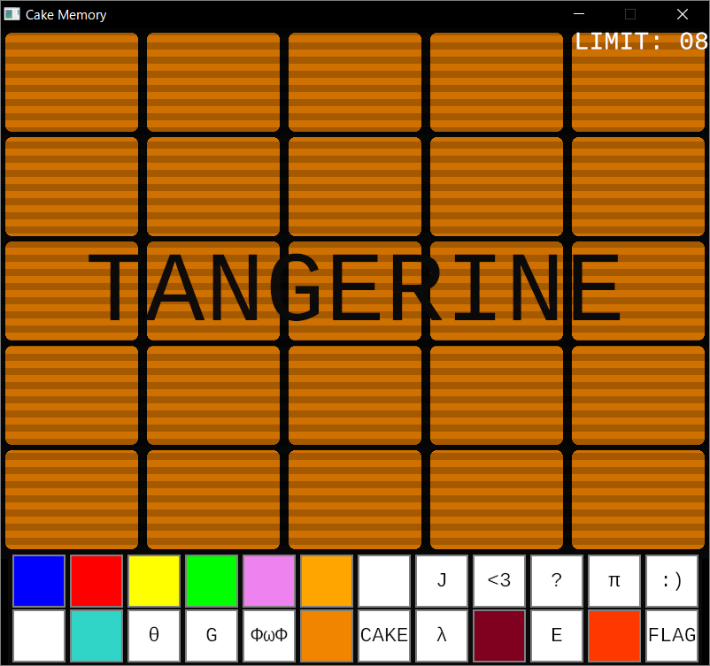
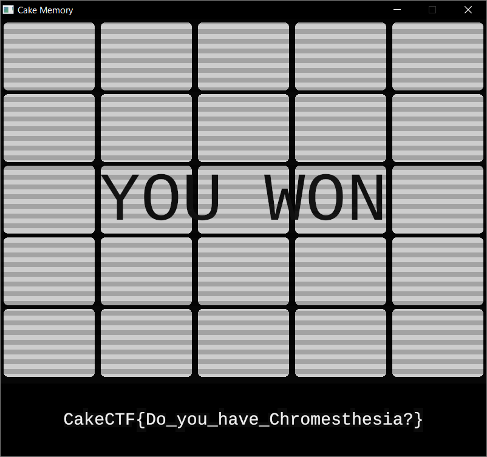

# Cake Memory:cheat:289pts
Welcome to Cake Memory.  
This advanced memory and cognitive recognition test is designed to stimulate several segments of the brain, allowing us to see how quickly and efficiently your brain works.  

[cake_memory_ea3efda375fcdbbd010cfa03317cd292.tar.gz](cake_memory_ea3efda375fcdbbd010cfa03317cd292.tar.gz)  

# Solution
ファイルが配布されるので解凍すると、exeとelfが入っている。  
exeを起動すると、色(と文字)が表示され読み上げられるので、それを記憶して答えるゲームのようだ。  
  
一度でも間違えるとゲームオーバーになり、ラウンドが増えるごとに色も増えていく。  
まずは何ラウンドまであるのか知りたいので、ラウンドが読み上げられることから`resources/snd/voice`を漁ると`r5.wav`でファイナルラウンドと言っている。  
つまり5ラウンドまで耐えればよい。  
以下の例のように出てきた色をメモっていけばたやすくクリアできる。  
```
ybgb
vrgybg
oyvovogo
y<bb:<ybyr
```
4ラウンドまでは自力で到達できるが、5ラウンド目では高速で色が表示され、種類も豊富なのでついていけない(Ωは左下のようだ)。  
  
超人ならば可能だろうが私には難しいので、色の表示と読み上げを録画し、exeの動作を遅くしてやり手作業で頑張る方針を立てる。  
[うさみみハリケーン](https://www.vector.co.jp/soft/win95/prog/se375830.html)でプロセスにアタッチし、実行速度を調整してやる(1%にした)。  
色の表示段階で遅くしてしまうと音声が聞き取りにくく、同じ色が連続する場合に間違える可能性があるため、入力段階になった瞬間に遅くしてやるとよい。  
あとは録画を見返しながら、手動でポチポチするとクリアできる。  
  
クリアするとflagが表示された。  

## CakeCTF{Do_you_have_Chromesthesia?}