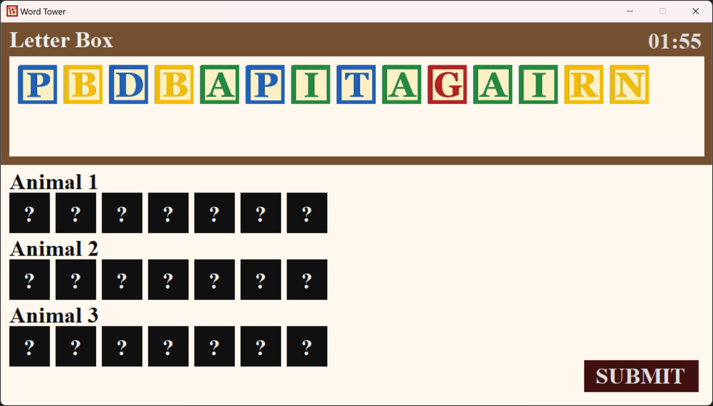
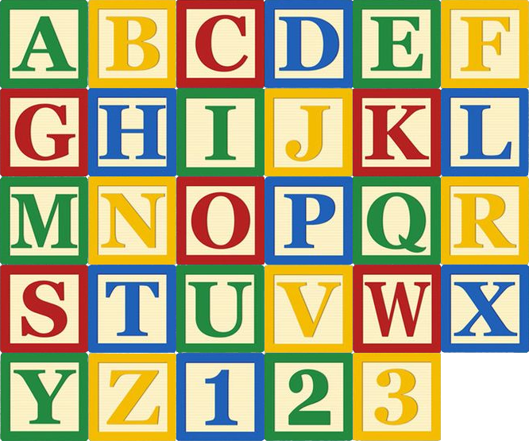
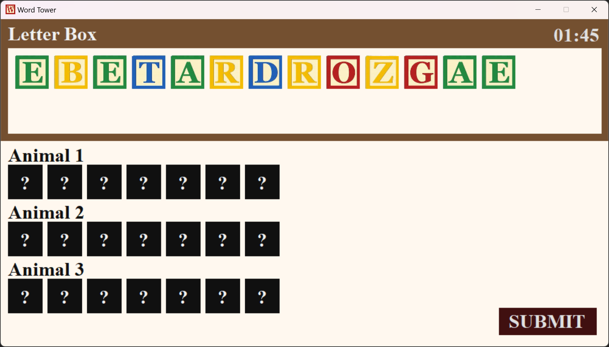
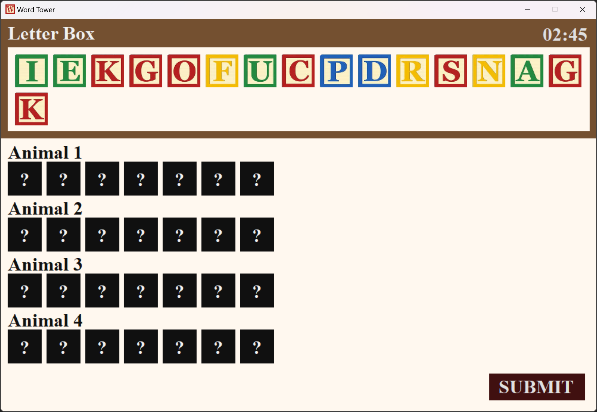
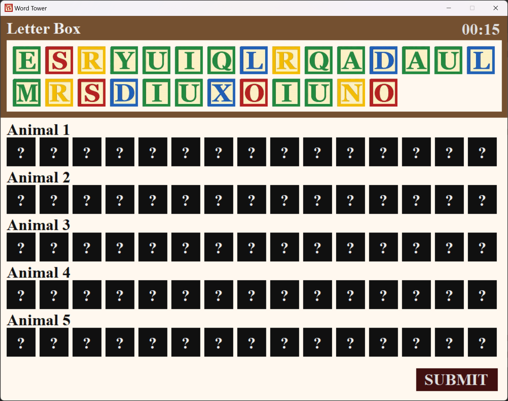
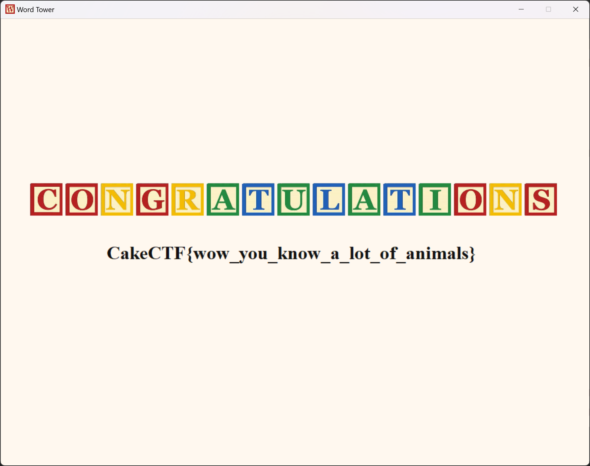

# Word Tower:cheat:214pts
Word Tower is a game in which players use given letter blocks to create animal names.  
ex) K C A N A W A F E A L S L O P  
-> SNAKE / ALPACA / WOLF  

[wordtower_39e259cbf819239a069282825ed6f5ed.tar.gz](wordtower_39e259cbf819239a069282825ed6f5ed.tar.gz)  

# Solution
チート問題としてexeファイルが配布されている。  
起動すると、与えられたアルファベットのカードで動物の名前を作るゲームのようだ。  
  
初めに現在のステージ数が画像で表示されるが、まずは手動でフラグに到達可能である総ステージ数なのか画像を抽出して調査する。  
1000ステージなどある場合は自動化しなければならない。  
```bash
$ binwalk --dd='.*' wordtower.exe

DECIMAL       HEXADECIMAL     DESCRIPTION
--------------------------------------------------------------------------------
0             0x0             Microsoft executable, portable (PE)
552600        0x86E98         XML document, version: "1.0"
556624        0x87E50         PNG image, 666 x 555, 8-bit/color RGBA, non-interlaced
556665        0x87E79         Zlib compressed data, best compression

```
  
数字画像が3までなので、ステージも最大3で手動で到達できそうである。  
ゲームをSTARTすると右上に制限時間が表示されており、これからより短くなることが予想されるのでカウントの遅延や停止を試みる。  
ここで、起動時にWindowsのシステム時間を見ているとあたりをつける。  
時間の自動同期をオフにし、以下のスクリプトで時間を変更し続ける(要管理者権限)。  
```cmd
time 00:10:00
echo START
timeout /t 5 /nobreak
:loop
timeout /t 2 /nobreak && time 00:10:15
goto loop
```
スクリプト起動後の5sの間にゲームのSTARTボタンを押すと、その後は15s経過した時間に自動で戻り続ける。  
これによりすべてのステージで時間を気にする必要がなくなった。  
次に、動物の組み合わせを手動で発見することが煩わしいため、与えられたアルファベットに一致する動物の組み合わせを探索するスクリプトを作成する。  
exe内に正誤判定のための動物の辞書があるだろうと考えstringsコマンドにかける。  
```bash
$ strings -n 1 wordtower.exe | grep panda -5
snake
tiger
turtle
wolf
zebra
panda
aardvark
albatross
alligator
ant
anteater
```
辞書があるようだ。  
stringsの余計な出力部分を削除し、zoo.txtとして保存しておく。  
あとは以下のスクリプトで、探索を行えばよい。  
```python
from itertools import combinations

with open("zoo.txt", "r") as f:
    zoo = f.read().split("\n")

text = input("Letter Box: ").lower()
num = int(input("#Words[num]: "))

for animal in zoo:
    if not all([c in text for c in animal]):
        zoo.remove(animal)


for animals in combinations(zoo, num):
    chimera = "".join(animals)
    if len(chimera) != len(text):
        continue
    if "".join(sorted(chimera)) == "".join(sorted(text)):
        print(f"{animals=}")
        break
```
ゲームを始める。  
ステージ1は以下の通りであった。  
  
```
$ python solve.py
Letter Box: ebetardrozgae
#Words[num]: 3
animals=('deer', 'goat', 'zebra')
```
ステージ2は以下の通りであった。  
  
```
$ python solve.py
Letter Box: iekgofucpdrsnagk
#Words[num]: 4
animals=('duck', 'frog', 'pig', 'snake')
```
ステージ3は以下の通りであった。  
  
```
$ python solve.py
Letter Box: esryuiqlrqadaulmrsdiuxoiuno
#Words[num]: 5
animals=('dinosaur', 'lemur', 'oryx', 'quail', 'squid')
```
時間は永遠にあるので、遅いスクリプトで充分である。  
  
出てきた動物を手で入力していくとflagが得られた。  

## CakeCTF{wow_you_know_a_lot_of_animals}