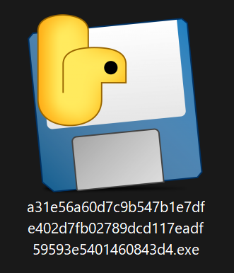
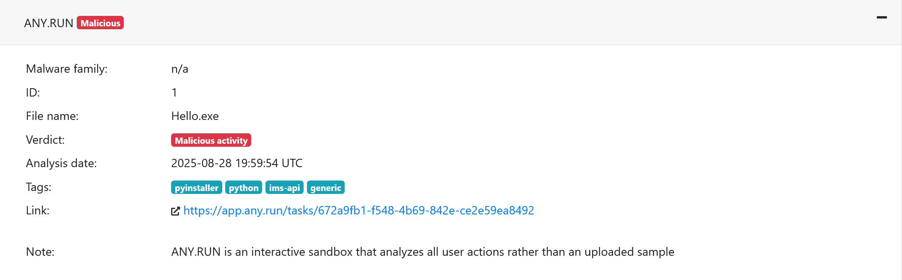
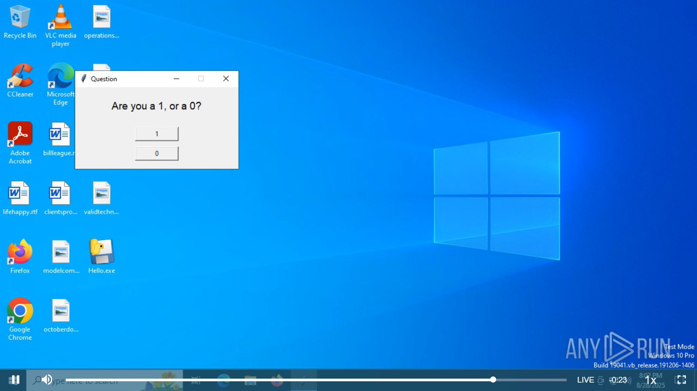
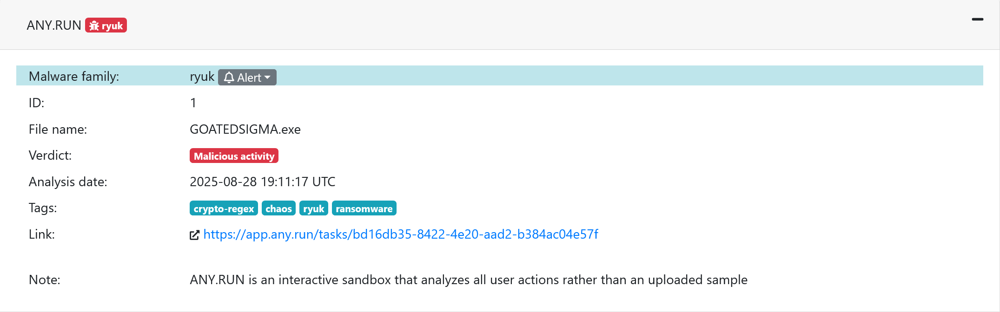
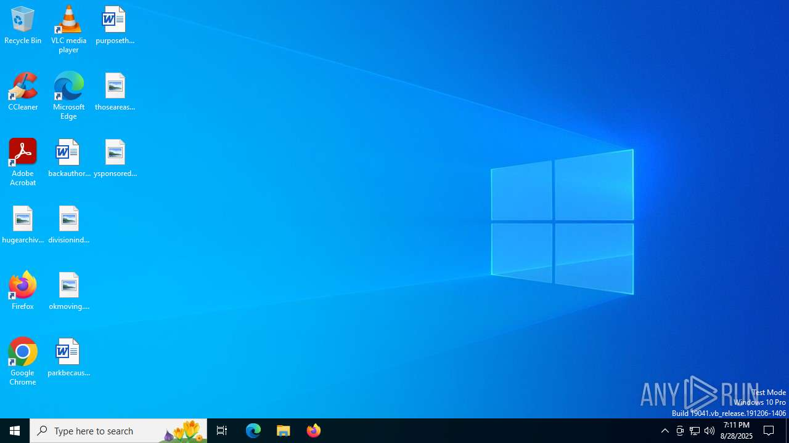
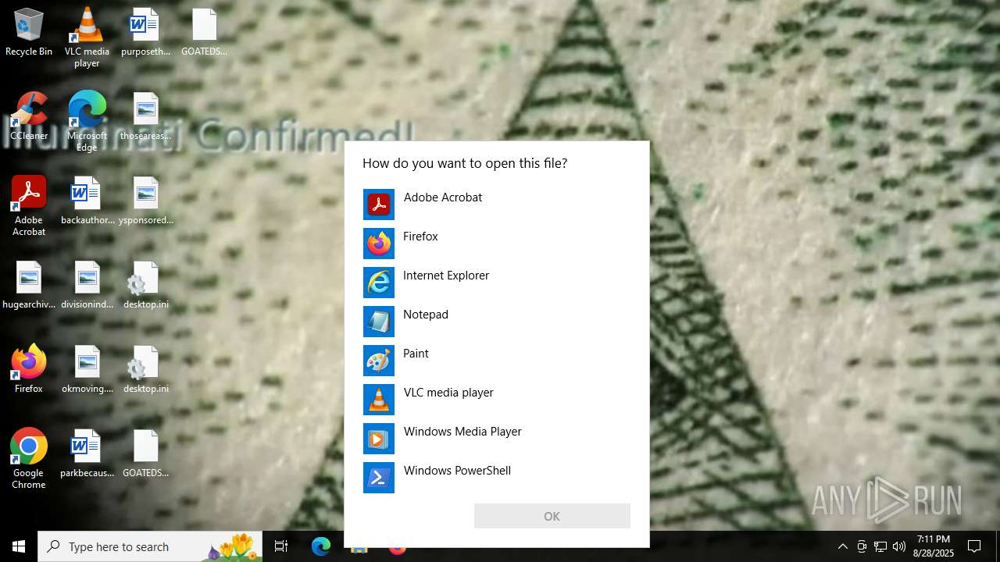
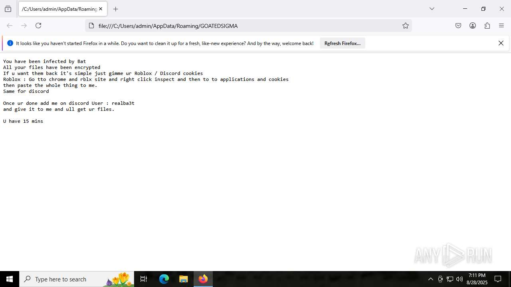

# grandbazaar:Threat hunting:192pts
Can you identify the threats in the Grand Bazaar of activities?  

[VERYBESTGUDI451amlastone.7z](VERYBESTGUDI451amlastone.7z)  

---

Q1. How many alerts there exists in total in the elastic data? (Points: 7)  
the answer is an integer  

Q2. What are the hashes of the threats? (Points: 19)  
DCTF{sha256(hash-malware-first):sha256(hash-malware-second)}  

Q3. What is the SHA3-384 hash of the second threat? (Points: 24)  
DCTF{SHA3-384}  

Q4. What programming language did the first malware used? (Points: 18)  
DCTF{string}  

Q5. What domain did the first malware tried to contact? (Points: 20)  
DCTF{second-level-domain.top-level-domain}  

Q6. How many selecting options did the first malware GUI had? (Points: 21)  
the answer is an integer  

Q7. What MITRE Technique did the second malware with the “legitimate” process used? (Points: 21)  
DCTF{Txxxx}  

Q8. How many child processes did the svchost had? (Points: 15)  
the answer is an integer  

Q9. What is the name of the file that is created on desktop after second malware (Points: 21)  
DCTF{string}  

Q10. What is the discord username of the hacker in the second malware behavior? (Points: 26)  
DCTF{string}  

# Solution
VERYBESTGUDI451amlastone.7zと10個の問題で構成される。  
各問題には数回の提出制限が設けられているため、慎重を期する必要がある。  
※ファイルサイズの問題でVERYBESTGUDI451amlastone.7zを分割している(`cat VERYBESTGUDI451amlastone.7z-?? > VERYBESTGUDI451amlastone.7z`で戻せる)。  
```text
b3bea891823414914e0488c4717ea80279b25f65  VERYBESTGUDI451amlastone.7z
7df6b757b87c304f7fc54937580c8b8f37be2e20  VERYBESTGUDI451amlastone.7z-00
f8466d7acda913b2c538dc84e0c4010f3fe7be0b  VERYBESTGUDI451amlastone.7z-01
feccff01d6d0ebe955eea826b2b52dddd003669c  VERYBESTGUDI451amlastone.7z-02
f9119c05a3b6296170f2c7c0899a39a8aa09baec  VERYBESTGUDI451amlastone.7z-03
```
まずはファイルを展開し、`docker compose up -d`でローカルにサービスを立ち上げておく。  
さらに展開後のディレクトリで、以下のプロンプトをCursor (**claude-4.1-opus** MAX)に食べさせる。  
```
$ docker compose up -d で、既にサービスは立ち上げてあります。
以下の質問に一つづつ順番に答えてください。答えがわかったら一度提示して指示を仰いでください。各質問の答えには番号と短い過程も付加してください。

Q1. How many alerts there exists in total in the elastic data?
the answer is an integer

Q2. What are the hashes of the threats?
DCTF{sha256(hash-malware-first):sha256(hash-malware-second)}

Q3. What is the SHA3-384 hash of the second threat?
DCTF{SHA3-384}

Q4. What programming language did the first malware used?
DCTF{string}

Q5. What domain did the first malware tried to contact?
DCTF{second-level-domain.top-level-domain}

Q6. How many selecting options did the first malware GUI had?
the answer is an integer

Q7. What MITRE Technique did the second malware with the “legitimate” process used?
DCTF{Txxxx}

Q8. How many child processes did the svchost had?
the answer is an integer

Q9. What is the name of the file that is created on desktop after second malware
DCTF{string}

Q10. What is the discord username of the hacker in the second malware behavior?
DCTF{string}
```
初めに以下のような応答が得られる。  
```
Q1の回答:
番号: Q1
質問: Elasticデータ内のアラートの総数
答え: 23
短い過程:
1. Docker環境を確認し、Elasticsearchがポート9200で稼働していることを確認
2. docker inspectコマンドでElasticsearchのパスワード（111111）を取得
3. curlコマンドでElasticsearch APIにアクセスし、.internal.alerts-*インデックスのドキュメント数をカウント
4. 結果として23件のアラートが存在することを確認
次の質問に進んでよろしいでしょうか？
```
`23`がQ1のflagであった。  
次に`続けてください`とQ2へ進めると、以下のような応答が得られた。  
```
Q2の回答:
番号: Q2
質問: 脅威のハッシュ値
答え: DCTF{78a4417231ec0cc0449742675640b9aa74a021c2c4493c04e7244f7267905aa3:98a1da8c0e9095c7aad02a540ad7f2961827b1f1b30ab22033157b29c8a502a4}
短い過程:
1. Elasticsearchのアラートデータから2つのマルウェアを発見
2. 1つ目のマルウェア: C:\Users\malware\AppData\Roaming\svchost.exe (GOATEDSIGMA.exe)
   - SHA256: a2254802dd387d0e0ceb61e2849a44b51879f625b89879e29592c80da9d479a2
3. 2つ目のマルウェア: C:\Users\malware\Desktop\a31e56a60d7c9b547b1e7dfe402d7fb02789dcd117eadf59593e5401460843d4\*.exe
   - SHA256: a31e56a60d7c9b547b1e7dfe402d7fb02789dcd117eadf59593e5401460843d4
4. 各ハッシュ値のSHA256を計算
   - sha256(a2254802dd387d0e0ceb61e2849a44b51879f625b89879e29592c80da9d479a2) = 78a4417231ec0cc0449742675640b9aa74a021c2c4493c04e7244f7267905aa3
   - sha256(a31e56a60d7c9b547b1e7dfe402d7fb02789dcd117eadf59593e5401460843d4) = 98a1da8c0e9095c7aad02a540ad7f2961827b1f1b30ab22033157b29c8a502a4
次の質問に進んでよろしいでしょうか？
```
フラグが間違っていた。  
過程を見ると、問題文が悪いため`sha256(hash-malware-first)`や`sha256(hash-malware-second)`を再度`sha256`にかけろと受け取っているが、実はSHA256であることを示しているだけである。  
つまり、`a2254802dd387d0e0ceb61e2849a44b51879f625b89879e29592c80da9d479a2`と`a31e56a60d7c9b547b1e7dfe402d7fb02789dcd117eadf59593e5401460843d4`をそのまま使う。  
時系列に言及しておらず不安なため、`そのマルウェアはどちらが先？`と聞くと以下のような結果が返ってきた。  
```
タイムスタンプを確認した結果：
a31e56a60d7c9b547b1e7dfe402d7fb02789dcd117eadf59593e5401460843d4 が先に実行されました。
時系列：
1. 22:39:11.850 - a31e56a60d7c9b547b1e7dfe402d7fb02789dcd117eadf59593e5401460843d4.exe（1つ目のマルウェア）
2. 23:08:44.831 - svchost.exe/GOATEDSIGMA.exe - a2254802dd387d0e0ceb61e2849a44b51879f625b89879e29592c80da9d479a2（2つ目のマルウェア）
つまり、Q2の回答の順番は正しく、最初のマルウェアのハッシュが前半、2番目のマルウェアのハッシュが後半になっています。
続けてQ3に進んでよろしいでしょうか？
```
先ほどの回答は正しいといいつつも、先ほどと逆順を提示された。  
これを指定された形式にした`DCTF{a31e56a60d7c9b547b1e7dfe402d7fb02789dcd117eadf59593e5401460843d4:a2254802dd387d0e0ceb61e2849a44b51879f625b89879e29592c80da9d479a2}`がQ2のflagであった。  
次のQ3は二つ目のマルウェアのSHA3-384がフラグらしく、SHA256はQ2で手に入っているので、それをGoogle検索してみる。  
すると[MalwareBazaar | SHA256 a2254802dd387d0e0ceb61e2849a44b51879f625b89879e29592c80da9d479a2 (Chaos)](https://bazaar.abuse.ch/sample/a2254802dd387d0e0ceb61e2849a44b51879f625b89879e29592c80da9d479a2/)がヒットした。  
[Image](images/MalwareBazaar_a2254802dd387d0e0ceb61e2849a44b51879f625b89879e29592c80da9d479a2.png)  
SHA3-384 hashが書かれていたため、これを指定された形式した`DCTF{4f9c609d2f44b18b359d2e52061889302da0dca8e3d244a3e4759b5e78463a9e9fc9046d4acd3e0c7a866f0a01beff3b}`がQ3のflagであった。  
次のQ4は問題文によると、一つ目のマルウェアの開発言語を答えればいいらしい。  
先ほどと同じサイトであるMalwareBazaar内に一つ目のマルウェアのハッシュも見つかった。  
[MalwareBazaar | SHA256 a31e56a60d7c9b547b1e7dfe402d7fb02789dcd117eadf59593e5401460843d4](https://bazaar.abuse.ch/sample/a31e56a60d7c9b547b1e7dfe402d7fb02789dcd117eadf59593e5401460843d4/)を見ると、マルウェア本体がダウンロードできるようだ。  
[Image](images/MalwareBazaar_a31e56a60d7c9b547b1e7dfe402d7fb02789dcd117eadf59593e5401460843d4.png)  
ダウンロード後にパスワード`infected`で展開して、解析しようとするとアイコンが以下のようなものであった。  
  
PyInstallerのアイコンのようなので、開発言語はpythonと予想できる。  
指定された形式である`DCTF{python}`とするとQ4のflagとなった。  
次に再度Cursorへ戻り、`Q5に進んで`と指示すると、以下のような結果が返ってきた。  
```
Q5の回答:
番号: Q5
質問: 最初のマルウェアが接続を試みたドメイン
答え: DCTF{discord.com}
短い過程:
1. 最初のマルウェア（a31e56a60d7c9b547b1e7dfe402d7fb02789dcd117eadf59593e5401460843d4.exe）の2. ネットワーク活動を調査
3. Sysmonログ（Event ID 22 - DNS Query）から、22:39:50.672にDNSクエリを発見
4. QueryName: discord.com への接続を試みていることを確認
DNSクエリは"ERROR_TIMEOUT"ステータスで失敗している
次の質問に進んでよろしいでしょうか？
```
`DCTF{discord.com}`がQ5のflagであった。  
次のQ6は、一つ目のマルウェアのGUIにあった選択オプションの数という実行しなければわからないような質問である。  
一つ目のマルウェアの[MalwareBazaar](https://bazaar.abuse.ch/sample/a31e56a60d7c9b547b1e7dfe402d7fb02789dcd117eadf59593e5401460843d4/)を調査していると、[ANY.RUNのリンク](https://app.any.run/tasks/672a9fb1-f548-4b69-842e-ce2e59ea8492/)が記載されていた。  
  
ANY.RUNでは実行画面が閲覧できる。  
  
ボタンが2つあるため`2`がQ6のflagであった。  
次に再度Cursorへ戻り、`Q7に進んでください`と指示すると、以下のような結果が返ってきた。  
```
Q7の回答:
番号: Q7
質問: 2番目のマルウェアが「正当な」プロセスを使用したMITRE Technique
答え: DCTF{T1036}
短い過程:
1. 2番目のマルウェア（GOATEDSIGMA.exe）はC:\Users\malware\AppData\Roaming\svchost.exeとして実行
2. svchost.exeは正当なWindowsシステムプロセスの名前
3. マルウェアが正当なプロセス名を使用して偽装する行為は、MITRE ATT&CKのT1036（Masquerading）技術に該当
4. この技術により、マルウェアは正当なプロセスとして検出を回避しようとしている
次にQ8に進みます。
```
`DCTF{T1036}`がQ7のflagであった。  
さらにQ8へ進み始めたので放置すると以下のような結果が返ってきた。  
```
Q8の回答:
番号: Q8
質問: svchostの子プロセスの数
答え: 3
短い過程:
1. 悪意のあるsvchost.exe（PID: 1112）のプロセスを調査
2. ParentProcessId: 1112から生成された子プロセスを検索
3. 以下の3つのcmd.exeプロセスが直接の子プロセスとして確認：
   - PID: 7684 (bcdeditコマンド実行)
   - PID: 744 (vssadmin/wmicコマンド実行)
   - PID: 348 (wbadminコマンド実行)
4. これらのcmd.exeはさらに子プロセスを生成しているが、svchostの直接の子プロセスは3つ
次にQ9に進みます。
```
`3`がQ8のflagであった。  
Q9は、二つ目のマルウェアがデスクトップに作ったファイルを答えるという、これもまたANY.RUNを見ろと言わんばかりの問題だ。  
[MalwareBazaar](https://bazaar.abuse.ch/sample/a2254802dd387d0e0ceb61e2849a44b51879f625b89879e29592c80da9d479a2/)に[ANY.RUNのリンク](https://app.any.run/tasks/bd16db35-8422-4e20-aad2-b384ac04e57f/)が記載されている。  
  
実行画面を見ると、壁紙の変化とともにデスクトップに`GOATEDS…`というファイルが作成されていることがわかる。  
  
  
その後に表示される感染メッセージのファイル名がURLバーから読み取れ、`GOATEDSIGMA`なのでおそらくこのファイルだろう。  
  
指定された形式である`DCTF{GOATEDSIGMA}`にすると、Q9のflagとなった。  
最後のQ10は、二つ目のマルウェアからわかるハッカーのDiscordユーザ名が聞かれている。  
先ほどの感染メッセージをよく見ると、`realba3t`とユーザ名が書かれている。  
これを指定された形式にした`DCTF{realba3t}`がQ10のflagであった。  

## 23
## DCTF{a31e56a60d7c9b547b1e7dfe402d7fb02789dcd117eadf59593e5401460843d4:a2254802dd387d0e0ceb61e2849a44b51879f625b89879e29592c80da9d479a2}
## DCTF{4f9c609d2f44b18b359d2e52061889302da0dca8e3d244a3e4759b5e78463a9e9fc9046d4acd3e0c7a866f0a01beff3b}
## DCTF{python}
## DCTF{discord.com}
## 2
## DCTF{T1036}
## 3
## DCTF{GOATEDSIGMA}
## DCTF{realba3t}