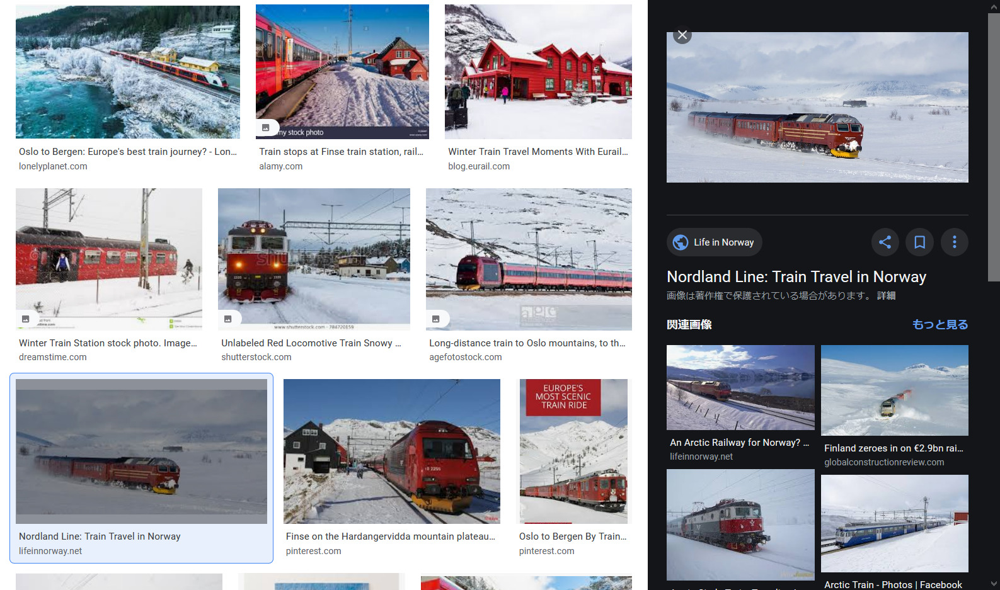
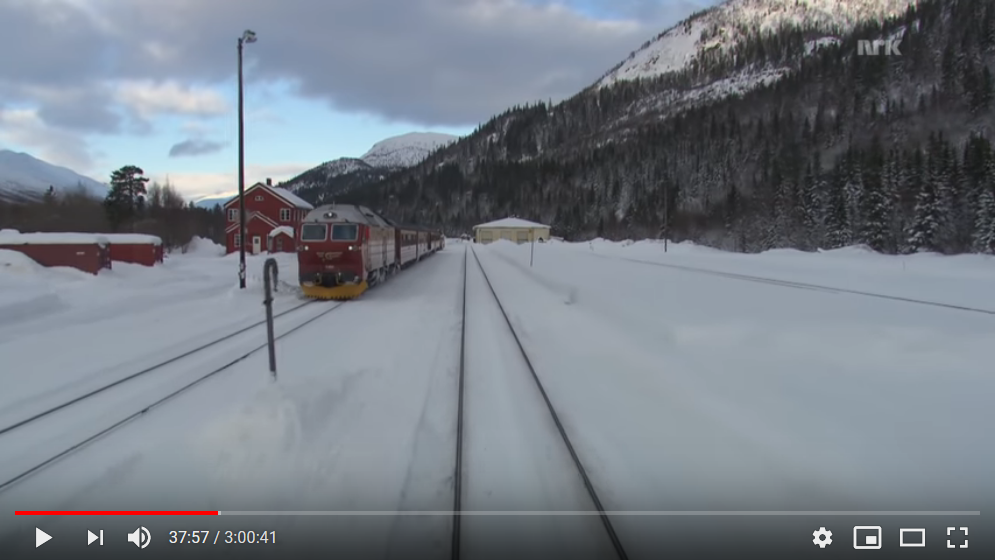

# Off the Rails 2: Electric Boogaloo: Far from Home:osint:336pts
Okay so I'm starting to think I may have got on the wrong train again and now it's snowing so hard I have no clue where I am 😬. Thankfully, I managed to snap this pic before the storm started. We seem to have stopped at this station.. can you tell me it's name?  
Please tell me the name of the station in lower case flag format, with any spaces replaced by underscores.  
Attached files:  
- no_pain_no_train.png (sha256: 5d4189012db8bc5522bce945b9311c474bc63c77fe25b7d15497997919cd81b7)  

[no_pain_no_train.png](no_pain_no_train.png)  

# Solution
no_pain_no_train.pngが渡される。  
どうやら、今いる駅を見つけてほしいようだ(GPS使えないのか)。  
雪、針葉樹林、赤い電車、赤い家から北欧周辺にあたりをつける。  
北欧の国を順に検索していくと、`norway red train snow`で似た電車を発見できる。  
  
Nordland Line(電車はNSB Di 4)のようだ。  
Nordland Lineの路線を探すが、駅が多すぎる。  
YouTubeに動画があるので、それを再生していると切り抜いたであろう元動画を見つけた。  
スタートから40分ほどで到着する駅である。  
  
[Cab Ride on Nordland line railway winter 03. (37:57)](https://youtu.be/jL9vALlM8YQ?t=2277)  
これによると、該当する駅はStjørdalらしいがflagが間違っているようだ。  
以下の動画と見比べると、元動画の電車のスタートがTrondheimではない(説明文にはそう書いてあるが…)。  
[Cab Ride Norway : Trondheim - Bodø (Spring) Nordland Line](https://youtu.be/tnsQ8DjD6YE)  
元動画のスタート駅を見つけてその40分後の駅を答えればよい。  
外観からMo i Ranaがスタート駅のようだ。  
[Cab Ride Norway : Trondheim - Bodø (Spring) Nordland Line (6:42:42)](https://youtu.be/tnsQ8DjD6YE?t=24162)  
その40分後の駅は[Nordland Line - Wikipedia](https://en.wikipedia.org/wiki/Nordland_Line)よりDunderlandとわかる。  
これがflagだった。  

## DUCTF{dunderland}