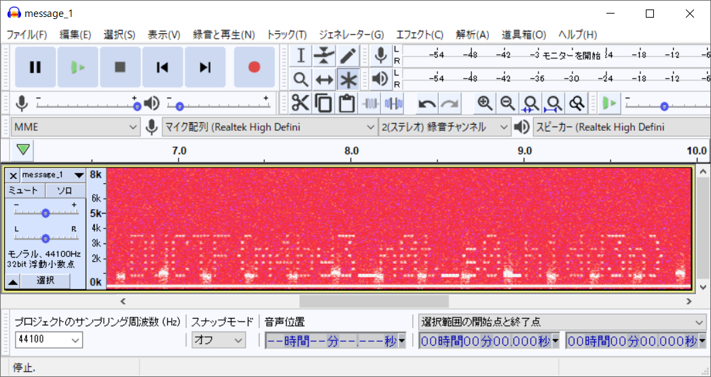

# On the spectrum:forensics:100pts
My friend has been sending me lots of WAV files, I think he is trying to communicate with me, what is the message he sent?  
Attached files:  
- message_1.wav (sha256: 069dacbd6d6d5ed9c0228a6f94bbbec4086bcf70a4eb7a150f3be0e09862b5ed)  

[message_1.wav](message_1.wav)  

# Solution
wavファイルのようだ。  
問題名の通りスぺクトログラムを見てやる。  
  
flagが書かれていた。  

## DUCTF{m4by3_n0t_s0_h1dd3n}