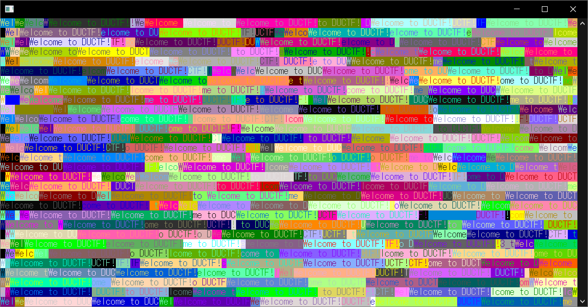

# Welcome!:misc:100pts
Welcome to DUCTF!  
ssh ductf@chal.duc.tf -p 30301  
Password: ductf  
Epilepsy warning  

# Solution
sshするとターミナル画面いっぱいにカラフルな文字が表示される。  
  
出力をファイルにとってgrepしてみる。  
```bash
$ ssh ductf@chal.duc.tf -p 30301 > log.txt
ductf@chal.duc.tf's password:
Connection to chal.duc.tf closed.
$ strings log.txt | grep DUCTF{
[38;14HDUCTF{w3lc0m3_t0_DUCTF_h4v3_fun!}
[46;47HDUCTF{w3lc0m3_t0_DUCTF_h4v3_fun!}
[14;134HDUCTF{w3lc0m3_t0_DUCTF_h4v3_fun!}
[2;101HDUCTF{w3lc0m3_t0_DUCTF_h4v3_fun!}
[34;95HDUCTF{w3lc0m3_t0_DUCTF_h4v3_fun!}
[26;104HDUCTF{w3lc0m3_t0_DUCTF_h4v3_fun!}
[49;79HDUCTF{w3lc0m3_t0_DUCTF_h4v3_fun!}
```
flagが隠れていた。  

## DUCTF{w3lc0m3_t0_DUCTF_h4v3_fun!}