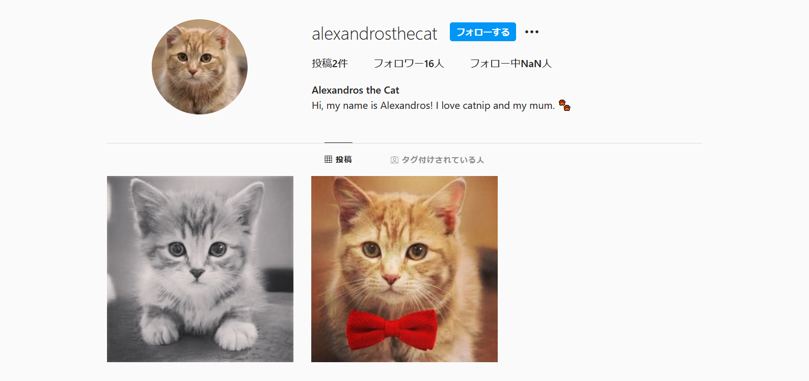
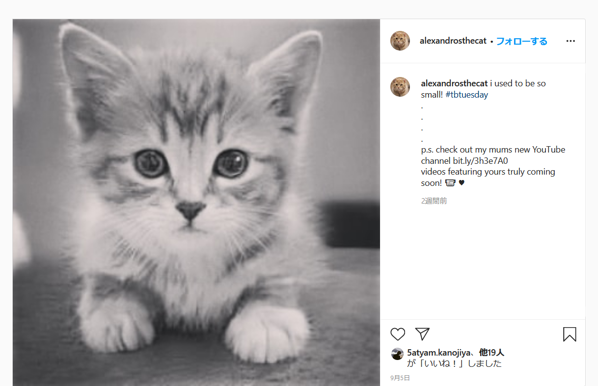
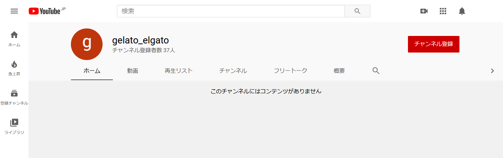
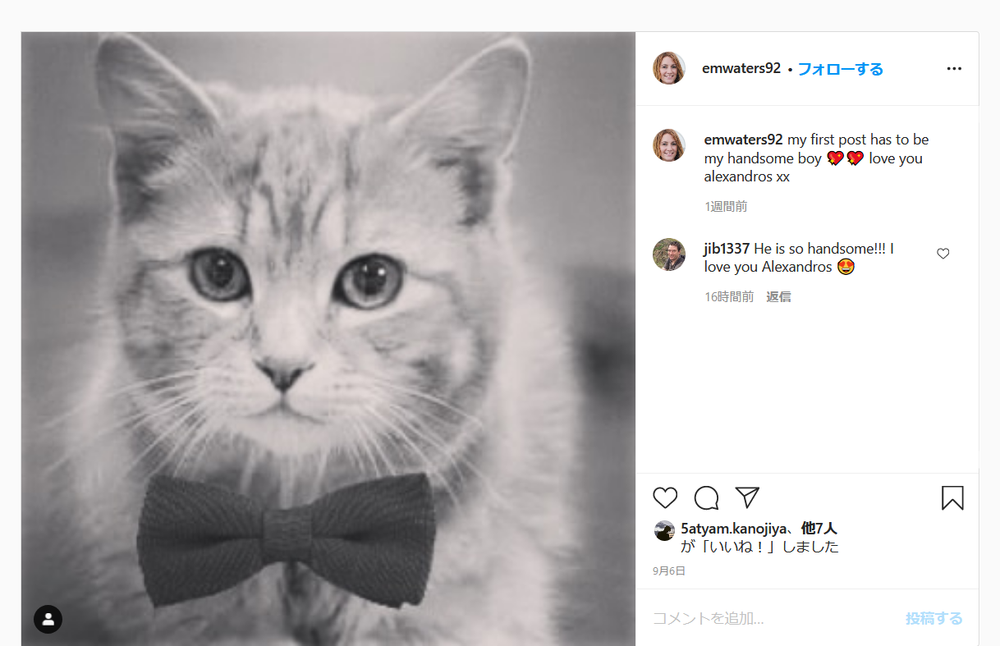

# Welcome to Petstagram:osint:100pts
Who is Alexandros the cat exactly? And who is this mysterious "mum" he keeps talking about?  
Submit his mum's full name in lowercase and with underscores instead of spaces, as the flag: DUCTF{name}  
Hint  
I'm looking for their mum's full name. Are you sure you have everything you need?  
Hint  
If you have Alexandros' mum's given name and surname... what else could there be left to find to get her full name?  

# Solution
PetstagramからInstagramを怪しんで検索する。  
`Alexandros the cat`で[ヒット](https://www.instagram.com/alexandrosthecat/)した。  
  
投稿に飼い主(mum)のYouTubeリンクがあった。  
  
gelato_elgatoというアカウント名だ。  
  
これをツイッターで検索すると以下の[アカウント](https://twitter.com/gelato_elgato)が出てきた。  
  
call me theresaらしい。  
再度Instagramに戻り、フォロワーをサーチするとemwaters92が[ヒット](https://www.instagram.com/emwaters92/)した。  
投稿に同じ猫が写っている。  
  
名前がEmily Watersでアカウントがemwaters92なのでEmily T Watersのようだ。  
Tがtheresaである可能性が高い。  
flagを指定されたとおりに整形する。  

## DUCTF{emily_theresa_waters}