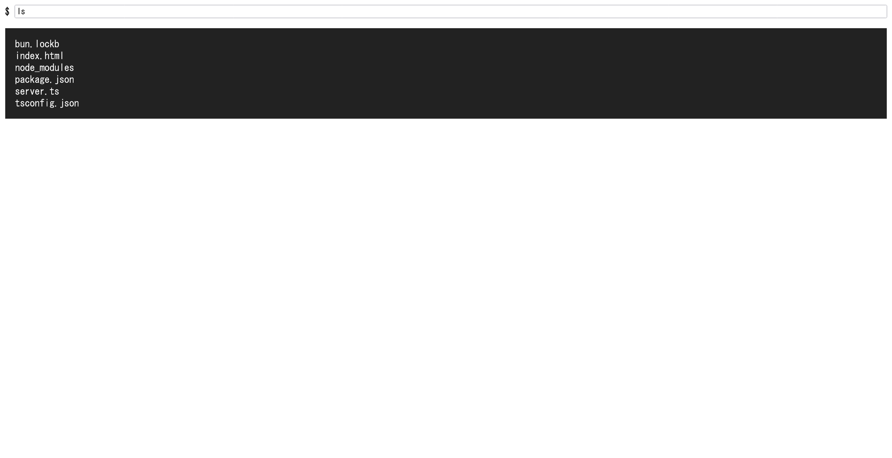
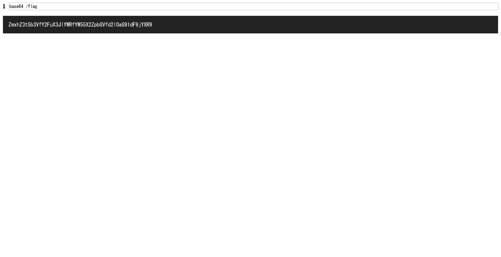

# busybox1:web misc:1pts
Attachments  
[busybox1.zip](busybox1.zip)  

Servers  
[https://busybox1-44lpge4jkn-fuuaq4evkq-an.a.run.app/](https://busybox1-44lpge4jkn-fuuaq4evkq-an.a.run.app/)  

Read `/flag`.  

**Target time: 5:00**  

# Solution
ソースとURLが渡される。  
アクセスするとコマンドを実行できるサイトのようだ。  
  
ソースのserver.tsを見ると以下であった。  
```ts
const port = process.env.PORT || 3000;

if (process.env.FLAG) {
  Bun.write("/flag", process.env.FLAG);
  delete process.env.FLAG;
  delete Bun.env.FLAG;
}

Bun.serve({
  port,
  async fetch(req) {
    const path = new URL(req.url).pathname;
    if (req.method === "POST" && path === "/run") {
      const json = await req.json();
      const command = json.command;
      if (
        !Array.isArray(command) ||
        !command.every((c): c is string => typeof c === "string") ||
        command.length === 0
      ) {
        return Response.json({ error: "Invalid command." });
      }

      if (command[0].includes("/")) {
        return Response.json({ error: "Only commands in /bin are allowed!" });
      }
      if (["cat", "sh"].some((banned) => command[0].includes(banned))) {
        return Response.json({ error: "Banned!" });
      }

      command[0] = "/bin/" + command[0];

      try {
        const proc = Bun.spawnSync(command, { env: Bun.env });
        return Response.json({
          stdout: proc.stdout.toString(),
          stderr: proc.stderr.toString(),
        });
      } catch (e: unknown) {
        return Response.json({
          error: String(e),
        });
      }
    }
    return new Response(Bun.file("index.html"));
  },
});
```
`/bin/`にコマンドを結合して実行しているようだ。  
`/flag`を読み取れば良いようなので、`base64`など適当なコマンドを試してやる。  
  
```bash
$ echo -n 'ZmxhZ3t5b3VfY2FuX3JlYWRfYW55X2ZpbGVfd2l0aG91dF9jYXR9' | base64 -d
flag{you_can_read_any_file_without_cat}
```
flagが読み取れた。  

## flag{you_can_read_any_file_without_cat}