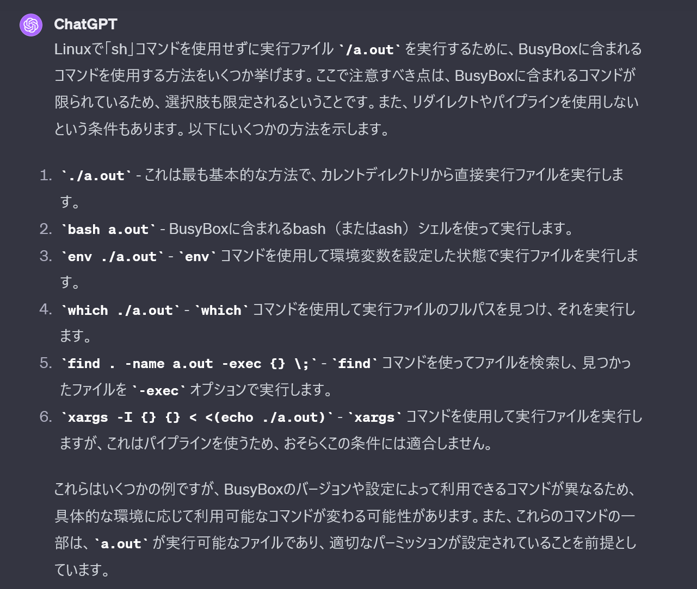
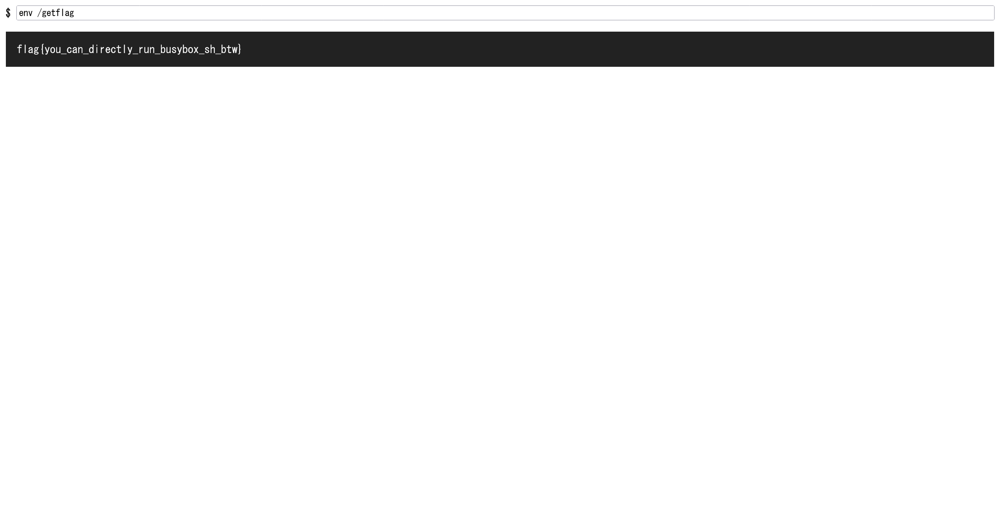

# busybox2:web misc:1pts
Attachments  
[busybox2.zip](busybox2.zip)  

Servers  
[https://busybox2-xkvdlsrsr9-fuuaq4evkq-an.a.run.app/](https://busybox2-xkvdlsrsr9-fuuaq4evkq-an.a.run.app/)  

Run `/getflag`.  

**Target time: 10:00**  

# Solution
[busybox1](../busybox1/)の強化バージョンのようだ。  
今回は`/getflag`を実行しなければならない。  
ChatGPT4に以下を聞いてみる。  
```
文字列"sh"を用いることなく実行ファイル/a.outを実行し、その結果を表示するLinuxコマンドをできる限り多く列挙して。ただし、実行ファイル名はコマンドの後方に記述したいです。コマンドはbusyboxに含まれているものだけを利用してください。リダイレクトなどは使用禁止です。
```
  
`env`が利用できるようだ。  

flagが得られた。  

## flag{you_can_directly_run_busybox_sh_btw}