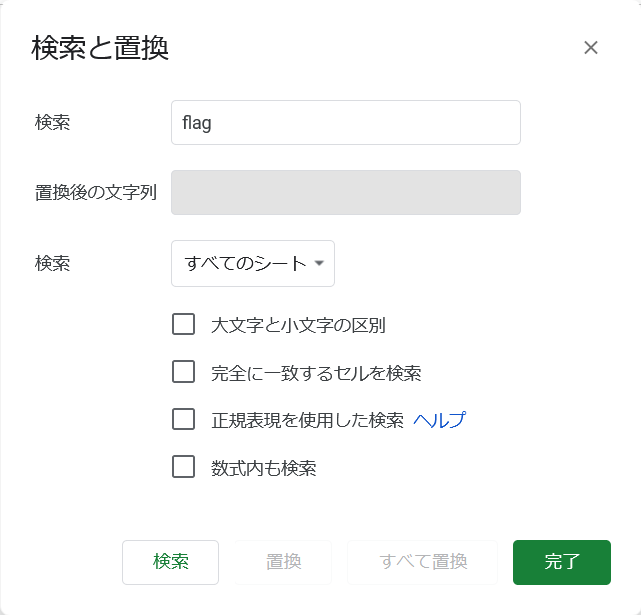

# digits-of-pi:web:388pts
There's more to this [spreadsheet](https://docs.google.com/spreadsheets/d/1y7AxYvBwJ1DeapnhV401w0T5HzQNIfrN1WeQFbnwbIE/edit) than meets the eye.  

# Solution
スプレッドシートが渡される。  
Digits of pi  
[site.png](site/site.png)  
数式を確認するとA2に`=ARRAYFORMULA(Source!A:B)`とあった。  
非表示のシートSourceがあるようで、それを表示しているようだがセルがデータ分しか用意されていない。  
Sourceに何か書かれていそうである。  
文字列`flag`で検索を行う。  
  
SourceのO401にflagが書かれていた。  
flag  
[flag.png](site/flag.png)  
ちなみに自身で編集できるシートを新規作成し、セルに`=IMPORTRANGE("1y7AxYvBwJ1DeapnhV401w0T5HzQNIfrN1WeQFbnwbIE","Source!A:Z")`を入力しても取得できる。  

## flag{hidden_sheets_are_not_actually_hidden}