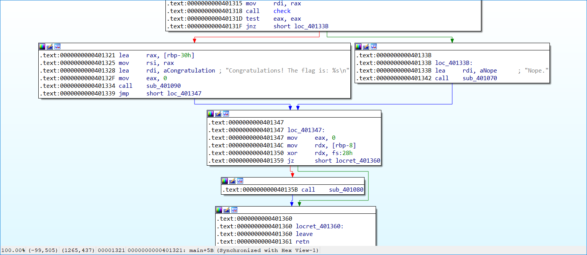

# Easy Flag Checker:Reversing:130pts
このバイナリに文字列を与えると、フラグであるかどうかチェックしてくれます。  

---

This binary checks if the input is the flag.  

---

Attachments: [chall](chall)  

# Solution
配布されたファイルを実行してみる。  
```bash
$ ./chall
Input flag: flagggggg
Nope.
```
よくあるangr問のようだ。  
IDAでアドレスを調査する。  
  
findが`0x401321`、avoidが`0x40133B`とわかる。  
以下のchall.pyで殴る。  
```python:chall.py
import angr

p = angr.Project("./chall")
state = p.factory.entry_state()
sim = p.factory.simulation_manager(state)
sim.explore(find=(0x400000+0x1321,), avoid=(0x400000+0x133b,))
if len(sim.found) > 0:
    print(sim.found[0].posix.dumps(0))
```
実行する。  
```bash
$ python chall.py
b'HarekazeCTF{0rth0d0x_fl4g_ch3ck3r!}'
```
flagが得られた。  

## HarekazeCTF{0rth0d0x_fl4g_ch3ck3r!}