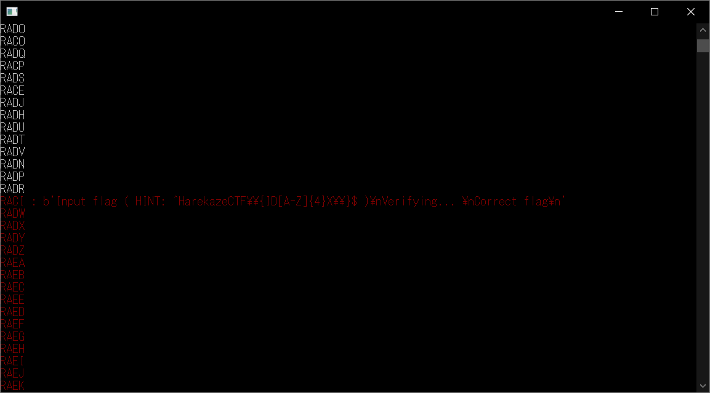

# Wait:Reversing:157pts
Please be patient. Brute-force attacks on the score server are prohibited.  

---

Attachments: [a.out](a.out)  
# Solution
a.outが渡されるので、実行してみる。  
```bash
$ ./a.out
Input flag ( HINT: ^HarekazeCTF\{ID[A-Z]{4}X\}$ )
AAAAA
Wrong flag
$ ./a.out
Input flag ( HINT: ^HarekazeCTF\{ID[A-Z]{4}X\}$ )
HarekazeCTF{IDAAAAX}
Verifying...
Wrong flag
```
フォーマットに従った入力を行うと数秒待たされる。  
4桁大文字なので総当たりできそうだ。  
以下のbfwait.pyで並列化して試す(一文字目を自分で指定している)。  
正解のフラグを検知すると、文字が赤色に変わる。  
```python:bfwait.py
import sys
import subprocess
from concurrent.futures import ThreadPoolExecutor

alph = "ABCDEFGHIJKLMNOPQRSTUVWXYZ"

def flag(text):
    res = subprocess.check_output("./a.out", input=b"HarekazeCTF{ID" + text.encode() + b"X}")
    print(text)
    sys.stdout.flush()
    if not b"Wrong flag" in res:
        print("\033[31m", end="")
        print("{} : {}".format(text, res))
        sys.stdout.flush()

tpe = ThreadPoolExecutor(max_workers=100)

i1 = input("[1]>> ")
print(i1)
for i2 in alph:
    for i3 in alph:
        for i4 in alph:
            tpe.submit(flag, "{}{}{}{}".format(i1, i2, i3, i4))

tpe.shutdown()
```
実行すると、Rを一文字目で指定したときに文字が赤色に変わる。  
  
```bash
$ ./a.out
Input flag ( HINT: ^HarekazeCTF\{ID[A-Z]{4}X\}$ )
HarekazeCTF{IDRACIX}
Verifying...
Correct flag
```
flagを得ることができた。  

## HarekazeCTF{IDRACIX}