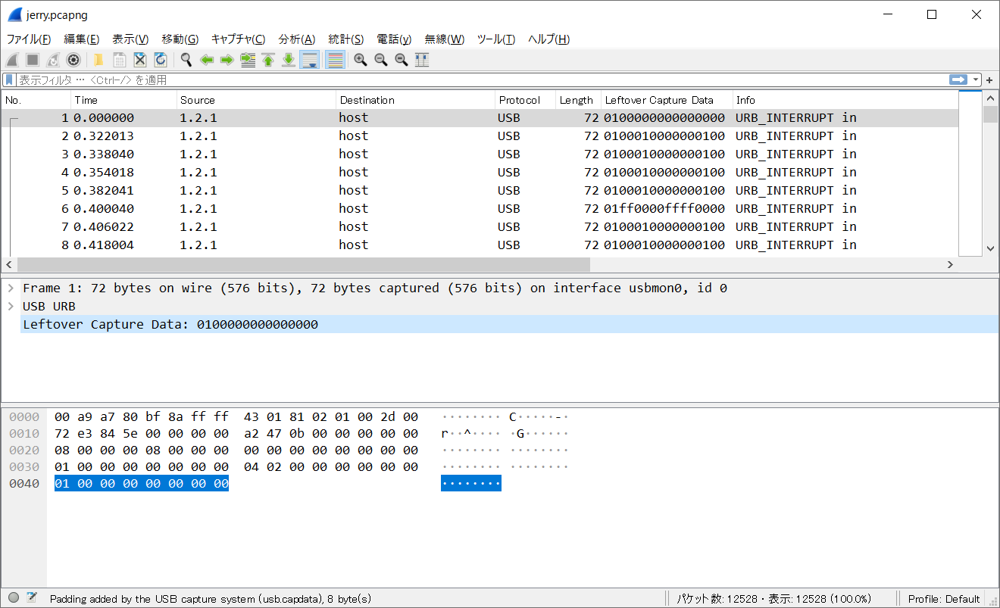
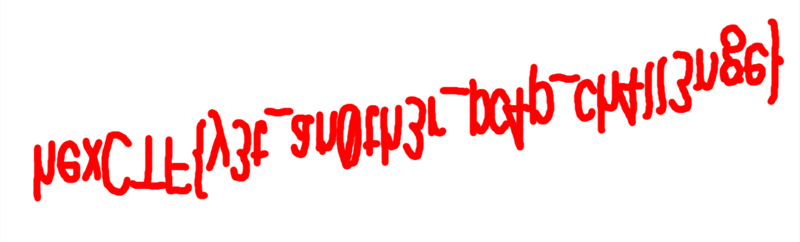

# T&J:Misc:839pts
Can you help Tom catch Jerry?  
[jerry.pcapng](jerry.pcapng)  

# Solution
Wiresharkでファイルを開くと、中身はUSBとの通信をキャプチャしたものであることがわかる。  
この手のものとしてはUSBキーボードやUSBマウスが多い。  
トムとジェリーからマウスを捕まえることが予想されるのでUSBマウスとの通信であると考え解析を行う。  
  
明らかにusb.capdataが怪しいのでファイルに出力する。  
```bash
$ tshark -r jerry.pcapng -T fields -e usb.capdata > capdata.txt
$ cat capdata.txt
01:00:00:00:00:00:00:00
01:00:01:00:00:00:01:00
01:00:01:00:00:00:01:00
01:00:01:00:00:00:01:00
01:00:01:00:00:00:01:00
01:ff:00:00:ff:ff:00:00
01:00:01:00:00:00:01:00
01:00:01:00:00:00:01:00
01:00:01:00:00:00:01:00
01:00:01:00:00:00:01:00
01:00:01:00:00:00:01:00
01:ff:00:00:ff:ff:00:00
01:00:01:00:00:00:01:00
~~~
```
以下のようにマウス操作と対応しているようだ。  
1byte:マウスボタン  
2byte:x座標変位  
3byte:y座標変位  
4~8byte:いろいろ  
F-14.pyでマウスの動きを可視化する。  
````python:F-14.py
# http://ctf.publog.jp/archives/1056626672.htmlより
import sys
import matplotlib.pyplot as plt

plt.xlim(-100, 2000)
plt.ylim(-100, 500)

filename = "capdata.txt"

def compliment(h):
    i = int(h, 16)
    return i - ((0x80 & i) << 1)

def plot(i, x, y, c="red"):
    plt.plot(x, y, color=c, marker="o")

tx = ty = i = 0

for line in open(filename).readlines():
    if len(line) > 1:
        status, dx, dy, junk, aaa, bbb, ccc, ddd = line.split(":")
        tx += compliment(dx)
        ty += compliment(dy)
    if status != "00":
        i += 1
        plot(i, tx, ty)

plt.show()
````
flagが描かれていた。  
  

## hexCTF{y3t_an0th3r_pc4p_ch4ll3nge}