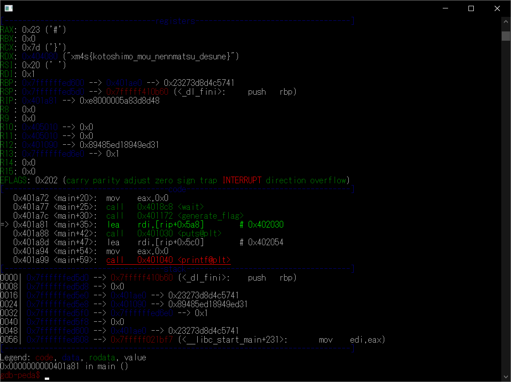

# countdown:Reversing:68pts
ここCTF王国では、新年になったらフラグを予想し、当たったら100万円が貰える行事があります。  
行事に使うカウントダウンのプログラムを手に入れたので、新年より先にフラグを入手して100万円を手に入れましょう。  
[countdown](countdown)  

# Solution
実行すると新年までのカウントダウンが始まる。  
```bash
$ ./countdown
New year countdown!
6day 12:11:10 ...
6day 12:11:9 ...
6day 12:11:8 ...
6day 12:11:7 ...
6day 12:11:6 ...
6day 12:11:5 ...
6day 12:11:4 ...
6day 12:11:3 ...
6day 12:11:2 ...
6day 12:11:1 ...
6day 12:11:0 ...
^C
```
CTF終了後なので待つのは不可能だ。  
gdbで振る舞いを見る。  
```bash
$ gdb ./countdown
~~~
gdb-peda$ disass main
Dump of assembler code for function main:
   0x0000000000401a5e <+0>:     push   rbp
   0x0000000000401a5f <+1>:     mov    rbp,rsp
   0x0000000000401a62 <+4>:     sub    rsp,0x30
   0x0000000000401a66 <+8>:     lea    rdi,[rip+0x5af]        # 0x40201c
   0x0000000000401a6d <+15>:    call   0x401030 <puts@plt>
   0x0000000000401a72 <+20>:    mov    eax,0x0
   0x0000000000401a77 <+25>:    call   0x4018c8 <wait>
   0x0000000000401a7c <+30>:    call   0x401172 <generate_flag>
   0x0000000000401a81 <+35>:    lea    rdi,[rip+0x5a8]        # 0x402030
   0x0000000000401a88 <+42>:    call   0x401030 <puts@plt>
   0x0000000000401a8d <+47>:    lea    rdi,[rip+0x5c0]        # 0x402054
   0x0000000000401a94 <+54>:    mov    eax,0x0
   0x0000000000401a99 <+59>:    call   0x401040 <printf@plt>
   0x0000000000401a9e <+64>:    lea    rax,[rbp-0x30]
   0x0000000000401aa2 <+68>:    mov    rsi,rax
   0x0000000000401aa5 <+71>:    lea    rdi,[rip+0x5af]        # 0x40205b
   0x0000000000401aac <+78>:    mov    eax,0x0
   0x0000000000401ab1 <+83>:    call   0x401070 <__isoc99_scanf@plt>
   0x0000000000401ab6 <+88>:    lea    rax,[rbp-0x30]
   0x0000000000401aba <+92>:    mov    rsi,rax
   0x0000000000401abd <+95>:    lea    rdi,[rip+0x25bc]        # 0x404080 <flag>
   0x0000000000401ac4 <+102>:   call   0x401050 <strcmp@plt>
   0x0000000000401ac9 <+107>:   test   eax,eax
   0x0000000000401acb <+109>:   jne    0x401ad9 <main+123>
   0x0000000000401acd <+111>:   lea    rdi,[rip+0x58c]        # 0x402060
   0x0000000000401ad4 <+118>:   call   0x401030 <puts@plt>
   0x0000000000401ad9 <+123>:   mov    eax,0x0
   0x0000000000401ade <+128>:   leave
   0x0000000000401adf <+129>:   ret
End of assembler dump.
```
ステップ実行し確認すると、上記のwaitで止まっているようだ。  
$pcを0x0000000000401a7cにすればよい。  
```bash
gdb-peda$ start
~~~
gdb-peda$ n 4
~~~
gdb-peda$ set $pc = 0x0000000000401a7c
gdb-peda$ n
```
  
flagがレジスタに入っていた。  

## xm4s{kotoshimo_mou_nennmatsu_desune}