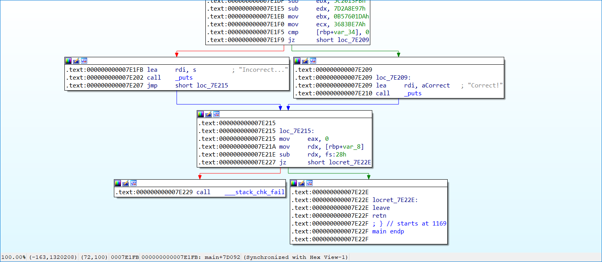

# dummy:Reversing:82pts
dummy! dummy! dummy!  
[dummy](dummy)  

# Solution
dummyが配布される。  
実行すると以下のようであった。  
```bash
$ ./dummy
FLAG: Nooooo
Incorrect...
```
angr問なので、IDAでアドレスを確認する。  
  
以下のdummy.pyで殴る。  
```python:dummy.py
import angr

p = angr.Project("./dummy")
state = p.factory.entry_state()
sim = p.factory.simulation_manager(state)
sim.explore(find=(0x400000+0x7e209,), avoid=(0x400000+0x7e1fb,))
if len(sim.found) > 0:
    print(sim.found[0].posix.dumps(0))
```
実行する。  
```bash
$ python dummy.py
WARNING | 2020-12-25 11:16:20,892 | cle.loader | The main binary is a position-independent executable. It is being loaded with a base address of 0x400000.
b'xm4s{mad_dummy_blocks_the_way!}\x00%c'
```
flagが得られた。  

## xm4s{mad_dummy_blocks_the_way!}