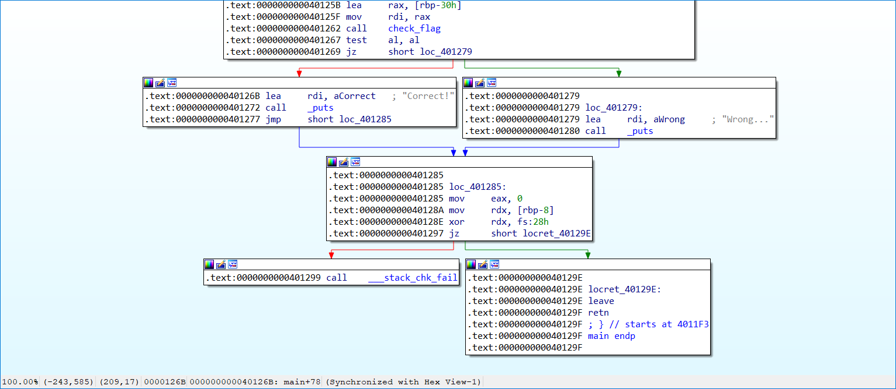

# first_asm:Reversing:86pts
もしアセンブリを読んだことが無くても、この問題に挑戦してみませんか？  
[check_flag.s](check_flag.s)　　　　[first_asm](first_asm)　　　　[first_asm.c](first_asm.c)　　　　[Makefile](Makefile)  

# Solution
アセンブリを読む気がないのでangrで殴る。  
IDAでアドレスを確認する。  
  
以下のasm.pyで殴る。  
```python:asm.py
import angr

p = angr.Project("./first_asm")
state = p.factory.entry_state()
sim = p.factory.simulation_manager(state)
sim.explore(find=(0x400000+0x126b,), avoid=(0x400000+0x1279,))
if len(sim.found) > 0:
    print(sim.found[0].posix.dumps(0))
```
実行する。  
```bash
$ python asm.py
b'xm4s{we1c0me_t0_a55emb1y_w0r1d!}%c'
```
flagが得られた。  

## xm4s{we1c0me_t0_a55emb1y_w0r1d!}